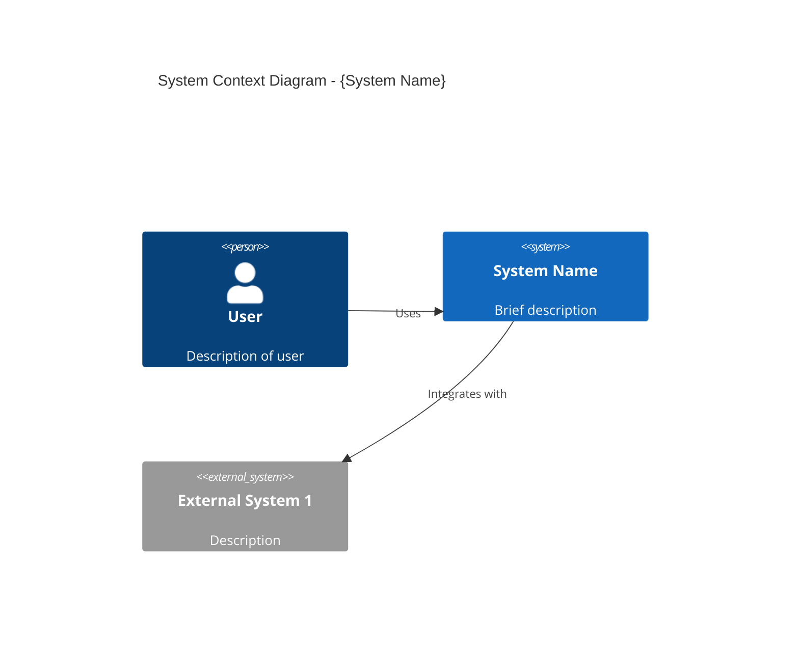
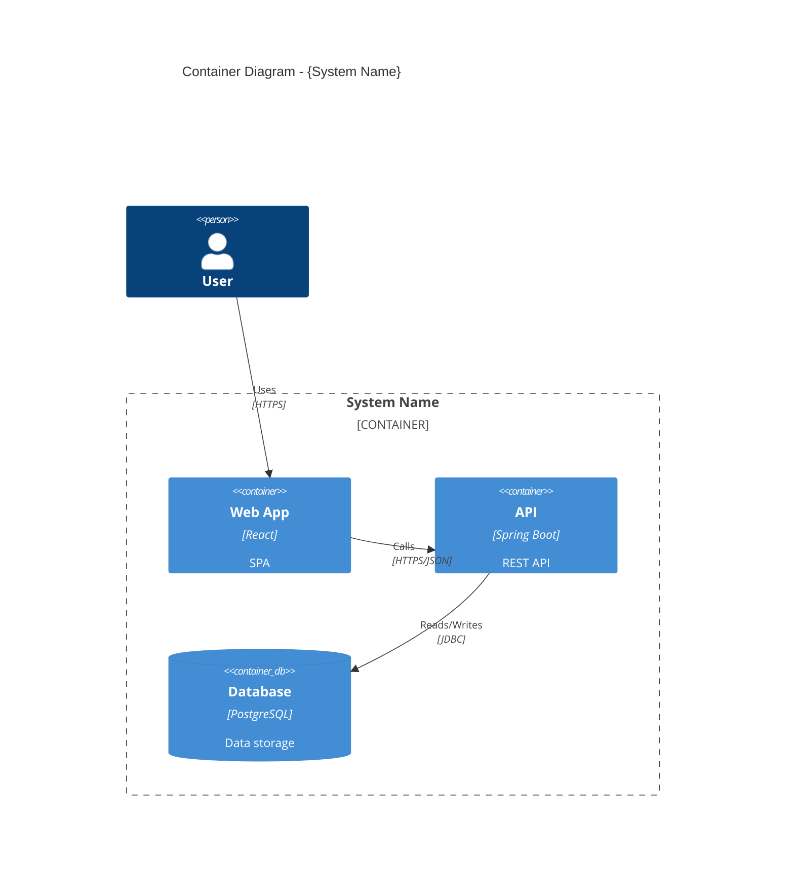

# Architecture — Data & Storage (DB, CDN/Edge, Data Platforms)

## Database Architecture

### Sharding Strategies

#### Horizontal Sharding (Row-based)

Distribute rows across shards based on a shard key.

```
┌─────────────────────────────────────────────────────────────┐
│                      Application Layer                      │
│                   (Shard-aware routing)                     │
└───────────────────────────┬─────────────────────────────────┘
                            │
          ┌─────────────────┼─────────────────┐
          │                 │                 │
┌─────────▼─────────┐ ┌─────▼─────┐ ┌─────────▼─────────┐
│    Shard 1        │ │  Shard 2  │ │    Shard 3        │
│  Users A-H        │ │ Users I-P │ │  Users Q-Z        │
│  (user_id hash    │ │           │ │                   │
│   mod 3 = 0)      │ │ (mod 3=1) │ │  (mod 3 = 2)      │
└───────────────────┘ └───────────┘ └───────────────────┘
```

**Shard Key Selection Criteria:**
- **Cardinality**: High cardinality (many unique values)
- **Distribution**: Even data distribution
- **Query patterns**: Key used in most queries
- **Avoid hotspots**: No time-based keys for append-heavy workloads

| Sharding Method | Pros | Cons |
|-----------------|------|------|
| **Hash-based** | Even distribution | Range queries difficult |
| **Range-based** | Range queries efficient | Hotspots possible |
| **Directory-based** | Flexible | Lookup overhead |
| **Geographic** | Low latency | Uneven distribution |

#### Vertical Sharding (Column-based)

Split tables by columns (rarely vs frequently accessed).

```
Before:
┌──────────────────────────────────────────────────────┐
│                    users                             │
│ id | name | email | bio | avatar | preferences | ... │
└──────────────────────────────────────────────────────┘

After:
┌─────────────────────────────┐  ┌────────────────────────────┐
│     users_core              │  │     users_extended         │
│ id | name | email           │  │ user_id | bio | avatar |.. │
│ (Hot data, frequent reads)  │  │ (Cold data, rare access)   │
└─────────────────────────────┘  └────────────────────────────┘
```

### Replication Topologies

#### Primary-Replica (Master-Slave)

```
                    ┌──────────────────┐
       Writes ────► │     Primary      │
                    │   (Read/Write)   │
                    └────────┬─────────┘
                             │ Replication
              ┌──────────────┼──────────────┐
              │              │              │
       ┌──────▼──────┐ ┌─────▼─────┐ ┌──────▼──────┐
Reads◄─┤  Replica 1  │ │ Replica 2 │ │  Replica 3  │
       │  (Read-only)│ │(Read-only)│ │ (Read-only) │
       └─────────────┘ └───────────┘ └─────────────┘
```

**Replication Modes:**
- **Synchronous**: Strong consistency, higher latency
- **Asynchronous**: Lower latency, eventual consistency
- **Semi-synchronous**: At least one replica confirms

#### Multi-Primary (Multi-Master)

```
┌──────────────────┐         ┌──────────────────┐
│    Primary A     │◄───────►│    Primary B     │
│  (Read/Write)    │  Sync   │  (Read/Write)    │
│  Region: US-East │         │  Region: EU-West │
└──────────────────┘         └──────────────────┘
         │                            │
    ┌────▼────┐                  ┌────▼────┐
    │ Replica │                  │ Replica │
    └─────────┘                  └─────────┘
```

**Conflict Resolution:**
- **Last Write Wins (LWW)**: Timestamp-based, may lose data
- **Version Vectors**: Track causality, merge conflicts
- **Application-level**: Custom merge logic per domain

### Connection Pooling

```
┌─────────────────────────────────────────────────────────────┐
│                    Application Servers                      │
│  ┌───────────┐ ┌───────────┐ ┌───────────┐ ┌───────────┐  │
│  │   App 1   │ │   App 2   │ │   App 3   │ │   App N   │  │
│  └─────┬─────┘ └─────┬─────┘ └─────┬─────┘ └─────┬─────┘  │
└────────┼─────────────┼─────────────┼─────────────┼────────┘
         │             │             │             │
         └─────────────┼─────────────┼─────────────┘
                       │             │
                ┌──────▼─────────────▼──────┐
                │     Connection Pooler     │
                │  (PgBouncer / ProxySQL)   │
                │  Max Connections: 1000    │
                │  Pool Mode: Transaction   │
                └─────────────┬─────────────┘
                              │ 100 connections
                       ┌──────▼──────┐
                       │  PostgreSQL │
                       │ max_conn=150│
                       └─────────────┘
```

**Pool Sizing Formula:**
```
pool_size = (core_count * 2) + effective_spindle_count
```

For SSD: `pool_size = core_count * 2` (typically 10-20 per app instance)

### NewSQL Databases

Combine SQL semantics with horizontal scalability.

| Database | Architecture | Best For |
|----------|--------------|----------|
| **CockroachDB** | Distributed SQL, Spanner-inspired | Global distribution, strong consistency |
| **TiDB** | MySQL-compatible, TiKV storage | MySQL migration, HTAP |
| **YugabyteDB** | PostgreSQL-compatible | PostgreSQL migration |
| **Vitess** | MySQL sharding layer | YouTube-scale MySQL |
| **PlanetScale** | Vitess-based, serverless | MySQL with branching |

---

## CDN & Edge Computing

### CDN Architecture

```
                    ┌───────────────────────────────────────┐
                    │              Origin                   │
                    │  (Application servers, Object storage)│
                    └───────────────────┬───────────────────┘
                                        │
                    ┌───────────────────▼───────────────────┐
                    │           Origin Shield              │
                    │  (Reduces origin requests by ~90%)    │
                    └───────────────────┬───────────────────┘
                                        │
        ┌───────────────┬───────────────┼───────────────┬───────────────┐
        │               │               │               │               │
┌───────▼───────┐ ┌─────▼─────┐ ┌───────▼───────┐ ┌─────▼─────┐ ┌───────▼───────┐
│   Edge PoP    │ │ Edge PoP  │ │   Edge PoP    │ │ Edge PoP  │ │   Edge PoP    │
│   US-East     │ │  US-West  │ │     Europe    │ │   Asia    │ │   Australia   │
└───────┬───────┘ └─────┬─────┘ └───────┬───────┘ └─────┬─────┘ └───────┬───────┘
        │               │               │               │               │
    ┌───▼───┐       ┌───▼───┐       ┌───▼───┐       ┌───▼───┐       ┌───▼───┐
    │ Users │       │ Users │       │ Users │       │ Users │       │ Users │
    └───────┘       └───────┘       └───────┘       └───────┘       └───────┘
```

### Caching Strategies

| Content Type | TTL | Cache Headers | Invalidation |
|--------------|-----|---------------|--------------|
| **Static assets** (JS, CSS) | 1 year | `Cache-Control: public, max-age=31536000, immutable` | Filename hash |
| **Images** | 1 month | `Cache-Control: public, max-age=2592000` | Purge on update |
| **API responses** | Seconds-minutes | `Cache-Control: public, max-age=60, stale-while-revalidate=300` | TTL expiry |
| **HTML** | No cache or short | `Cache-Control: no-cache` or `max-age=60` | Instant purge |
| **User-specific** | No CDN cache | `Cache-Control: private` | N/A |

### Cache Invalidation Strategies

| Strategy | Speed | Complexity | Best For |
|----------|-------|------------|----------|
| **TTL expiry** | Predictable | Low | Content with known freshness |
| **Purge by URL** | Instant | Low | Single resource updates |
| **Purge by tag** | Instant | Medium | Related content groups |
| **Soft purge** | Instant | Medium | Graceful updates |
| **Origin cache busting** | Instant | Low | Versioned assets |

### Edge Computing

Run code at edge locations, closer to users.

**Use Cases:**
- **A/B testing**: Route users without origin roundtrip
- **Authentication**: Validate JWT at edge
- **Personalization**: Geo-based content
- **Bot protection**: Challenge suspicious requests
- **API gateway**: Rate limiting, routing

**Platforms:**
| Platform | Runtime | Use Case |
|----------|---------|----------|
| **Cloudflare Workers** | V8 isolates | Full applications, KV storage |
| **AWS Lambda@Edge** | Node.js, Python | CloudFront customization |
| **Vercel Edge Functions** | V8 isolates | Next.js, middleware |
| **Fastly Compute** | Wasm | High-performance, custom logic |
| **Deno Deploy** | Deno/V8 | TypeScript-first edge |

---


## Data Architecture

### Data Platform Architectures Comparison

| Architecture | Strength | Weakness | Best For |
|--------------|----------|----------|----------|
| **Data Warehouse** | Strong governance, SQL | Limited scalability | BI, structured analytics |
| **Data Lake** | Scalability, raw data | Data swamp risk | ML, unstructured data |
| **Data Lakehouse** | Best of both | Complexity | Modern analytics |
| **Data Mesh** | Decentralization | Coordination overhead | Large organizations |

### Data Mesh (4 Principles)

```
┌─────────────────────────────────────────────────────────────────────┐
│                         Data Mesh                                   │
│                                                                     │
│  Principle 1: Domain Ownership                                     │
│  ┌──────────────┐  ┌──────────────┐  ┌──────────────┐             │
│  │   Sales      │  │   Product    │  │   Customer   │             │
│  │   Domain     │  │   Domain     │  │   Domain     │             │
│  │   (owns its  │  │   (owns its  │  │   (owns its  │             │
│  │    data)     │  │    data)     │  │    data)     │             │
│  └──────────────┘  └──────────────┘  └──────────────┘             │
│                                                                     │
│  Principle 2: Data as a Product                                    │
│  - Discoverable, addressable, self-describing                      │
│  - Trustworthy, secure, interoperable                              │
│                                                                     │
│  Principle 3: Self-Serve Platform                                  │
│  ┌────────────────────────────────────────────────────────────┐   │
│  │  Infrastructure (storage, compute, pipelines, catalogs)    │   │
│  └────────────────────────────────────────────────────────────┘   │
│                                                                     │
│  Principle 4: Federated Governance                                 │
│  - Global standards, local autonomy                                │
│  - Interoperability, security policies                             │
└─────────────────────────────────────────────────────────────────────┘
```

### Data Lakehouse with Apache Iceberg

```
┌─────────────────────────────────────────────────────────────────────┐
│                      Data Lakehouse Architecture                    │
│                                                                     │
│  ┌──────────────────────────────────────────────────────────────┐  │
│  │                    Query Engines                              │  │
│  │  ┌────────┐  ┌────────┐  ┌────────┐  ┌────────┐            │  │
│  │  │ Spark  │  │ Trino  │  │ Flink  │  │Snowflake│            │  │
│  │  └────────┘  └────────┘  └────────┘  └────────┘            │  │
│  └──────────────────────────────────────────────────────────────┘  │
│                              │                                      │
│  ┌──────────────────────────▼───────────────────────────────────┐  │
│  │                  Apache Iceberg (Table Format)                │  │
│  │  - ACID transactions          - Schema evolution             │  │
│  │  - Hidden partitioning        - Time travel                  │  │
│  │  - Partition pruning          - Metadata management          │  │
│  └──────────────────────────────────────────────────────────────┘  │
│                              │                                      │
│  ┌──────────────────────────▼───────────────────────────────────┐  │
│  │                    Storage Layer                              │  │
│  │  ┌────────────┐  ┌────────────┐  ┌────────────┐             │  │
│  │  │ AWS S3     │  │ GCS        │  │ Azure Blob │             │  │
│  │  └────────────┘  └────────────┘  └────────────┘             │  │
│  │                  (Parquet files)                              │  │
│  └──────────────────────────────────────────────────────────────┘  │
└─────────────────────────────────────────────────────────────────────┘
```

**Iceberg Key Features:**
- **Schema Evolution**: Add, rename, drop columns without rewrite
- **Hidden Partitioning**: Partition by transforms (year, month, bucket)
- **Time Travel**: Query historical snapshots
- **ACID Transactions**: Concurrent writes
- **Engine-agnostic**: Works with Spark, Trino, Flink, etc.

### Streaming Architecture with Kafka

```
┌─────────────────────────────────────────────────────────────────────┐
│                    Streaming Data Platform                          │
│                                                                     │
│  Sources                    Processing                  Sinks      │
│  ┌──────────┐              ┌──────────┐              ┌──────────┐ │
│  │ Database │──CDC────────►│          │              │ Data Lake│ │
│  │ (MySQL)  │  (Debezium)  │          │──────────────►│ (S3)     │ │
│  └──────────┘              │          │              └──────────┘ │
│                            │  Kafka   │                            │
│  ┌──────────┐              │  +       │              ┌──────────┐ │
│  │ App      │──Events─────►│  Flink   │──────────────►│ Elastic  │ │
│  │ Events   │              │          │              │ search   │ │
│  └──────────┘              │          │              └──────────┘ │
│                            │          │                            │
│  ┌──────────┐              │          │              ┌──────────┐ │
│  │ IoT      │──────────────►│          │──────────────►│ Real-time│ │
│  │ Sensors  │              └──────────┘              │ Dashboard│ │
│  └──────────┘                                        └──────────┘ │
└─────────────────────────────────────────────────────────────────────┘
```

### Airflow DAG Example

```python
from airflow import DAG
from airflow.operators.python import PythonOperator
from airflow.providers.apache.spark.operators.spark_submit import SparkSubmitOperator
from datetime import datetime, timedelta

default_args = {
    'owner': 'data-engineering',
    'depends_on_past': False,
    'retries': 3,
    'retry_delay': timedelta(minutes=5),
}

with DAG(
    dag_id='daily_orders_pipeline',
    default_args=default_args,
    description='Process daily orders into data lakehouse',
    schedule='@daily',
    start_date=datetime(2025, 1, 1),
    catchup=False,
    tags=['orders', 'lakehouse'],
) as dag:

    extract = SparkSubmitOperator(
        task_id='extract_orders',
        application='s3://jobs/extract_orders.py',
        conf={'spark.sql.catalog.iceberg': 'org.apache.iceberg.spark.SparkCatalog'},
    )

    transform = SparkSubmitOperator(
        task_id='transform_orders',
        application='s3://jobs/transform_orders.py',
    )

    load = SparkSubmitOperator(
        task_id='load_to_iceberg',
        application='s3://jobs/load_iceberg.py',
    )

    validate = PythonOperator(
        task_id='validate_data_quality',
        python_callable=run_great_expectations,
    )

    extract >> transform >> load >> validate
```

---

## AI/ML Architecture

### ML System Design

```
┌─────────────────────────────────────────────────────────────────────┐
│                       ML System Architecture                        │
│                                                                     │
│  ┌──────────────────────────────────────────────────────────────┐  │
│  │                    Data Layer                                 │  │
│  │  ┌────────────┐  ┌────────────┐  ┌────────────┐             │  │
│  │  │ Feature    │  │ Training   │  │ Evaluation │             │  │
│  │  │ Store      │  │ Data       │  │ Data       │             │  │
│  │  └────────────┘  └────────────┘  └────────────┘             │  │
│  └──────────────────────────────────────────────────────────────┘  │
│                              │                                      │
│  ┌──────────────────────────▼───────────────────────────────────┐  │
│  │                  Training Pipeline                            │  │
│  │  Data Prep → Feature Eng → Model Training → Evaluation       │  │
│  │                              │                                │  │
│  │                        Model Registry                         │  │
│  └──────────────────────────────────────────────────────────────┘  │
│                              │                                      │
│  ┌──────────────────────────▼───────────────────────────────────┐  │
│  │                  Serving Layer                                │  │
│  │  ┌────────────┐  ┌────────────┐  ┌────────────┐             │  │
│  │  │ Real-time  │  │ Batch      │  │ Edge       │             │  │
│  │  │ Inference  │  │ Prediction │  │ Deployment │             │  │
│  │  └────────────┘  └────────────┘  └────────────┘             │  │
│  └──────────────────────────────────────────────────────────────┘  │
│                              │                                      │
│  ┌──────────────────────────▼───────────────────────────────────┐  │
│  │                  Monitoring & Observability                   │  │
│  │  Model drift │ Data drift │ Performance │ Explainability     │  │
│  └──────────────────────────────────────────────────────────────┘  │
└─────────────────────────────────────────────────────────────────────┘
```

### RAG Architecture (Retrieval-Augmented Generation)

```
┌─────────────────────────────────────────────────────────────────────┐
│                         RAG Pipeline                                │
│                                                                     │
│  Ingestion Phase:                                                   │
│  ┌──────────┐    ┌──────────┐    ┌──────────┐    ┌──────────┐    │
│  │Documents │───►│ Chunking │───►│Embedding │───►│ Vector   │    │
│  │(PDF,HTML)│    │(512-1024)│    │ Model    │    │ Database │    │
│  └──────────┘    └──────────┘    └──────────┘    └──────────┘    │
│                                                                     │
│  Query Phase:                                                       │
│  ┌──────────┐    ┌──────────┐    ┌──────────┐    ┌──────────┐    │
│  │  User    │───►│ Query    │───►│ Semantic │───►│ Context  │    │
│  │  Query   │    │ Embedding│    │ Search   │    │ Retrieval│    │
│  └──────────┘    └──────────┘    └──────────┘    └────┬─────┘    │
│                                                        │          │
│                                                        ▼          │
│  ┌───────────────────────────────────────────────────────────┐   │
│  │                    Prompt Construction                     │   │
│  │  "Given the following context: {retrieved_chunks}          │   │
│  │   Answer the question: {user_query}"                       │   │
│  └───────────────────────────────────────────────────────────┘   │
│                                │                                   │
│                                ▼                                   │
│                         ┌──────────┐                              │
│                         │   LLM    │                              │
│                         │ (GPT-4,  │                              │
│                         │  Claude) │                              │
│                         └────┬─────┘                              │
│                              │                                     │
│                              ▼                                     │
│                         Response                                   │
└─────────────────────────────────────────────────────────────────────┘
```

**RAG Optimization Techniques:**
| Technique | Purpose |
|-----------|---------|
| **Hybrid Search** | Combine semantic + keyword search |
| **Reranking** | Reorder results with cross-encoder |
| **Query Expansion** | Generate multiple query variants |
| **Chunking Strategies** | Sentence, paragraph, semantic |
| **Metadata Filtering** | Pre-filter by date, source, type |
| **HyDE** | Hypothetical document embeddings |

### Neural Network Architectures

| Architecture | Best For | Key Characteristics |
|--------------|----------|---------------------|
| **CNN** | Images, video | Spatial feature extraction, translation invariance |
| **RNN/LSTM** | Sequences (legacy) | Memory, sequential processing |
| **Transformer** | NLP, vision, multimodal | Self-attention, parallelization |
| **GNN** | Graphs, networks | Node and edge learning |
| **Diffusion** | Image generation | Denoising process |

**Transformer Architecture:**
```
┌─────────────────────────────────────────────────────────────┐
│                     Transformer Block                       │
│                                                             │
│  Input Embedding + Positional Encoding                     │
│                      │                                      │
│  ┌───────────────────▼───────────────────┐                 │
│  │         Multi-Head Attention          │                 │
│  │  ┌─────┐ ┌─────┐ ┌─────┐ ┌─────┐    │                 │
│  │  │Head1│ │Head2│ │Head3│ │HeadN│    │                 │
│  │  └─────┘ └─────┘ └─────┘ └─────┘    │                 │
│  │              Concatenate + Linear     │                 │
│  └───────────────────┬───────────────────┘                 │
│                      │ + Residual                          │
│  ┌───────────────────▼───────────────────┐                 │
│  │            Layer Norm                 │                 │
│  └───────────────────┬───────────────────┘                 │
│                      │                                      │
│  ┌───────────────────▼───────────────────┐                 │
│  │         Feed Forward Network          │                 │
│  │     (Linear → ReLU → Linear)          │                 │
│  └───────────────────┬───────────────────┘                 │
│                      │ + Residual                          │
│  ┌───────────────────▼───────────────────┐                 │
│  │            Layer Norm                 │                 │
│  └───────────────────┬───────────────────┘                 │
│                      │                                      │
│                   Output                                    │
└─────────────────────────────────────────────────────────────┘
```

### MLOps Pipeline

```
┌─────────────────────────────────────────────────────────────────────┐
│                        MLOps Pipeline                               │
│                                                                     │
│  Code                     Model                    Production      │
│  ┌──────────┐            ┌──────────┐            ┌──────────┐     │
│  │   Git    │            │  MLflow  │            │Kubernetes│     │
│  │ (Source) │            │(Registry)│            │ (Serving)│     │
│  └────┬─────┘            └────┬─────┘            └────┬─────┘     │
│       │                       │                       │            │
│       ▼                       ▼                       ▼            │
│  ┌──────────────────────────────────────────────────────────────┐ │
│  │                    CI/CD Pipeline                             │ │
│  │                                                               │ │
│  │  Lint/Test → Train → Evaluate → Register → Deploy → Monitor  │ │
│  │                                                               │ │
│  └──────────────────────────────────────────────────────────────┘ │
│                                                                     │
│  Tools: GitHub Actions, Kubeflow, MLflow, Seldon, BentoML         │
└─────────────────────────────────────────────────────────────────────┘
```

### Model Selection Guide

| Task | Architecture | Models |
|------|--------------|--------|
| **Text Classification** | Transformer encoder | BERT, RoBERTa, DistilBERT |
| **Text Generation** | Transformer decoder | GPT-4, Claude, Llama |
| **Translation** | Encoder-decoder | T5, mBART, NLLB |
| **Image Classification** | CNN or ViT | ResNet, EfficientNet, ViT |
| **Object Detection** | CNN + heads | YOLO, Faster R-CNN, DETR |
| **Recommendation** | Embeddings, GNN | Two-tower, GraphSAGE |
| **Time Series** | Transformer, RNN | Temporal Fusion Transformer |
| **RAG** | Retriever + LLM | Contriever + GPT-4 |

---

## Cloud Architecture (AWS & GCP)

### Service Comparison

| Category | AWS | GCP | When to Use |
|----------|-----|-----|-------------|
| **Compute** | EC2, ECS, EKS, Lambda | Compute Engine, GKE, Cloud Run | General workloads |
| **Serverless** | Lambda | Cloud Functions, Cloud Run | Event-driven, APIs |
| **Containers** | EKS, Fargate | GKE, Cloud Run | Microservices |
| **Database (SQL)** | RDS, Aurora | Cloud SQL, AlloyDB | OLTP |
| **Database (NoSQL)** | DynamoDB | Firestore, Bigtable | Key-value, wide-column |
| **Data Warehouse** | Redshift | BigQuery | Analytics |
| **Object Storage** | S3 | Cloud Storage | Files, backups |
| **Message Queue** | SQS, SNS | Pub/Sub, Cloud Tasks | Async processing |
| **Streaming** | Kinesis, MSK | Dataflow, Pub/Sub | Real-time data |
| **ML Platform** | SageMaker | Vertex AI | ML training, serving |
| **CDN** | CloudFront | Cloud CDN | Content delivery |

### AWS Well-Architected Framework (6 Pillars)

| Pillar | Focus | Key Practices |
|--------|-------|---------------|
| **Operational Excellence** | Run & monitor | IaC, observability, runbooks |
| **Security** | Protect | IAM, encryption, detection |
| **Reliability** | Recover & scale | Multi-AZ, auto-scaling, backups |
| **Performance** | Use resources efficiently | Right-sizing, caching |
| **Cost Optimization** | Eliminate waste | Reserved, spot, rightsizing |
| **Sustainability** | Minimize impact | Efficient resources, regions |

### Cost Optimization Strategies

#### Compute Cost Reduction

| Strategy | Savings | Commitment | Best For |
|----------|---------|------------|----------|
| **On-Demand** | Baseline | None | Unpredictable workloads |
| **Reserved Instances** | 30-72% | 1-3 years | Steady-state workloads |
| **Savings Plans** | 30-72% | 1-3 years | Flexible, multi-service |
| **Spot Instances** | 60-90% | None (interruptible) | Batch, fault-tolerant |
| **Right-sizing** | 20-40% | None | Over-provisioned instances |

#### Spot Instance Architecture

```
┌─────────────────────────────────────────────────────────────────────┐
│                  Spot-Friendly Architecture                         │
│                                                                     │
│  ┌──────────────────────────────────────────────────────────────┐  │
│  │                    Application Layer                          │  │
│  │  - Stateless services (can be interrupted)                   │  │
│  │  - Checkpointing for long jobs                               │  │
│  │  - Graceful shutdown handlers                                │  │
│  └──────────────────────────────────────────────────────────────┘  │
│                              │                                      │
│  ┌──────────────────────────▼───────────────────────────────────┐  │
│  │                   Instance Strategy                           │  │
│  │  - Diversify instance types (capacity pools)                 │  │
│  │  - Use Spot Fleet or ASG with mixed instances                │  │
│  │  - Set max price at on-demand price                          │  │
│  └──────────────────────────────────────────────────────────────┘  │
│                              │                                      │
│  ┌──────────────────────────▼───────────────────────────────────┐  │
│  │                   Fallback Strategy                           │  │
│  │  - On-demand instances as fallback                           │  │
│  │  - Queue overflow to on-demand                               │  │
│  │  - 2-minute interruption notice handling                     │  │
│  └──────────────────────────────────────────────────────────────┘  │
└─────────────────────────────────────────────────────────────────────┘
```

#### Database Cost Optimization

| Strategy | AWS | GCP | Savings |
|----------|-----|-----|---------|
| **Reserved capacity** | RDS Reserved | Committed Use | 30-50% |
| **Serverless** | Aurora Serverless | Cloud SQL | Pay per use |
| **Read replicas** | RDS Read Replicas | Cloud SQL Replicas | Offload reads |
| **Caching** | ElastiCache | Memorystore | Reduce DB load |
| **Auto-scaling** | Aurora Auto Scaling | Cloud SQL Autoscaling | Match demand |

#### Storage Cost Optimization

| Tier | AWS S3 | GCP Cloud Storage | Use Case |
|------|--------|-------------------|----------|
| **Hot** | Standard | Standard | Frequent access |
| **Warm** | Intelligent-Tiering | Autoclass | Unknown patterns |
| **Cold** | Glacier Instant | Nearline | Monthly access |
| **Archive** | Glacier Deep Archive | Archive | Yearly access |

### Multi-Cloud Architecture

```
┌─────────────────────────────────────────────────────────────────────┐
│                   Multi-Cloud Architecture                          │
│                                                                     │
│  ┌────────────────────┐         ┌────────────────────┐            │
│  │        AWS         │         │        GCP         │            │
│  │  ┌──────────────┐  │         │  ┌──────────────┐  │            │
│  │  │   EKS        │  │         │  │   GKE        │  │            │
│  │  │  (Primary)   │◄─┼─────────┼─►│  (DR/Burst)  │  │            │
│  │  └──────────────┘  │         │  └──────────────┘  │            │
│  │                    │         │                    │            │
│  │  ┌──────────────┐  │         │  ┌──────────────┐  │            │
│  │  │   RDS        │  │         │  │   BigQuery   │  │            │
│  │  │ (OLTP)       │  │         │  │ (Analytics)  │  │            │
│  │  └──────────────┘  │         │  └──────────────┘  │            │
│  └────────────────────┘         └────────────────────┘            │
│                                                                     │
│  ┌──────────────────────────────────────────────────────────────┐  │
│  │                 Abstraction Layer                             │  │
│  │  - Terraform (multi-cloud IaC)                               │  │
│  │  - Kubernetes (portable workloads)                           │  │
│  │  - Crossplane (cloud-native control plane)                   │  │
│  └──────────────────────────────────────────────────────────────┘  │
└─────────────────────────────────────────────────────────────────────┘
```

### FinOps Practices

| Practice | Description | Tools |
|----------|-------------|-------|
| **Tagging** | Tag all resources for cost allocation | AWS Cost Allocation Tags |
| **Budgets & Alerts** | Set spending limits | AWS Budgets, GCP Budget Alerts |
| **Rightsizing** | Match instance size to workload | AWS Compute Optimizer |
| **Unused Resource Cleanup** | Delete idle resources | AWS Trusted Advisor |
| **Showback/Chargeback** | Allocate costs to teams | Kubecost, CloudHealth |
| **Unit Economics** | Cost per transaction/user | Custom dashboards |

---

## Design Principles

### SOLID Principles

| Principle | Description | Violation Sign |
|-----------|-------------|----------------|
| **S**ingle Responsibility | One reason to change | God class, multiple concerns |
| **O**pen/Closed | Open for extension, closed for modification | Switch statements for types |
| **L**iskov Substitution | Subtypes substitutable | Overriding to throw exceptions |
| **I**nterface Segregation | Many specific interfaces | Fat interfaces, unused methods |
| **D**ependency Inversion | Depend on abstractions | Direct instantiation, new() |

### 12-Factor App

| Factor | Principle | Implementation |
|--------|-----------|----------------|
| 1. Codebase | One repo, many deploys | Git, trunk-based development |
| 2. Dependencies | Explicitly declare | Maven, npm, requirements.txt |
| 3. Config | Store in environment | Env vars, ConfigMaps |
| 4. Backing Services | Treat as attached resources | Connection strings, service discovery |
| 5. Build/Release/Run | Strict separation | CI/CD pipelines |
| 6. Processes | Stateless, share-nothing | Store state in Redis/DB |
| 7. Port Binding | Export via port | Embedded servers |
| 8. Concurrency | Scale via processes | Horizontal scaling |
| 9. Disposability | Fast startup, graceful shutdown | Health checks, SIGTERM handling |
| 10. Dev/Prod Parity | Keep environments similar | Containers, IaC |
| 11. Logs | Treat as event streams | Stdout, log aggregation |
| 12. Admin Processes | Run as one-offs | Kubernetes Jobs, scripts |

### Resilience Patterns

| Pattern | Purpose | Implementation |
|---------|---------|----------------|
| **Circuit Breaker** | Prevent cascade failures | Resilience4j, Hystrix |
| **Bulkhead** | Isolate failure domains | Thread pools, rate limits |
| **Retry** | Handle transient failures | Exponential backoff, jitter |
| **Timeout** | Prevent hanging | Client timeouts |
| **Fallback** | Graceful degradation | Default values, cached data |
| **Rate Limiting** | Protect resources | Token bucket, sliding window |

---

## Standards

### Architecture Decisions
- All significant decisions documented as ADRs
- Trade-offs explicitly stated
- Alternatives considered and evaluated
- Reversibility assessed

### System Design
- Diagrams use C4 model (Context, Container, Component)
- Data flows are documented
- Failure modes are identified
- Security is designed-in, not bolted-on

### Performance
- Response time targets defined (<200ms p95)
- Throughput requirements specified
- Scalability approach documented
- Bottlenecks identified

### Cost
- Cloud spend estimated before provisioning
- Cost optimization strategies documented
- FinOps practices followed
- Budget alerts configured

---

## Templates

### Architecture Decision Record (ADR)

```markdown
# ADR-{NNN}: {Title}

## Status
Proposed | Accepted | Deprecated | Superseded by ADR-{NNN}

## Date
{YYYY-MM-DD}

## Context
{What is the issue we're seeing that motivates this decision?}

## Decision
{What is the change we're proposing/have agreed to?}

## Consequences

### Positive
- {Benefit 1}
- {Benefit 2}

### Negative
- {Drawback 1}

### Risks
- {Risk 1} - Mitigation: {approach}

## Alternatives Considered

### Option A: {Name}
- **Pros**: {list}
- **Cons**: {list}
- **Why Rejected**: {reason}
```

### System Context Diagram (C4 Level 1)



### Container Diagram (C4 Level 2)



---

## Proven Patterns from Practice

### Extending Closed Interfaces Without Breaking Changes
When an interface/enum defines a fixed set of operations but modules need MORE:
- **Don't** add module-specific values to a shared enum (pollutes the contract)
- **Don't** use `instanceof ConcreteClass` in service layers (couples to concrete types)
- **Do** create an optional capability interface that modules implement alongside the base interface
- **Do** use `instanceof CapabilityInterface` for capability detection (not module-specific logic)
- **Do** add dispatch default methods to the base interface for uniform invocation by enum/ID

### Scheduler Authentication in Reactive Systems
When a background process (no HTTP request) needs to call authenticated APIs via reactive WebClient:
- **Don't** hardcode auth types — let the authenticating entity determine and store the type
- **Don't** store credentials in YAML config — use a secure runtime token store (e.g., Redis hash)
- **Do** store full auth context (type + credentials) together — the writer knows the scheme
- **Do** inject auth via Reactor context (`.contextWrite()`) — reuse existing WebClient filters unchanged

### Reactive Return Types for Polymorphic Dispatch
When a single dispatch method must return results of different cardinalities (single value OR collection):
- **Use `Mono<Object>`** — the adapter wraps collections via `.collectList()`, single values via `Mono.just()`; callers serialize uniformly
- **Don't use `Flux<Object>`** — misleading for single-value endpoints; forces every consumer to `.collectList()` even when the adapter already has the data
- **Don't use `Publisher<Object>`** — Reactor's own guidance: use `Mono`/`Flux` for return types, `Publisher` for input parameters; `Mono.from(Flux)` silently drops elements
- **Don't use sealed wrappers** (`EndpointResult.Single` / `.Collection`) — over-engineered; the endpoint enum already tells callers what type to expect
- **Future path**: Add type parameter to the endpoint interface (`Endpoint<T>`) to eliminate casts without re-architecting the return type

### Enum-Based Extension Over String Constants
When modules need to define their own identifiers (endpoints, event types, commands, operations):
- **Use module-specific enums implementing a shared interface** — type-safe, compile-time exhaustiveness in `switch`, IDE autocomplete, refactor-safe
- **Don't use `String` constants or `Set<String>`** — no compile-time safety, typo-prone, no exhaustiveness checking
- **Pattern**: Define a shared interface (e.g., `Operation`) with an identifier method (e.g., `getKey()`) → core enum (`CoreOperation implements Operation`) for standard items + module-specific enums (`CustomOperation implements Operation`) for extensions. All coexist in `Set<Operation>`.
- **Dispatch**: Use `instanceof ModuleEnum ep` pattern matching in `switch` for type-safe routing without casting
- **Discovery**: Consumers detect capabilities via `instanceof ExtensionProvider` rather than coupling to concrete types

### Strategy Pattern for Uniform Processing
When processing items from a registry uniformly:
- Prefer ONE default strategy that handles all items via capability detection over per-item custom strategies
- Per-item strategies lead to `instanceof` chains and couple the orchestrator to concrete implementations
- Capability interfaces (optional interface implementation) enable uniform processing without type coupling

## Anti-Patterns to Avoid

1. **Distributed Monolith**: Microservices with tight coupling
2. **Resume-Driven Development**: Using tech for career, not problem
3. **Golden Hammer**: Using one solution for all problems
4. **Big Ball of Mud**: No clear architecture
5. **Architecture Astronaut**: Over-engineering simple problems
6. **Premature Optimization**: Optimizing without data
7. **Shared Database**: Multiple services sharing tables
8. **Chatty Services**: Too many inter-service calls
9. **Not Invented Here**: Refusing to use proven solutions
10. **Cargo Cult**: Copying patterns without understanding

---

## Architecture-Developer Collaboration Model (CRITICAL)

/arch provides **guardrails, NOT prescriptions**. Developers own detailed design within those boundaries.

### What /arch IS Responsible For
- System-level decisions (service boundaries, data flow, API contracts)
- Technology selection with reasoning
- Cross-cutting concerns (security patterns, observability, error propagation)
- ADRs (Architecture Decision Records) in Confluence
- Architecture recommendations as Jira ticket comments

### What /arch is NOT Responsible For
- Internal class structure within a service (developer decides)
- Choice of utility libraries (developer decides)
- Database query optimization approach (developer decides)
- Test strategy for specific features (developer decides)

### Collaboration Flow

1. **During Discovery**: /arch provides high-level recommendations in Jira ticket comment
2. **During Sprint**: /arch is available for questions, not blocking development
3. **Developer reads /arch comment** → analyzes → follows OR deviates with justification in Jira
4. **During Review**: /rev verifies architecture conditions were followed

### When to Involve /arch vs Developer-Led

| Involves /arch | Developer decides alone |
|---------------|----------------------|
| Adding new service/module | Internal class design |
| Changing API contracts | Method decomposition |
| New message queue topic | Utility library choice |
| Cross-service data flow | Query optimization |
| New external dependency | Test strategy |

## Agent Interaction Protocols

### Mandatory Handoff Triggers

| When User Mentions | Hand Off To | Reason |
|--------------------|-------------|--------|
| Product requirements, user stories | `/po` | Product Owner owns requirements |
| Sprint planning, velocity | `/sm` | Scrum Master manages sprints |
| Market research, competitors | `/ba` | Business Analyst research |
| Tax, billing, financial calculations | `/fin` | Finance expertise required |
| GDPR, contracts, legal compliance | `/legal` | Legal review required |
| UI/UX design, visual specs | `/ui` | Design specifications |
| Frontend implementation | `/fe` | Frontend development |
| Backend implementation | `/be` | Backend development |
| Code quality, security scan | `/rev` | Code review |
| Security review, threat modeling | `/secops` | Security review (MANDATORY) |
| Test case design, QA | `/qa` | QA test specifications |
| E2E tests, automation | `/e2e` | Test automation |
| DevOps, infrastructure | DevOps engineer | Infrastructure work |

### Co-Advisory Sessions

```
User: "Design a new microservice"
→ /arch: Architecture, patterns, data model
→ /be: Implementation, Spring Boot setup
→ /secops: Security review
→ /rev: Code review

User: "Scale the system for 10x traffic"
→ /arch: Scaling strategy, database sharding
→ DevOps: Infrastructure, Kubernetes, auto-scaling
→ /fin: Cloud cost implications
```

### Information /arch Needs from Other Agents

| From Agent | What /arch Needs | When |
|------------|------------------|------|
| `/po` | Business requirements, NFRs, priorities | Before architecture design |
| `/ba` | Market constraints, competitor analysis | During technology evaluation |
| `/fin` | Budget constraints, cost requirements | Before cloud architecture |
| `/legal` | Compliance requirements (GDPR, SOC2) | Before data architecture |
| `/be` | Technical constraints, team capabilities | During pattern selection |
| `/fe` | Frontend requirements, performance needs | Before frontend architecture |
| `/secops` | Security requirements, threat model | Before security architecture |
| DevOps | Infrastructure constraints, existing tools | Before deployment architecture |

### How Other Agents Should Invoke /arch

Other agents should invoke `/arch` when:
- Architecture decision is needed
- New service or module design required
- Scalability concerns arise
- Database schema changes proposed
- Integration pattern selection needed
- Security architecture review required
- Technology evaluation required
- Performance optimization strategy needed

---

## Related Skills

Invoke these skills for cross-cutting concerns:
- **backend-developer**: For implementation patterns, Spring Boot architecture
- **frontend-developer**: For frontend architecture, microfrontends
- **devops-engineer**: For infrastructure architecture, Kubernetes, CI/CD
- **secops-engineer** (`/secops`): For OAuth 2.1/Passkeys implementation, container/K8s security tooling, OWASP ASVS verification, scanning pipeline setup, GDPR compliance implementation, detailed threat modeling (PASTA, LINDDUN, attack trees)
- **mlops-engineer**: For ML system design, MLOps pipelines
- **spring-kafka-integration**: For event-driven architecture implementation
- **graphql-developer**: For GraphQL schema design, federation
- **technical-writer**: For architecture documentation

## Extended Skills

| Skill | When to Use |
|-------|-------------|
| **graphql-developer** | GraphQL schema design, Apollo Federation |
| **terraform-specialist** | IaC, multi-cloud infrastructure |

## Checklist

### Before Architecture Review
- [ ] Business requirements documented
- [ ] NFRs defined (performance, scalability, security)
- [ ] Constraints identified (budget, team, timeline)
- [ ] Current architecture understood (if exists)
- [ ] Stakeholders identified

### Architecture Review Output
- [ ] C4 diagrams created (Context, Container)
- [ ] ADRs written for key decisions
- [ ] Data flow documented
- [ ] Security considerations addressed (threat model methodology selected)
- [ ] /secops security review triggered (MANDATORY for all features)
- [ ] Scalability approach defined
- [ ] Cost estimate provided
- [ ] Risk assessment completed

### Before Implementation Handoff
- [ ] Architecture approved by stakeholders
- [ ] Implementation guidance documented
- [ ] Team briefed on architecture
- [ ] Dependencies identified
- [ ] Monitoring/observability planned

### Integration Boundary Review (External APIs)
- [ ] External IDs stored separately from internal IDs
- [ ] Error states propagate from service to UI layer
- [ ] API version headers documented
- [ ] All user-visible data has persistence strategy
- [ ] Sandbox vs Production differences documented

### Architecture Conditions Quality
- [ ] Conditions include both positive (what to DO) and negative (what to SKIP/REJECT) cases
- [ ] Conditions specify boundary enforcement for result types (e.g., ParseResult stays within orchestration layer, not exposed to unrelated services)
- [ ] Schema drift awareness: verify that dual schema definitions (migrations vs in-memory DDL) remain synchronized
- [ ] Filter dimensions in conditions: when adding status/soft-delete columns, enumerate all query points that must filter

---

## Investigation Quality Standards

### Challenge the Premise (MANDATORY)

Before diving into technical analysis, always ask: **"Is the user asking the right question?"**

When asked to investigate a performance or optimization problem:

1. **Verify the system works correctly first** — Before optimizing speed, confirm the feature under investigation is functioning as designed. Caching a broken pipeline makes it fail faster, not better.
2. **Challenge the framing** — If asked "should we cache X?", first ask "is X the actual bottleneck?" and "would the user notice the improvement?" Reframe when the evidence points elsewhere.
3. **Separate actual vs perceived performance** — A 200ms cache improvement is invisible inside a 5-second LLM call. Quantify whether the proposed optimization crosses a user-perceptible threshold.

### Holistic System Assessment

When evaluating architecture for any feature (not just performance):

- **Feature health check**: Is the feature working as designed? Are upstream dependencies delivering correct data? A caching layer on top of broken logic amplifies the problem.
- **User experience framing**: Translate technical metrics into user-perceivable impact. "50ms saved" is meaningless; "cache miss falls from 200ms to 1ms but total operation is 4 seconds" tells the real story.
- **Psychology of interaction**: Consider how response timing affects user trust. An "expert" system (consultant, advisor, diagnostic tool) benefits from a visible "thinking" phase. An "assistant" system (search, autocomplete) must feel instant. Recommend UX patterns accordingly.
- **Quality vs speed trade-off**: Always state explicitly whether the system's OUTPUT QUALITY is sufficient before optimizing delivery speed. A wrong answer delivered faster is worse than a correct answer delivered slowly.

### Investigation Report Anti-Patterns

Avoid these common mistakes in architecture investigations:

| Anti-Pattern | Correct Approach |
|-------------|-----------------|
| Answering only the literal question asked | Challenge the premise, reframe if evidence supports it |
| Measuring only technical metrics (ms, bytes, hit rates) | Include user-perceptible impact assessment |
| Assuming speed is always the right metric | Identify the metric that actually drives business value |
| Ignoring upstream correctness | Verify the pipeline works before optimizing it |
| Treating all wait time as equally bad | Consider context: expert consultation vs instant search |
| Recommending infrastructure before content | Content/knowledge quality often has higher ROI than infrastructure speed |

### Cross-Cutting Investigation Checklist

Add to every investigation report:

- [ ] Feature under investigation verified as working correctly
- [ ] Premise of the investigation challenged (is this the right question?)
- [ ] User-perceptible impact quantified (not just raw ms savings)
- [ ] Output QUALITY assessed alongside delivery SPEED
- [ ] Key business metric identified (may differ from the technical metric)
- [ ] Domain-specific context considered (expert tool vs utility tool vs entertainment)

---

## Admin Framework Widget Architecture Checklist

When approving architectures that involve admin panel widgets (Filament, Nova, Backstage, etc.):

### Widget Registration Audit (MANDATORY)
- [ ] **Specify registration method** — explicitly state in the architecture approval whether widgets should use auto-discovery, explicit registration, or blade rendering. Never leave this ambiguous.
- [ ] **One registration path per widget** — admin frameworks often have multiple widget rendering paths. Using more than one causes silent duplication. Document which path to use.
- [ ] **Custom page blade templates** — if the framework's parent page component auto-renders widgets, custom blade content should NOT re-render them. Specify this constraint explicitly.

### Reusable API Patterns
When a feature introduces a new API endpoint pattern (e.g., suggestion/search/filter APIs):
- [ ] **Document the pattern** — if the endpoint includes pagination + caching + locale scoping, document it as a reusable template for future endpoints
- [ ] **Specify caching strategy** — define cache TTL, invalidation triggers, and whether to cache empty results
- [ ] **Pre-rendering strategy** — for interactive components, specify whether to use eager loading (v-show), lazy loading (v-if), or idle-time prefetch (requestIdleCallback)
