# Architecture — Diagrams (Mermaid · C4 · UML)

> Diagram standards & selection for /arch. Read when producing architecture diagrams.

## Mermaid Diagrams (MANDATORY)

**CRITICAL**: All architecture explanations and design documentation MUST include Mermaid diagrams in markdown files. Diagrams-as-code ensures version control, easy updates, and consistent rendering across tools.

### When to Use Mermaid Diagrams

| Situation | Required Diagram Type |
|-----------|----------------------|
| Explaining system architecture | C4 Context/Container (flowchart or C4) |
| Describing data flow | Flowchart or Sequence diagram |
| Documenting API interactions | Sequence diagram |
| Showing entity relationships | ER diagram or Class diagram |
| Explaining state transitions | State diagram |
| Documenting deployment | Flowchart with subgraphs |
| Describing event flows | Sequence or Flowchart |
| Showing component dependencies | Flowchart or Class diagram |
| Timeline/Gantt planning | Gantt diagram |
| User journeys | Journey diagram |

### Mermaid Diagram Types Reference

#### 1. Flowchart (Most Versatile)
Use for: System architecture, data flows, decision trees, processes

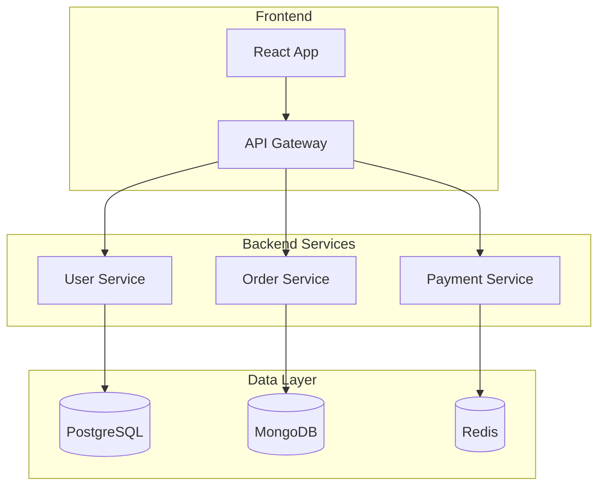

#### 2. Sequence Diagram
Use for: API interactions, service communication, user flows

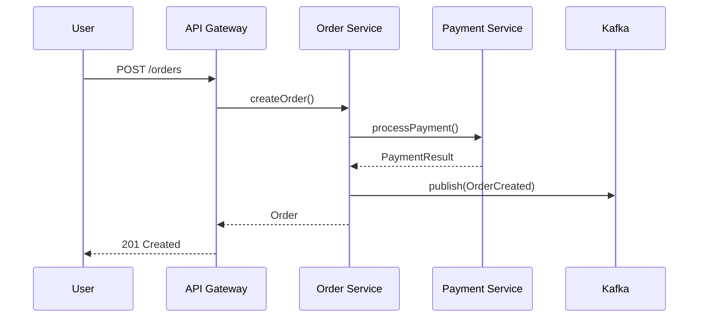

#### 3. Class Diagram
Use for: Domain models, data structures, entity relationships

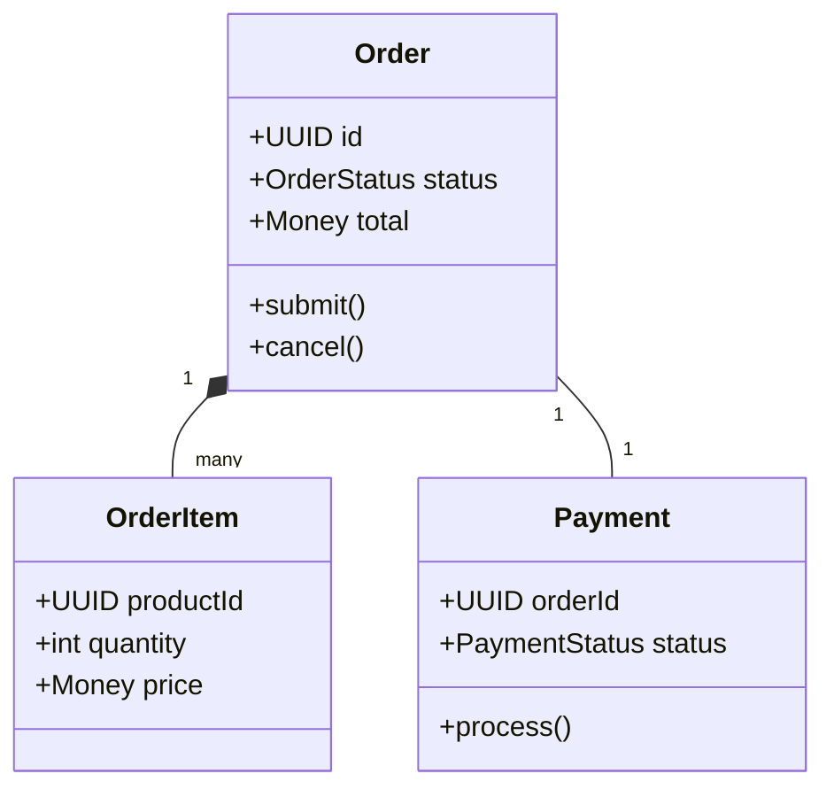

#### 4. State Diagram
Use for: Entity lifecycles, workflow states, state machines

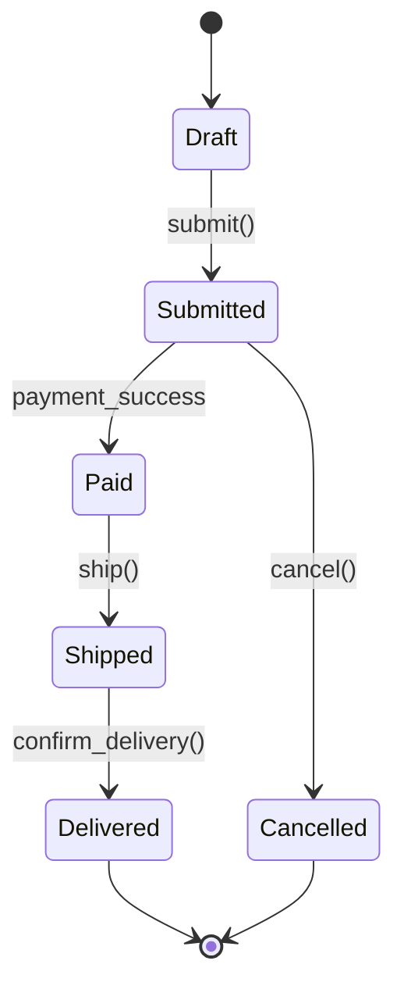

#### 5. ER Diagram
Use for: Database schema, entity relationships

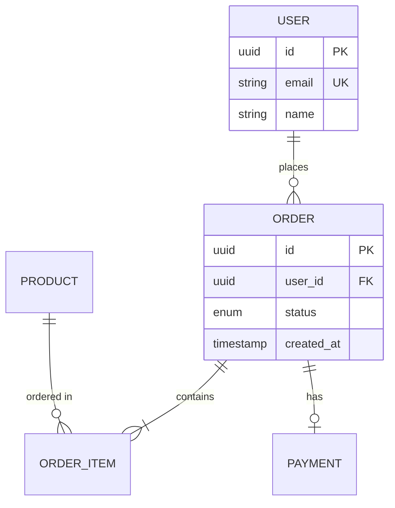

#### 6. C4 Diagrams (with C4 extension)
Use for: Architecture documentation at different zoom levels

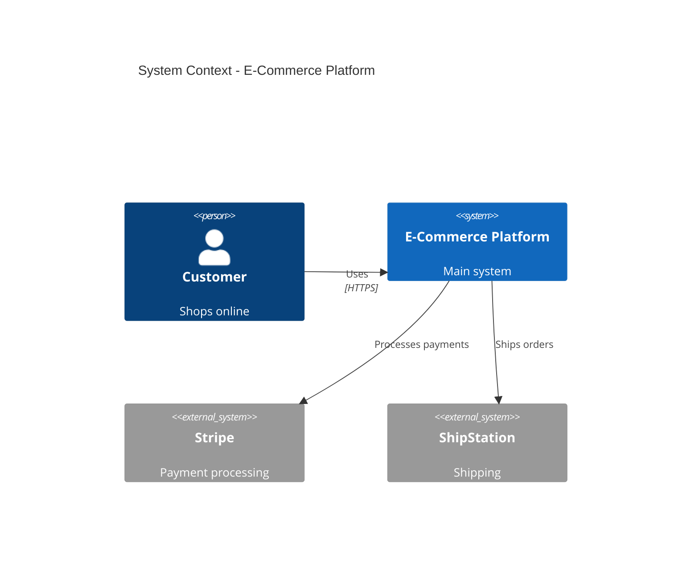

#### 7. Gantt Diagram
Use for: Project timelines, migration plans, release schedules

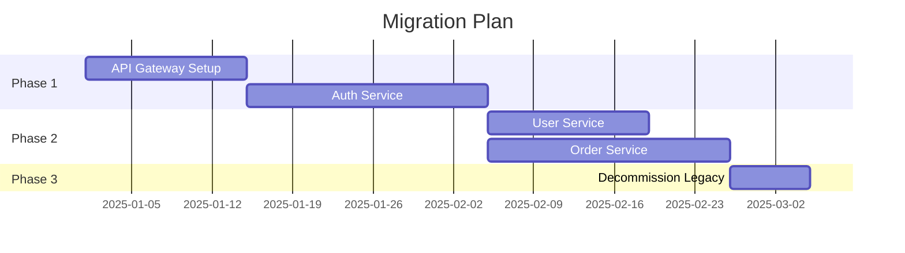

#### 8. Journey Diagram
Use for: User experience flows, customer journeys

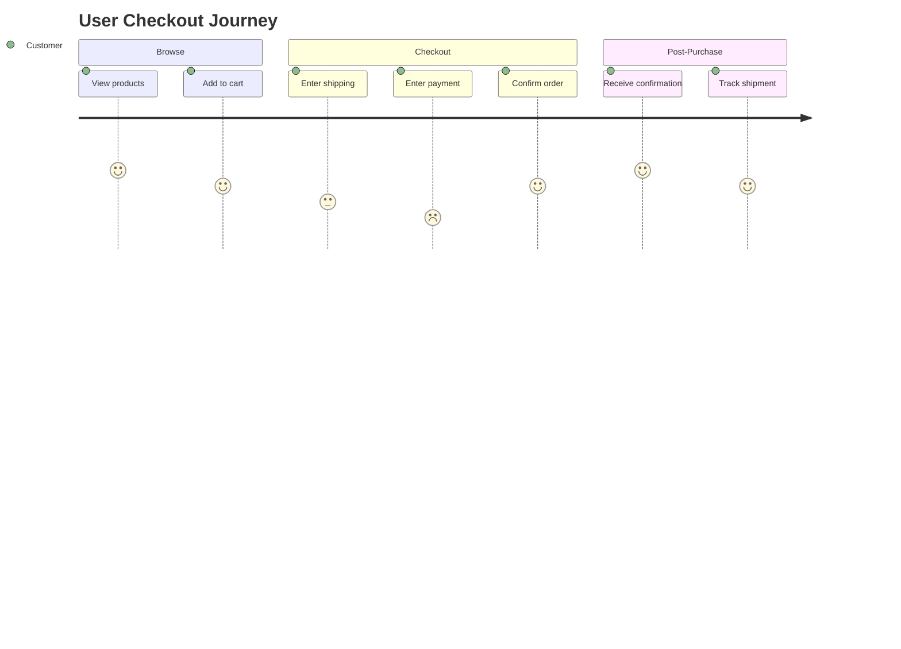

### Mermaid Best Practices

1. **Always include in documentation**: Every ADR, design doc, and architecture explanation must have at least one Mermaid diagram
2. **Use subgraphs for grouping**: Organize related components visually
3. **Add labels to relationships**: Describe what flows between components
4. **Keep diagrams focused**: One concept per diagram, split if too complex
5. **Use consistent styling**: Same colors/shapes for same component types
6. **Version with code**: Diagrams in markdown are version-controlled

### Diagram Selection Quick Reference

```
Need to show...                    → Use this diagram
─────────────────────────────────────────────────────
System overview                    → Flowchart with subgraphs
API call sequence                  → Sequence diagram
Database schema                    → ER diagram
Domain model                       → Class diagram
Entity lifecycle                   → State diagram
Project timeline                   → Gantt diagram
User flow                          → Journey or Sequence
Component dependencies             → Flowchart
Event-driven flow                  → Sequence diagram
Deployment topology                → Flowchart with subgraphs
Decision tree                      → Flowchart
```

---


## C4 Model Deep Dive

The C4 model provides a hierarchical approach to visualizing software architecture at different zoom levels. Created by Simon Brown.

### C4 Levels Overview

| Level | Name | Audience | Scope | Detail |
|-------|------|----------|-------|--------|
| 1 | System Context | Everyone | System + external entities | Very high |
| 2 | Container | Technical stakeholders | Applications, databases | High |
| 3 | Component | Developers | Internal structure | Medium |
| 4 | Code | Developers | Classes, interfaces | Low |

**Best Practice**: Most teams only need Levels 1 and 2. Use Level 3 for complex components. Level 4 is rarely needed (use IDE).

### Level 1: System Context Diagram

Shows your system as a black box, its users, and external systems.

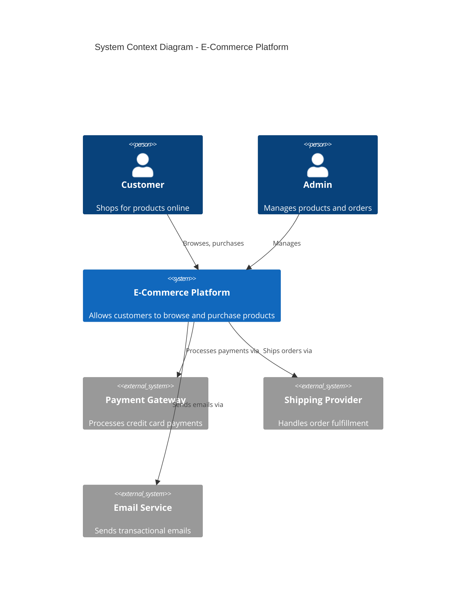

### Level 2: Container Diagram

Zooms into the system to show deployable units (applications, databases, message queues).

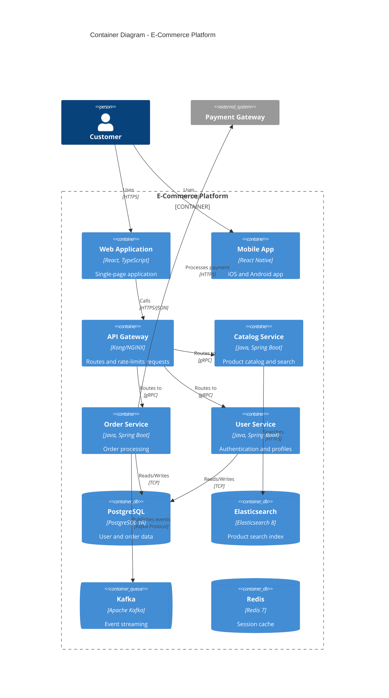

### Level 3: Component Diagram

Zooms into a single container to show its internal components.

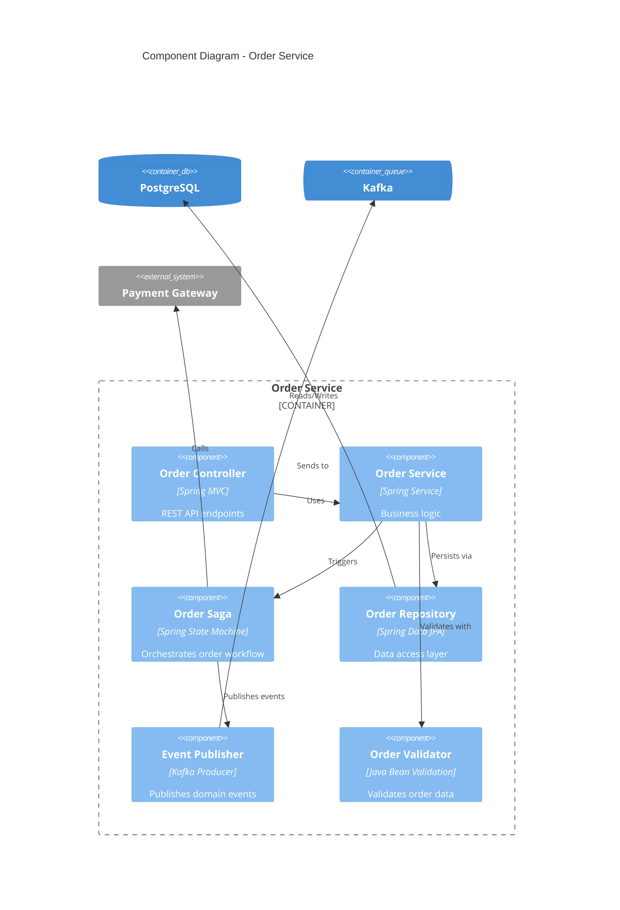

### Supplementary Diagrams

Beyond the four levels, C4 supports:

| Diagram | Purpose | When to Use |
|---------|---------|-------------|
| **System Landscape** | All systems in enterprise | Enterprise architecture |
| **Dynamic Diagram** | Runtime behavior for a scenario | Complex interactions |
| **Deployment Diagram** | Infrastructure and deployment | DevOps, capacity planning |

### C4 Best Practices

1. **Include descriptions**: Every element needs name, type, technology, and description
2. **Add a key/legend**: Explain colors, shapes, line styles
3. **Keep diagrams focused**: One responsibility per diagram
4. **Update regularly**: Diagrams should match reality
5. **Use tools**: Structurizr DSL, PlantUML, Mermaid for "diagrams as code"

---

## UML Diagrams

UML (Unified Modeling Language) remains valuable for detailed design documentation.

### Structural Diagrams

#### Class Diagram

Shows classes, attributes, methods, and relationships.

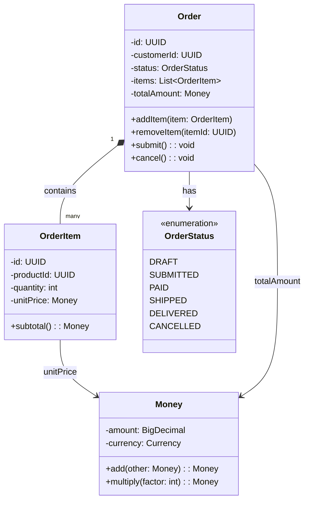

#### Component Diagram

Shows components and their interfaces.

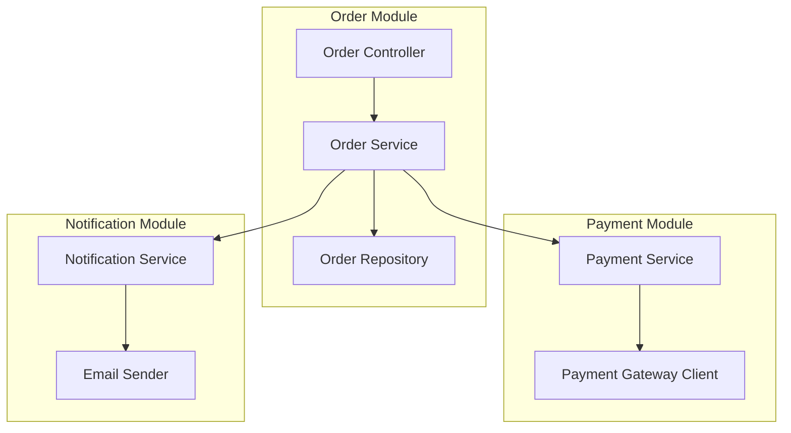

### Behavioral Diagrams

#### Sequence Diagram

Shows object interactions over time.

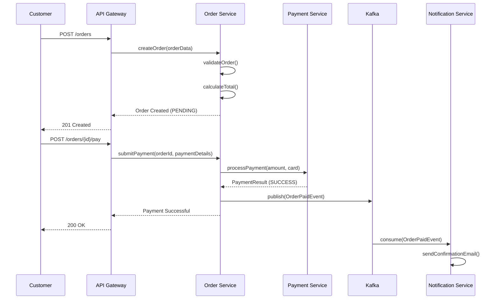

#### State Machine Diagram

Shows states and transitions.

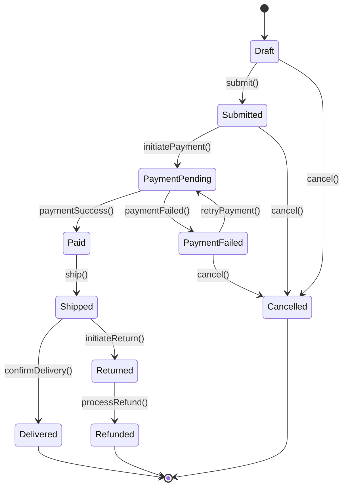

#### Activity Diagram

Shows workflow and parallel activities.

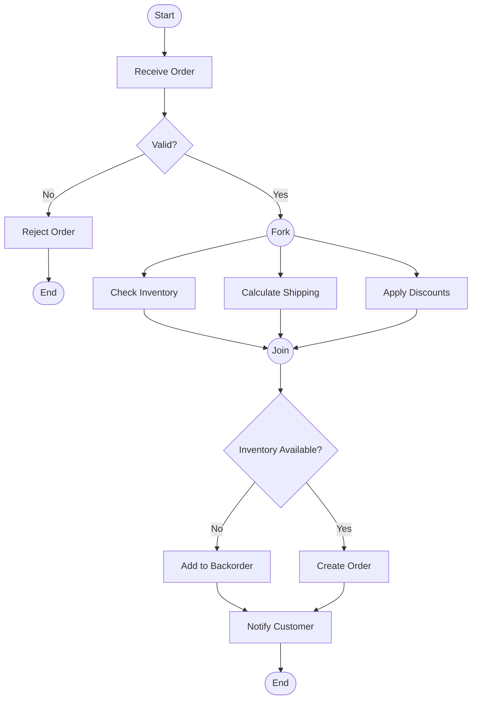

### UML Diagram Selection Guide

| Diagram | When to Use |
|---------|-------------|
| **Class** | Domain modeling, API contracts, data structures |
| **Sequence** | Complex interactions, API flows, debugging |
| **State Machine** | Entity lifecycles, workflow states |
| **Activity** | Business processes, parallel workflows |
| **Component** | Module dependencies, system structure |
| **Deployment** | Infrastructure, physical architecture |
| **Use Case** | Requirements gathering, stakeholder communication |

---

