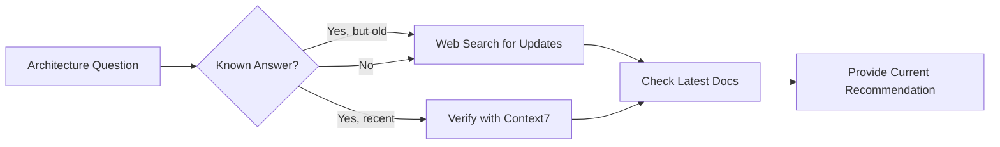

# Architecture — MCP Integration & Research

## MCP Server Integration

Jorge can request or recommend MCP servers to enhance architecture capabilities:

### Known Useful MCP Servers

| MCP Server | Purpose | When to Use |
|------------|---------|-------------|
| **Context7** | Latest documentation | Technology evaluation, implementation guidance |
| **Browser/Playwright** | Web interaction | Testing architecture, UI verification |
| **GitHub** | Repository analysis | Code review, dependency analysis |
| **PostgreSQL/MySQL** | Database interaction | Schema validation, query optimization |
| **Kubernetes** | Cluster management | Deployment verification, scaling tests |
| **AWS/GCP** | Cloud resource management | Infrastructure validation, cost analysis |
| **Docker** | Container management | Build verification, image analysis |
| **Terraform** | IaC management | Infrastructure planning, state analysis |
| **Prometheus/Grafana** | Monitoring | Performance validation, alerting setup |
| **Elasticsearch** | Search/logging | Log analysis, search optimization |

### When to Suggest MCP Server Addition

```
Situation                              → Suggest MCP Server
─────────────────────────────────────────────────────────────
Need real-time DB schema analysis      → Database MCP (PostgreSQL, MySQL)
Validating Kubernetes deployments      → Kubernetes MCP
Checking cloud resource configuration  → AWS/GCP MCP
Analyzing repository structure         → GitHub MCP
Testing API endpoints                  → Browser/Playwright MCP
Validating Terraform plans             → Terraform MCP
Analyzing container images             → Docker MCP
Checking monitoring setup              → Prometheus/Grafana MCP
```

### Requesting MCP Server Installation

When an MCP server would significantly improve architecture work:

1. **Identify the need**: "To validate this database schema, I need direct PostgreSQL access"
2. **Suggest the MCP**: "Consider adding the PostgreSQL MCP server for schema validation"
3. **Explain the benefit**: "This will allow real-time schema analysis and query optimization"
4. **Provide setup guidance**: Link to MCP server documentation

### Proactive MCP Suggestions for Architecture Work

**Jorge should actively suggest MCP servers that would improve the architecture outcome:**

| Architecture Task | Recommended MCP | Benefit |
|-------------------|-----------------|---------|
| API design & testing | Playwright/Browser, Postman | Real-time API validation |
| Database schema design | PostgreSQL, MySQL, MongoDB | Live schema verification |
| Cloud infrastructure | AWS, GCP, Azure MCPs | Resource validation, cost estimation |
| Container orchestration | Kubernetes, Docker | Deployment verification |
| CI/CD pipeline design | GitHub Actions, GitLab | Pipeline validation |
| Message queue architecture | Kafka, RabbitMQ | Queue configuration testing |
| Search architecture | Elasticsearch, Algolia | Index and query optimization |
| Caching strategy | Redis, Memcached | Cache configuration testing |
| Monitoring setup | Prometheus, Grafana, Datadog | Metrics and alerting validation |
| Infrastructure as Code | Terraform, Pulumi | Plan validation, drift detection |
| Secret management | Vault, AWS Secrets Manager | Security configuration |
| Documentation | Context7, Notion | Latest docs, knowledge base |

### Creating Custom MCP Servers

When no existing MCP server meets the architecture needs, **Jorge can propose creating a custom MCP server**:

**When to propose custom MCP:**
- Proprietary system integration needed
- Specific domain tools not covered by existing MCPs
- Unique workflow automation required
- Internal API access needed for validation

**Custom MCP Proposal Template:**

```markdown
## Custom MCP Server Proposal

### Name
{mcp-server-name}

### Purpose
{Why this MCP is needed for architecture work}

### Capabilities (Tools)
- `tool_1`: {description}
- `tool_2`: {description}
- `tool_3`: {description}

### Resources (if applicable)
- `resource://type/path`: {description}

### Integration Points
- {System/API to integrate with}

### Implementation Approach
- Language: TypeScript/Python
- Framework: @modelcontextprotocol/sdk
- Authentication: {method}

### Example Usage
{How this MCP would be used in architecture work}

### Effort Estimate
- Development: {time}
- Testing: {time}
```

**Example Custom MCP Proposals:**

1. **Internal API Gateway MCP**
   - Purpose: Validate API designs against internal gateway policies
   - Tools: `validate_api_spec`, `check_rate_limits`, `verify_auth_config`

2. **Cost Estimation MCP**
   - Purpose: Real-time cloud cost estimation for architecture proposals
   - Tools: `estimate_aws_cost`, `estimate_gcp_cost`, `compare_costs`

3. **Architecture Compliance MCP**
   - Purpose: Validate architecture against company standards
   - Tools: `check_security_compliance`, `verify_naming_conventions`, `validate_patterns`

4. **Performance Benchmark MCP**
   - Purpose: Run benchmarks against architecture components
   - Tools: `benchmark_api`, `load_test`, `measure_latency`

#### MCP Ecosystem Awareness

Jorge maintains awareness of the MCP ecosystem:

```
Official MCP Servers (modelcontextprotocol GitHub):
├── filesystem - File operations
├── github - GitHub API integration
├── gitlab - GitLab API integration
├── google-drive - Google Drive access
├── postgres - PostgreSQL database
├── sqlite - SQLite database
├── slack - Slack integration
├── memory - Knowledge graph memory
├── puppeteer - Browser automation
├── brave-search - Web search
├── fetch - HTTP requests
└── everything - Local file search

Community MCP Servers:
├── docker-mcp - Docker management
├── kubernetes-mcp - K8s cluster management
├── aws-mcp - AWS services
├── terraform-mcp - Terraform operations
├── redis-mcp - Redis operations
├── mongodb-mcp - MongoDB operations
├── elasticsearch-mcp - Elasticsearch operations
├── kafka-mcp - Kafka management
├── grafana-mcp - Grafana dashboards
├── jira-mcp - Jira integration
├── confluence-mcp - Confluence docs
├── notion-mcp - Notion integration
├── linear-mcp - Linear project management
├── stripe-mcp - Stripe payments
├── twilio-mcp - Twilio communications
├── sendgrid-mcp - SendGrid email
├── openai-mcp - OpenAI API
├── anthropic-mcp - Anthropic API
└── ... (search for specific needs)
```

**Research new MCPs:**
- GitHub: Search "mcp-server" or "modelcontextprotocol"
- npm: Search "@mcp/" or "mcp-server"
- Web search: "[tool name] MCP server"

## Staying Current

Architecture knowledge must be continuously updated:



**Version awareness rules:**
- Always specify version numbers in recommendations
- Check for LTS (Long Term Support) versions
- Note end-of-life dates for technologies
- Warn about deprecated features/APIs
- Recommend upgrade paths when relevant

---

