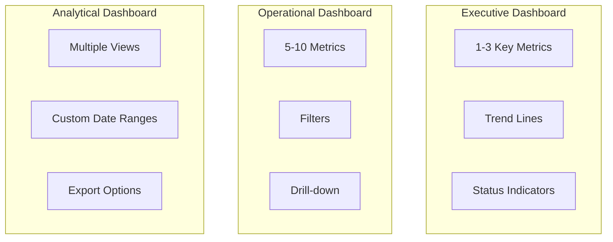
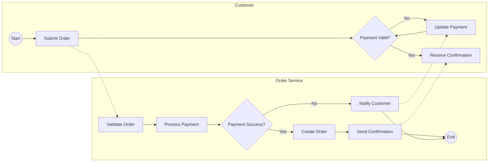
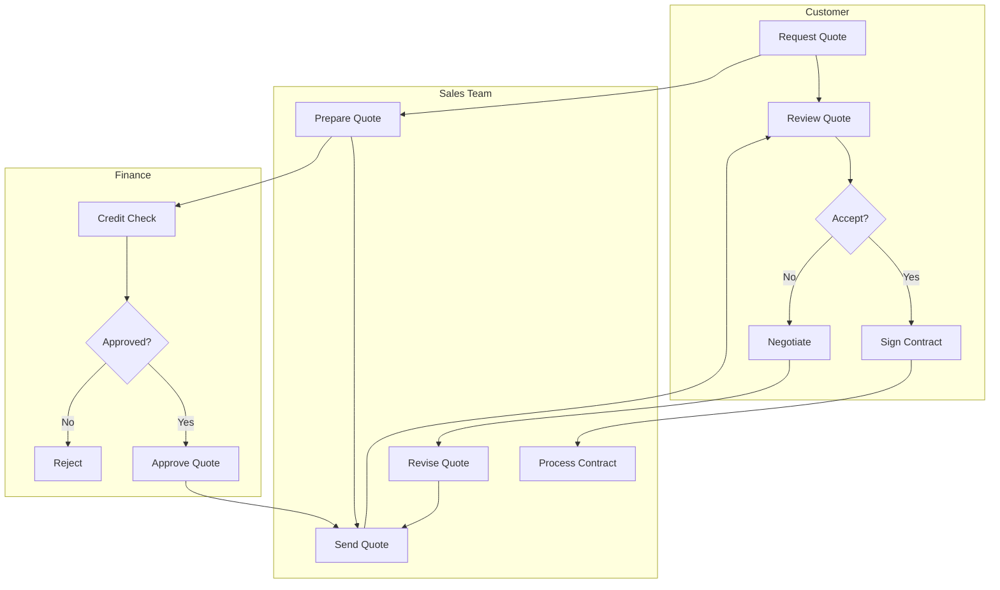
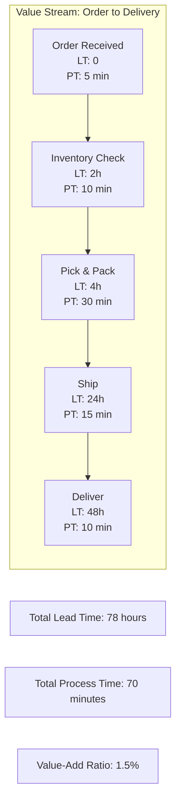

# BA — Data Analysis & Process Modeling (BPMN)

## Data Analysis & Visualization

### Statistical Methods for BA

| Method | When to Use | Example |
|--------|-------------|---------|
| **Descriptive stats** | Summarize data | Average order value, median response time |
| **Correlation** | Find relationships | Price vs. conversion rate |
| **Regression** | Predict outcomes | Revenue forecast based on marketing spend |
| **Cohort analysis** | Track groups over time | Retention by signup month |
| **Segmentation** | Group similar items | Customer segments by behavior |
| **A/B test analysis** | Compare variants | Landing page conversion |

### Key Formulas

```
Conversion Rate = (Conversions / Total Visitors) × 100

Churn Rate = (Customers Lost / Starting Customers) × 100

Customer Lifetime Value (CLV) = Average Revenue per Customer × Customer Lifespan

Customer Acquisition Cost (CAC) = Total Marketing Spend / New Customers Acquired

LTV:CAC Ratio = CLV / CAC  (Target: > 3:1)

Net Promoter Score (NPS) = % Promoters - % Detractors
```

### Data Visualization Selection

| Data Type | Best Chart | Avoid |
|-----------|------------|-------|
| **Comparison** | Bar chart, grouped bar | Pie chart for > 5 items |
| **Trend over time** | Line chart | 3D charts |
| **Part-to-whole** | Pie (< 5 items), stacked bar | Too many segments |
| **Distribution** | Histogram, box plot | Bar chart |
| **Relationship** | Scatter plot | Line chart |
| **Composition** | Stacked area, treemap | Too many categories |

### Dashboard Design Principles



**Dashboard Best Practices:**
- One page, one purpose
- Most important metric in top-left
- Use consistent color coding (green = good, red = bad)
- Show trends, not just current values
- Include comparison (vs. target, vs. last period)

---

## Business Process Modeling (BPMN 2.0)

### BPMN Core Elements

| Element | Symbol | Purpose |
|---------|--------|---------|
| **Start Event** | Circle | Process begins |
| **End Event** | Bold circle | Process ends |
| **Task** | Rounded rectangle | Work to be done |
| **Gateway (XOR)** | Diamond | Exclusive decision |
| **Gateway (AND)** | Diamond + | Parallel split/join |
| **Pool** | Container | Organization/participant |
| **Lane** | Horizontal division | Role within pool |
| **Sequence Flow** | Arrow | Order of activities |
| **Message Flow** | Dashed arrow | Communication between pools |

### Process Diagram with Mermaid



### Swimlane Diagram



### As-Is / To-Be Analysis

| Aspect | As-Is (Current) | To-Be (Future) | Gap |
|--------|-----------------|----------------|-----|
| **Process time** | 5 days | 1 day | -4 days |
| **Manual steps** | 12 | 3 | -9 steps |
| **Error rate** | 15% | 2% | -13% |
| **Cost per transaction** | $50 | $10 | -$40 |
| **Customer satisfaction** | 65% | 90% | +25% |

### Value Stream Mapping



**Key Metrics:**
- **Lead Time (LT)**: Total time from start to end
- **Process Time (PT)**: Actual work time (value-add)
- **Value-Add Ratio**: PT / LT × 100 (target: > 25%)

---

