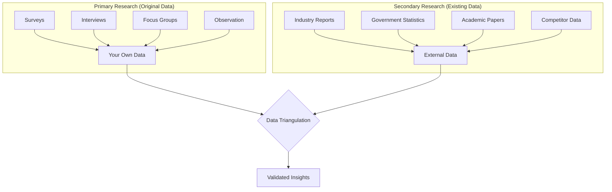
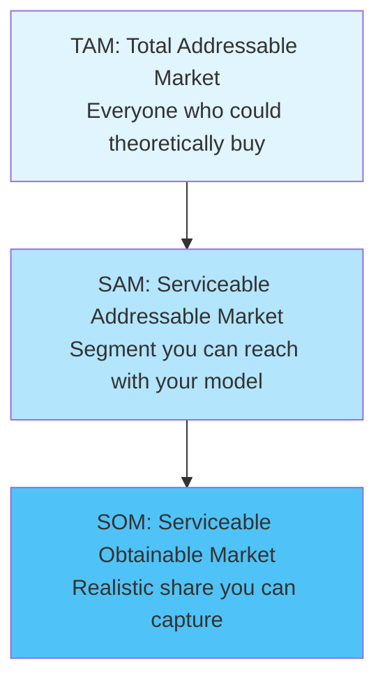
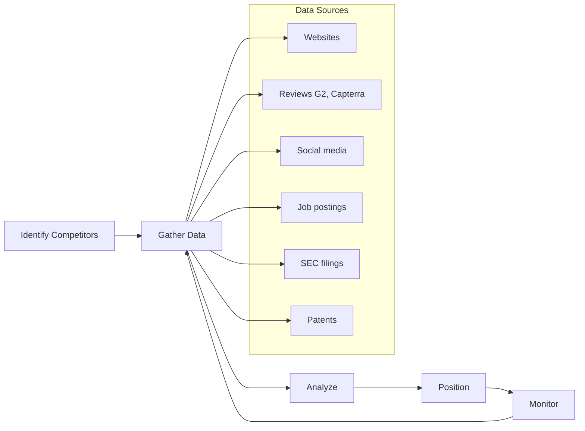

# BA — Market Research & Competitive Intelligence

## Market Research Deep Dive

### Research Methods Comparison

| Method | Type | Best For | Sample Size | Time |
|--------|------|----------|-------------|------|
| **Surveys** | Quantitative | Validation, sizing | 100-1000+ | Days-weeks |
| **Interviews** | Qualitative | Discovery, depth | 5-30 | Days-weeks |
| **Focus Groups** | Qualitative | Concept testing | 6-10 per group | Hours |
| **Observation** | Qualitative | Behavior understanding | Varies | Hours-days |
| **A/B Testing** | Quantitative | Optimization | 1000+ | Days-weeks |
| **Secondary Research** | Both | Context, benchmarks | N/A | Hours-days |

### Primary vs Secondary Research



### Survey Design Best Practices

| Element | Best Practice |
|---------|---------------|
| **Length** | < 10 minutes, 15-20 questions max |
| **Question types** | Mix of closed (70%) and open (30%) |
| **Scale** | 5-point Likert scale (strongly disagree → strongly agree) |
| **Order** | Easy → complex → sensitive → demographic |
| **Bias avoidance** | Neutral wording, randomize options |
| **Mobile-friendly** | 60%+ take surveys on mobile |

### Interview Guide Template

```markdown
## Interview Guide: {Topic}

### Metadata
- Duration: 45-60 minutes
- Format: Semi-structured
- Recording: Yes/No (with consent)

### Warm-up (5 min)
- Thank participant
- Explain purpose and confidentiality
- Get consent for recording

### Context Questions (10 min)
1. Tell me about your role and responsibilities
2. How long have you been doing {activity}?

### Core Questions (30 min)
1. Walk me through how you currently {process}
   - Probes: What works well? What's frustrating?
2. What are your biggest challenges with {topic}?
3. How do you currently solve {problem}?

### Concept Testing (10 min)
- Show prototype/concept
- What's your first reaction?
- What would make this useful for you?

### Wrap-up (5 min)
- Is there anything else you'd like to share?
- Can we follow up if needed?
- Thank participant
```

### Market Sizing (TAM/SAM/SOM)



**Calculation Methods:**

| Approach | Method | Best For |
|----------|--------|----------|
| **Top-down** | TAM × Market share % × Segment % | Quick estimates, investor pitches |
| **Bottom-up** | Units × Price × Customers | Operational planning, accuracy |
| **Value theory** | # of customers × Value per customer | New markets, disruptive products |

**Example (B2B SaaS):**
```
TAM: All businesses globally = $50B
SAM: SMBs in English-speaking markets = $8B
SOM: 2% market share Year 3 = $160M
```

---

## Competitive Intelligence

### Competitor Analysis Framework



### Competitive Intelligence Sources

| Source | Insights Available | Reliability |
|--------|-------------------|-------------|
| **Company website** | Positioning, features, pricing | High |
| **G2/Capterra reviews** | Strengths, weaknesses, use cases | Medium-High |
| **LinkedIn** | Team size, hiring trends, culture | High |
| **Job postings** | Technology stack, priorities | High |
| **Crunchbase** | Funding, investors, growth | High |
| **SEC filings (10-K)** | Revenue, strategy, risks | Very High |
| **Press releases** | Partnerships, launches | Medium |
| **Social media** | Sentiment, engagement | Medium |
| **Patent filings** | Innovation direction | High |

### Battlecard Template

```markdown
## Competitive Battlecard: {Competitor Name}

### Quick Facts
| Attribute | Details |
|-----------|---------|
| Founded | {year} |
| HQ | {location} |
| Employees | {count} |
| Funding | {total raised} |
| Revenue (est.) | ${X}M ARR |

### Positioning
**Their tagline:** "{tagline}"
**Target customer:** {ICP}
**Primary use case:** {use case}

### Strengths (Why they win)
1. {strength 1} - Counter: {our response}
2. {strength 2} - Counter: {our response}

### Weaknesses (Why they lose)
1. {weakness 1} - Exploit: {our advantage}
2. {weakness 2} - Exploit: {our advantage}

### Feature Comparison
| Feature | Us | Them | Notes |
|---------|-----|------|-------|
| {feature} | Yes/No/Partial | Yes/No/Partial | {context} |

### Pricing Comparison
| Tier | Us | Them |
|------|-----|------|
| Entry | ${X}/mo | ${Y}/mo |
| Pro | ${X}/mo | ${Y}/mo |
| Enterprise | Custom | Custom |

### Win/Loss Patterns
**We win when:**
- {pattern 1}
- {pattern 2}

**We lose when:**
- {pattern 1}
- {pattern 2}

### Objection Handling
**"Competitor has feature X"**
→ Response: {talking point}

**"Competitor is cheaper"**
→ Response: {talking point}
```

### Win/Loss Analysis Framework

| Data Point | Source | Questions |
|------------|--------|-----------|
| **Deal outcome** | CRM | Won/Lost/No decision |
| **Competitor** | Sales notes | Who did we compete against? |
| **Decision criteria** | Exit interview | What mattered most? |
| **Strengths cited** | Exit interview | What did they like about us? |
| **Weaknesses cited** | Exit interview | What concerns did they have? |
| **Pricing feedback** | Exit interview | Was price a factor? |
| **Timeline** | CRM | How long was the sales cycle? |

---

