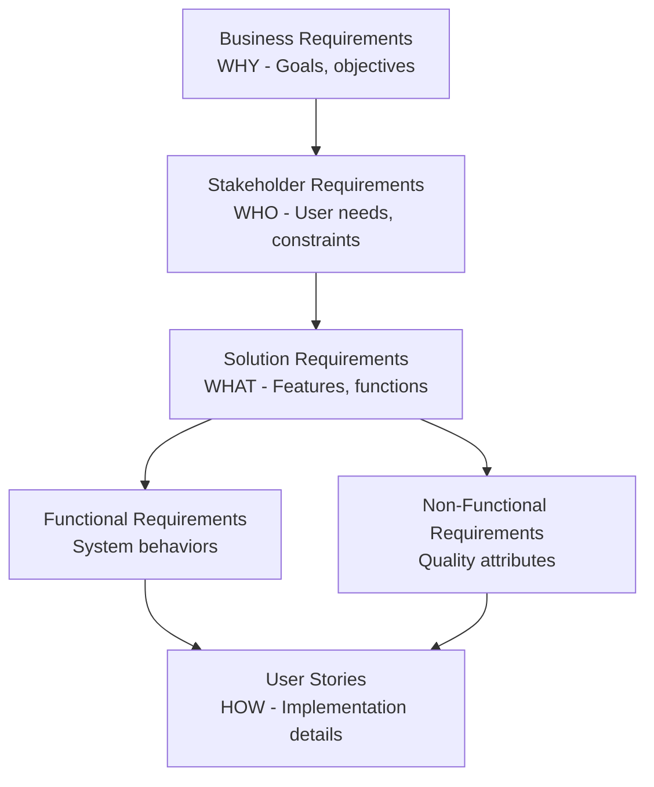

# BA — Requirements Engineering & Financial Analysis

## Requirements Engineering

### Requirements Hierarchy



### User Story Format (INVEST)

```markdown
## US-{ID}: {Title}

**As a** {user type/persona}
**I want** {goal/action}
**So that** {benefit/value}

### Acceptance Criteria

**Scenario 1: {Happy path}**
- **Given** {initial context}
- **When** {action performed}
- **Then** {expected outcome}

**Scenario 2: {Edge case}**
- **Given** {context}
- **When** {action}
- **Then** {outcome}

### Definition of Done
- [ ] Acceptance criteria met
- [ ] Unit tests written (> 80% coverage)
- [ ] Code reviewed
- [ ] Documentation updated
- [ ] PO accepted
```

**INVEST Criteria:**

| Letter | Meaning | Check |
|--------|---------|-------|
| **I** | Independent | Can be developed in any order |
| **N** | Negotiable | Details can be discussed |
| **V** | Valuable | Delivers value to users |
| **E** | Estimable | Team can estimate effort |
| **S** | Small | Fits in a sprint |
| **T** | Testable | Has clear pass/fail criteria |

### Acceptance Criteria Formats

**1. Given/When/Then (Gherkin)**
```gherkin
Scenario: Successful login
  Given I am on the login page
  And I have a valid account
  When I enter correct credentials
  And I click "Login"
  Then I should be redirected to the dashboard
  And I should see a welcome message
```

**2. Checklist Format**
```markdown
- [ ] User can enter email and password
- [ ] Validation errors shown for invalid input
- [ ] "Forgot password" link is visible
- [ ] Session persists for 24 hours
- [ ] Failed attempts are logged
```

**3. Rule-Based Format**
```markdown
- Email must be valid format (contains @ and domain)
- Password minimum 8 characters
- Maximum 5 login attempts before lockout
- Lockout duration: 15 minutes
```

### Requirements Traceability Matrix (RTM)

| Req ID | Requirement | User Story | Test Case | Status |
|--------|-------------|------------|-----------|--------|
| BR-001 | Users can register | US-101, US-102 | TC-101, TC-102 | Implemented |
| BR-002 | Users can login | US-103 | TC-103, TC-104 | In Progress |
| BR-003 | Password reset | US-104 | TC-105 | Planned |

### MoSCoW Prioritization

| Priority | Meaning | Rule |
|----------|---------|------|
| **Must Have** | Critical for launch | ~60% of effort |
| **Should Have** | Important but not critical | ~20% of effort |
| **Could Have** | Nice to have | ~20% of effort |
| **Won't Have** | Out of scope (this release) | Documented for later |

---

## Financial Analysis

### Key Financial Metrics

| Metric | Formula | Decision Rule |
|--------|---------|---------------|
| **ROI** | (Gain - Cost) / Cost × 100 | > 0% is profitable |
| **NPV** | Σ (Cash Flow / (1+r)^t) - Initial Investment | > 0 is good |
| **IRR** | Rate where NPV = 0 | > Hurdle rate is good |
| **Payback Period** | Initial Investment / Annual Cash Flow | < Target years |
| **TCO** | Purchase + Operating + Maintenance + Disposal | Lower is better |

### NPV Calculation Example

```
Initial Investment: $100,000
Discount Rate: 10%
Cash Flows:
  Year 1: $30,000
  Year 2: $40,000
  Year 3: $50,000
  Year 4: $40,000

NPV = -$100,000 + $30,000/(1.1)^1 + $40,000/(1.1)^2 + $50,000/(1.1)^3 + $40,000/(1.1)^4
NPV = -$100,000 + $27,273 + $33,058 + $37,566 + $27,321
NPV = $25,218

Decision: NPV > 0, project is financially viable
```

### Business Case Template

```markdown
## Business Case: {Project Name}

### Executive Summary
{2-3 paragraph overview of opportunity, solution, and expected outcomes}

### Problem Statement
- Current state: {description}
- Pain points: {list}
- Cost of inaction: ${X}/year

### Proposed Solution
- Description: {what we will build/buy/do}
- Scope: {in/out of scope}
- Timeline: {duration}

### Financial Analysis

#### Costs
| Category | Year 0 | Year 1 | Year 2 | Year 3 |
|----------|--------|--------|--------|--------|
| Development | $X | - | - | - |
| Infrastructure | - | $X | $X | $X |
| Operations | - | $X | $X | $X |
| Training | $X | - | - | - |
| **Total** | $X | $X | $X | $X |

#### Benefits
| Benefit | Year 1 | Year 2 | Year 3 |
|---------|--------|--------|--------|
| Revenue increase | $X | $X | $X |
| Cost savings | $X | $X | $X |
| Efficiency gains | $X | $X | $X |
| **Total** | $X | $X | $X |

#### Financial Metrics
| Metric | Value |
|--------|-------|
| NPV (10% discount) | ${X} |
| IRR | X% |
| Payback Period | X months |
| 3-Year ROI | X% |

### Risk Assessment
| Risk | Probability | Impact | Mitigation |
|------|-------------|--------|------------|
| {risk} | High/Med/Low | High/Med/Low | {plan} |

### Recommendation
{Clear recommendation with rationale}

### Next Steps
1. {action item}
2. {action item}
```

### Sensitivity Analysis

| Variable | Base Case | -20% | +20% | Impact on NPV |
|----------|-----------|------|------|---------------|
| Revenue | $1M | $800K | $1.2M | High |
| Development Cost | $200K | $160K | $240K | Medium |
| Discount Rate | 10% | 8% | 12% | Medium |
| Timeline | 12 mo | 10 mo | 14 mo | Low |

---

