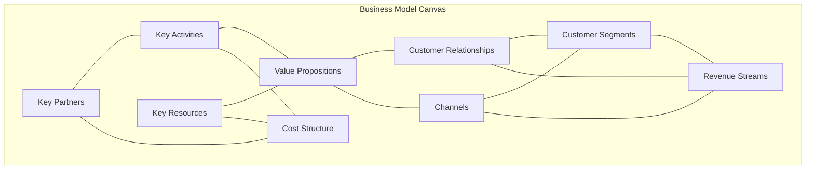
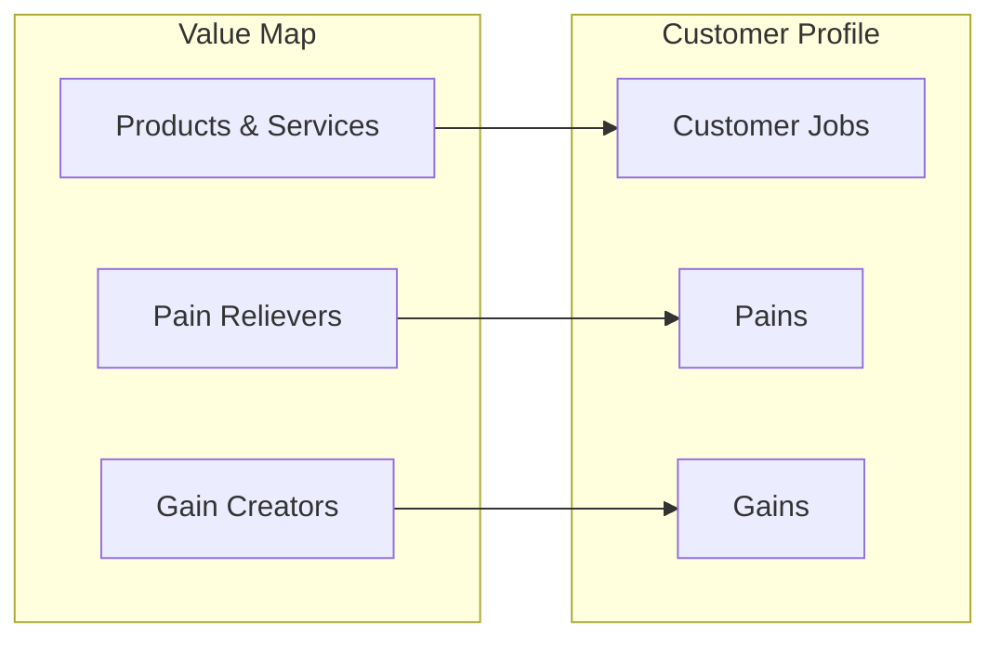
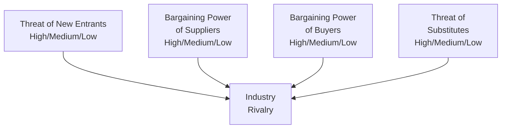
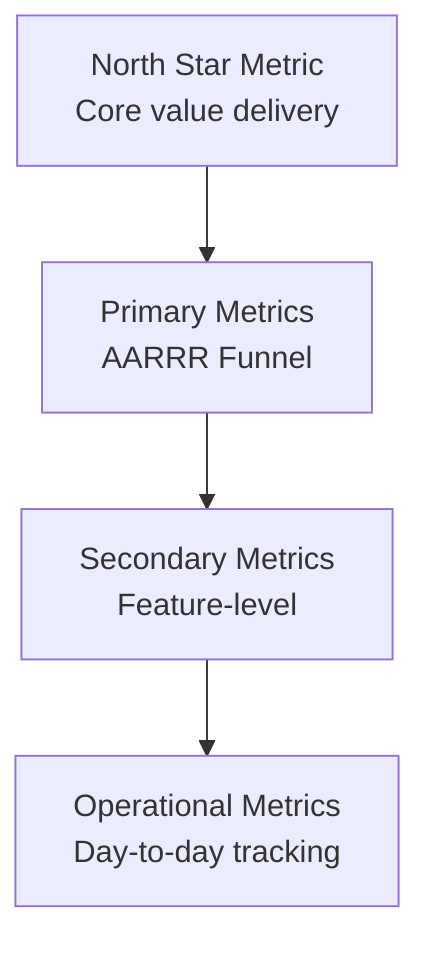
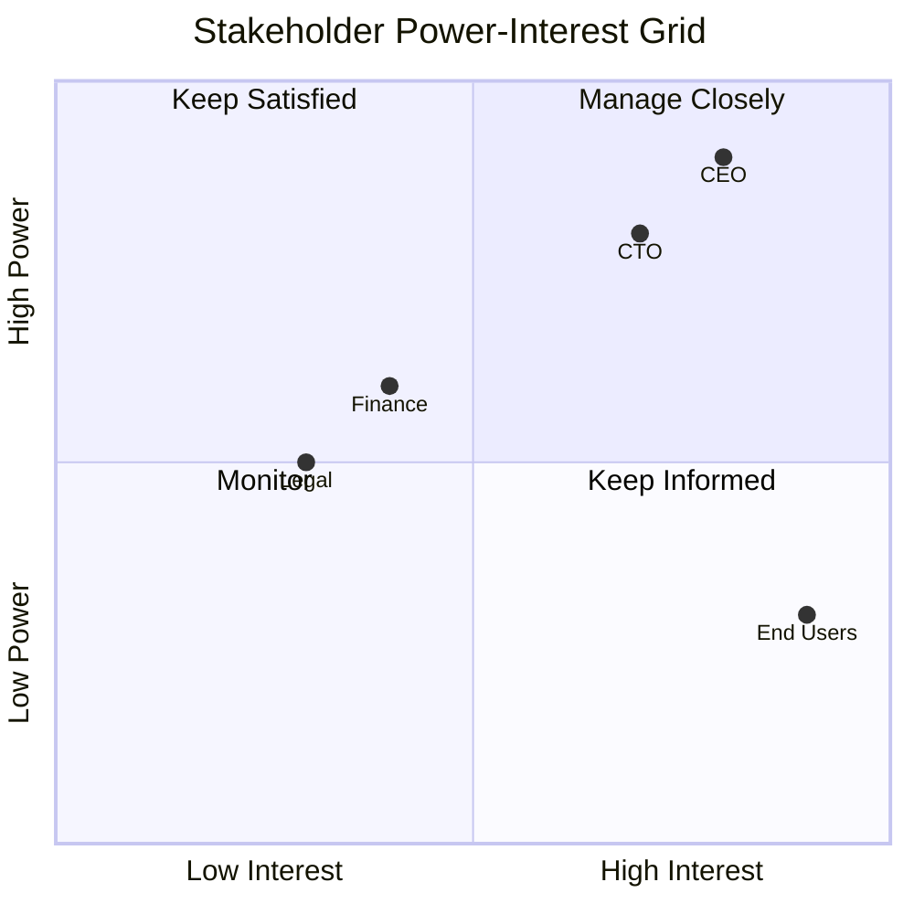

# BA — User Research, Strategy, Metrics & Stakeholders

## User Research & UX Analysis

### Persona Template

```markdown
## Persona: {Name}

### Demographics
- **Age:** {range}
- **Role:** {job title}
- **Company size:** {employees}
- **Industry:** {sector}

### Goals
1. {primary goal}
2. {secondary goal}

### Pain Points
1. {frustration 1}
2. {frustration 2}

### Behaviors
- Tools used: {list}
- Information sources: {list}
- Decision process: {description}

### Quote
> "{Representative quote that captures their perspective}"

### Scenario
{Brief story of how they would use the product}
```

### Customer Journey Map

```mermaid
flowchart LR
    subgraph Awareness
        A1[Discovers problem]
        A2[Researches solutions]
    end

    subgraph Consideration
        B1[Evaluates options]
        B2[Requests demo]
    end

    subgraph Decision
        C1[Compares pricing]
        C2[Gets approval]
        C3[Signs contract]
    end

    subgraph Onboarding
        D1[Account setup]
        D2[Training]
        D3[First use]
    end

    subgraph Retention
        E1[Regular use]
        E2[Support]
        E3[Renewal]
    end

    Awareness --> Consideration --> Decision --> Onboarding --> Retention
```



### Journey Map Template

| Stage | Actions | Thoughts | Emotions | Pain Points | Opportunities |
|-------|---------|----------|----------|-------------|---------------|
| Awareness | {actions} | {thoughts} | {emoji} | {pains} | {opportunities} |
| Consideration | {actions} | {thoughts} | {emoji} | {pains} | {opportunities} |
| Purchase | {actions} | {thoughts} | {emoji} | {pains} | {opportunities} |
| Onboarding | {actions} | {thoughts} | {emoji} | {pains} | {opportunities} |
| Usage | {actions} | {thoughts} | {emoji} | {pains} | {opportunities} |

### Jobs-to-be-Done (JTBD) Framework

**Job Statement Format:**
```
When {situation}, I want to {motivation}, so I can {expected outcome}.
```

**Example:**
```
When I'm preparing for a board meeting, I want to quickly generate
accurate financial reports, so I can confidently answer questions
about company performance.
```

**JTBD Interview Questions:**
1. Tell me about the last time you {did the job}
2. What triggered you to look for a solution?
3. What alternatives did you consider?
4. What made you choose the solution you used?
5. What would make this easier?

---

## Strategic Frameworks

### Business Model Canvas



### Value Proposition Canvas



### SWOT Analysis Template

```markdown
## SWOT Analysis: {Subject}

### Internal Factors

| Strengths | Weaknesses |
|-----------|------------|
| + {strength 1} | - {weakness 1} |
| + {strength 2} | - {weakness 2} |

### External Factors

| Opportunities | Threats |
|---------------|---------|
| + {opportunity 1} | - {threat 1} |
| + {opportunity 2} | - {threat 2} |

### Strategic Implications
- **SO Strategy** (Strengths + Opportunities): {strategy}
- **WO Strategy** (Weaknesses + Opportunities): {strategy}
- **ST Strategy** (Strengths + Threats): {strategy}
- **WT Strategy** (Weaknesses + Threats): {strategy}
```

### Porter's Five Forces



### Other Strategic Frameworks

| Framework | Purpose | When to Use |
|-----------|---------|-------------|
| **PESTLE** | External environment analysis | Market entry, strategy planning |
| **Ansoff Matrix** | Growth strategy | Product/market decisions |
| **BCG Matrix** | Portfolio analysis | Resource allocation |
| **Blue Ocean** | Create new market space | Innovation strategy |
| **Lean Canvas** | Startup business model | Early-stage ventures |
| **McKinsey 7S** | Organizational alignment | Change management |

---

## Metrics & KPIs

### Metric Hierarchy



### AARRR (Pirate Metrics)

| Stage | Metric | Example | Target |
|-------|--------|---------|--------|
| **A**cquisition | New visitors/signups | Website visitors | 10K/month |
| **A**ctivation | Users completing key action | Completed onboarding | 60% |
| **R**etention | Users returning | Day-7 retention | 40% |
| **R**evenue | Paying users | Conversion to paid | 5% |
| **R**eferral | Users inviting others | Referral rate | 15% |

### Leading vs Lagging Indicators

| Lagging (Outcome) | Leading (Predictive) |
|-------------------|---------------------|
| Revenue | Pipeline generated |
| Churn rate | Product usage decline |
| Customer satisfaction | Support ticket volume |
| Market share | Brand awareness |
| Employee turnover | Employee engagement |

### KPI Definition Template

```markdown
## KPI: {Name}

### Definition
- **What it measures:** {description}
- **Formula:** {calculation}
- **Data source:** {where data comes from}

### Targets
| Period | Target | Stretch |
|--------|--------|---------|
| Q1 | X | Y |
| Q2 | X | Y |

### Owner
- **Responsible:** {role}
- **Accountable:** {executive}

### Review Cadence
- Weekly: Operational review
- Monthly: Trend analysis
- Quarterly: Target adjustment
```

---

## Stakeholder Management

### Stakeholder Analysis Grid



### RACI Matrix

| Activity | Product Owner | Business Analyst | Developer | QA | Stakeholder |
|----------|---------------|------------------|-----------|-----|-------------|
| Define requirements | A | R | C | C | I |
| Write user stories | C | R | C | I | I |
| Estimate effort | I | C | R | C | I |
| Accept delivery | R | C | I | A | I |

**R** = Responsible, **A** = Accountable, **C** = Consulted, **I** = Informed

### Communication Plan

| Stakeholder | Interest | Preferred Channel | Frequency | Content |
|-------------|----------|-------------------|-----------|---------|
| Executive sponsor | Progress, risks | Email summary | Weekly | Dashboard, blockers |
| Product owner | Details, decisions | Slack, meetings | Daily | Status, questions |
| Development team | Requirements | Jira, standups | Daily | Stories, clarifications |
| End users | Impact | Newsletter | Monthly | Features, timeline |

### Managing Difficult Stakeholders

| Challenge | Strategy |
|-----------|----------|
| **Scope creep** | Document original scope, show impact of changes |
| **Unavailable** | Schedule recurring meetings, async updates |
| **Conflicting priorities** | Escalate to governance, data-driven prioritization |
| **Resistant to change** | Find early wins, involve in solution design |
| **Over-involved** | Set clear boundaries, regular updates |

---

