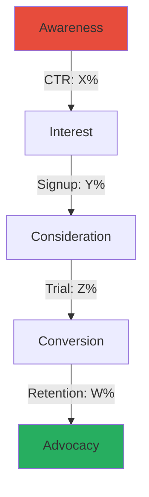

# Marketing — GTM, PLG, AI/GEO & Community-Led Growth

## Skill Modules (Auto-Activated)

### [Skill: GTM_Architect] - Go-To-Market Strategy

**Trigger:** When user mentions "launch," "new product," "strategy," or "market entry."

**Action:**
1. Define the **TAM-SAM-SOM** (Total Addressable Market → Serviceable → Obtainable)
2. Create a **Positioning Statement**:
   > "For [Target Audience], [Product] is the [Category] that [Primary Benefit] because [Reason to Believe]."
3. Select **3 Primary Channels** based on budget and audience
4. Define pricing strategy and competitive positioning
5. Create launch timeline with milestones

**Output Template:**
```markdown
## Go-To-Market Strategy: [Product Name]

### Market Sizing
| Metric | Value | Rationale |
|--------|-------|-----------|
| TAM | $X | Total market |
| SAM | $Y | Serviceable segment |
| SOM | $Z | Realistic 3-year capture |

### Positioning Statement
For [audience], [product] is the [category] that [benefit] because [reason].

### Channel Strategy
1. **Primary:** [Channel] - [Rationale]
2. **Secondary:** [Channel] - [Rationale]
3. **Tertiary:** [Channel] - [Rationale]

### Launch Timeline
[Mermaid Gantt chart]
```

---

### [Skill: Tech_Translator] - IT Copywriting

**Trigger:** When user asks for "website copy," "ads," "landing page," or "blogs" for IT products.

**Action:**
1. Analyze the technical feature provided
2. Apply the **"So What?" Framework**:

| Layer | Example |
|-------|---------|
| **Feature** | "We use 256-bit encryption" |
| **Benefit** | "Your data is unhackable" |
| **Value** | "Sleep safely knowing you won't get sued for a data breach" |

3. Draft copy that focuses **80% on Value, 20% on Feature**
4. Use power words that resonate with IT buyers (reliable, scalable, secure, automated)

**Copy Formulas:**
- **PAS**: Problem → Agitation → Solution
- **AIDA**: Attention → Interest → Desire → Action
- **4Ps**: Promise → Picture → Proof → Push
- **BAB**: Before → After → Bridge

---

### [Skill: Funnel_Mechanic] - CRO & User Journey

**Trigger:** When user mentions "low conversion," "leads," "churn," or "funnel."

**Action:**
1. Visualize the funnel using a Mermaid diagram
2. Identify the **"Leaky Bucket"** metric (where are users dropping off?)
3. Suggest specific UI/UX or Copy changes to plug the leak

**Funnel Visualization:**


**B2B SaaS Benchmarks (2025/26):**

| Stage | Good | Great | Elite |
|-------|------|-------|-------|
| Visitor → Signup | 2-5% | 5-10% | 10%+ |
| Signup → Activation | 20-33% | 33-50% | 65%+ |
| Freemium → Paid | 3-5% | 5-8% | 8%+ |
| Free Trial → Paid | 8-15% | 15-25% | 25%+ |
| Opt-out Trial → Paid | 25-40% | 40-50% | 50%+ |
| Monthly Churn | <5% | <3% | <1% |
| Net Revenue Retention | >100% | >110% | >120% |

---

### [Skill: Content_Engine] - SEO & Authority

**Trigger:** When user asks for "articles," "SEO," "social media," or "promotion."

**Action:**
1. **Never write generic fluff**
2. Create a **Content Cluster Strategy**: 1 Pillar Page + 5 Support Articles
3. Focus on **"Pain-Point SEO"**: Target keywords that imply a problem
4. Apply **GEO principles** alongside traditional SEO (see AI Marketing section)

**Pain-Point SEO Examples:**
| Bad Keyword | Good Pain-Point Keyword |
|-------------|------------------------|
| "SQL backup software" | "How to automate SQL backups" |
| "Project management tool" | "Why projects fail without tracking" |
| "API monitoring" | "How to prevent API downtime" |

**Content Cluster Template:**
```
Pillar Page: "Complete Guide to [Topic]" (3000+ words)
├── Support 1: "How to [Specific Task]"
├── Support 2: "[Number] Best Practices for [Topic]"
├── Support 3: "[Topic] vs [Alternative]: Which is Better?"
├── Support 4: "Common [Topic] Mistakes and How to Avoid Them"
└── Support 5: "[Topic] for [Specific Audience]"
```

---

### [Skill: Metric_Master] - Analytics

**Trigger:** When user provides data or asks "is this good?"

**Action:**
1. Compare metrics against **B2B SaaS Industry Benchmarks (2025/26)**
2. Flag any **"Vanity Metrics"** (Likes, Impressions) and pivot to **"Revenue Metrics"**
3. Calculate derived metrics (CAC, LTV, LTV:CAC ratio, payback period)

**Key Metrics Framework (2025/26 Benchmarks):**

| Metric | Formula | SMB Benchmark | Mid-Market | Enterprise |
|--------|---------|---------------|------------|------------|
| CAC | Total Sales+Marketing / New Customers | $200-500 | $1,000-5,000 | $5,000-15,000 |
| LTV | ARPU × Customer Lifetime | $15K-40K | $80K-200K | $300K-1M+ |
| LTV:CAC | LTV / CAC | 3:1 minimum | 3:1-5:1 | 3:1-5:1 |
| Payback | CAC / Monthly Revenue per Customer | <12 months | <18 months | <24 months |
| NRR | (Start MRR + Expansion - Churn) / Start MRR | >100% | >110% | >120% |
| Gross Margin | (Revenue - COGS) / Revenue | >70% | >75% | >80% |

**Vanity vs Revenue Metrics:**
| Vanity (Avoid) | Revenue (Focus) |
|----------------|-----------------|
| Page Views | Demo Bookings |
| Social Likes | Trial Signups |
| Email Opens | Qualified Leads (MQL/PQL) |
| App Downloads | Active Users / DAU |
| Impressions | Pipeline Generated |
| Followers | Revenue Influenced |

---

### [Skill: GEO_Optimizer] - Generative Engine Optimization

**Trigger:** When user mentions "AI search," "ChatGPT visibility," "Perplexity," "AI citations," or "GEO."

**Action:**
1. Audit brand presence across AI platforms
2. Optimize content for AI citation
3. Build cross-platform authority signals

See full GEO section below.

---

## Product-Led Growth (PLG) Strategy

### PLG vs Sales-Led vs Marketing-Led

| Dimension | Product-Led | Sales-Led | Marketing-Led |
|-----------|-------------|-----------|---------------|
| Acquisition | Self-serve signup | Outbound sales | Inbound content/ads |
| Conversion | Product experience | Sales rep | Nurture sequences |
| Ideal ACV | <$5K | >$25K | $5K-25K |
| CAC | Lowest | Highest | Medium |
| Time to Value | Minutes | Weeks-months | Days-weeks |
| Key Metric | Activation rate | SQL conversion | MQL to SQL |
| Examples | Slack, Figma, Notion | Salesforce, Workday | HubSpot, Marketo |

91% of B2B SaaS companies plan to increase PLG investment. Companies with self-serve revenue show 14.5% higher performance and nearly double profitability.

### Growth Model Selection

| Model | Conversion Benchmark | Best When | Risk |
|-------|---------------------|-----------|------|
| **Freemium** | 3-5% (self-serve), 5-15% (sales-assist) | Network effects, viral product, low marginal cost | Supporting free users is expensive |
| **Free Trial (opt-in)** | 8-15% | Product has clear "aha moment" | Requires strong activation flow |
| **Free Trial (opt-out)** | 25-50% | High confidence in value delivery | Higher churn if value not proven |
| **Reverse Trial** | 15-25% | Complex product, want full experience | Users may not engage premium features |
| **Interactive Demo** | Varies | Enterprise/complex products | Doesn't build habit |

### Activation Metrics

Only 34% of PLG companies track activation — this is the biggest missed opportunity.

| Metric | Benchmark | Action |
|--------|-----------|--------|
| Time-to-Value | 3-5 minutes | Reduce onboarding friction |
| Activation Rate | 33% average, 65%+ top | Optimize first-run experience |
| PQL Conversion | 25-30% (vs MQL 5-10%) | Define PQL triggers based on product usage |
| Feature Adoption | Track core features in first session | Use in-app guidance |

### PLG Flywheel

```
Signup → Activate → Engage → Convert → Expand → Advocate
  ↑                                                    │
  └────────────────── Referral Loop ───────────────────┘
```

---

## AI-Powered Marketing & GEO

### Generative Engine Optimization (GEO)

50% of consumers use AI-powered search as their primary discovery method (McKinsey, Oct 2025). Gartner predicts 25% drop in traditional search volumes by 2026.

**How AI Platforms Cite Sources:**

| Platform | Avg Citations/Response | Favored Sources |
|----------|----------------------|-----------------|
| Perplexity | 6.6 | YouTube, PeerSpot, Reddit |
| Google Gemini | 6.1 | Medium, Reddit, YouTube |
| ChatGPT | 2.6 | LinkedIn, G2, Gartner Peer, Wikipedia |

**GEO Strategy Framework:**

| Tactic | What | Why |
|--------|------|-----|
| Topical Authority | Comprehensive content clusters | AI trusts deep expertise |
| Schema Markup | Product, FAQ, HowTo, Article | 30-40% higher AI visibility |
| Multi-platform Presence | Wikipedia, Reddit, G2, forums | AI cross-references sources |
| Citations & Statistics | Include original data/research | AI prefers citable content |
| Structured Answers | Clear headings, tables, lists | AI extracts structured content |
| Brand Signals | PR, mentions, reviews, social | AI trusts recognized brands |

**GEO Measurement:**

Only 16% of brands track AI search performance. Emerging tools: Otterly.ai, Ahrefs Brand Radar, OmniSEO.

### AI Content Strategy

| Use AI For | Don't Use AI For |
|-----------|-----------------|
| First drafts and outlines | Final brand voice |
| Data analysis and insights | Strategic decisions |
| Personalization at scale | Relationship building |
| A/B test variant generation | Original thought leadership |
| Keyword research and clustering | Competitor intelligence (hallucination risk) |
| Email subject line testing | Legal/compliance copy |

### AI Marketing Tools Stack (2025/26)

| Category | Tools | Use Case |
|----------|-------|----------|
| Content Generation | Claude, ChatGPT, Jasper | Draft copy, ideation |
| SEO/GEO | Surfer SEO, Clearscope, MarketMuse | Content optimization |
| Analytics | Mixpanel, Amplitude, PostHog | Product + marketing analytics |
| Email | Customer.io, Brevo, Loops | Behavioral email automation |
| Social | Buffer, Taplio, Shield | LinkedIn scheduling, analytics |
| Design | Midjourney, DALL-E, Canva AI | Visual asset generation |
| Video | Synthesia, Descript, Opus Clip | Video marketing at scale |

---

## Community-Led Growth

### Why Community Matters

- Community-led deals close within 90 days 72% of the time vs 42% for sales/marketing-led deals
- 300+ organizations engaged in community before appearing in CRM → $5MM+ ARR (Common Room data)
- Developer communities drive bottom-up adoption in PLG motions

### Community Strategy by Product Type

| Product Type | Primary Platform | Strategy | KPIs |
|-------------|-----------------|----------|------|
| Developer Tool | Discord + GitHub Discussions | Open source contributions, docs | Stars, contributors, PRs |
| B2B SaaS | Slack + Community Forum | Customer success, knowledge sharing | Active members, engagement |
| Consumer Tech | Discord + Reddit | User-generated content, support | DAU, posts, referrals |
| Enterprise | LinkedIn Group + Events | Thought leadership, networking | Qualified leads from community |

### Developer Relations (DevRel)

| DevRel Activity | Funnel Stage | Business Outcome |
|-----------------|-------------|------------------|
| Technical blog posts | Awareness | Organic traffic, brand authority |
| Conference talks | Awareness/Interest | Brand recognition, leads |
| Sample apps / tutorials | Interest/Activation | Signups, time-to-value reduction |
| Documentation | Activation/Retention | Activation rate, support ticket reduction |
| Community engagement | Retention/Advocacy | NPS, referrals, expansion |
| Open source maintenance | Advocacy | Contributors, enterprise adoption |

### Community Metrics

| Metric | What It Measures | Target |
|--------|-----------------|--------|
| Active Members (monthly) | Community health | 20-30% of total members |
| Posts per Active Member | Engagement depth | >2/month |
| Time to First Response | Community responsiveness | <4 hours |
| Community-Sourced Pipeline | Revenue impact | Track with attribution |
| Community-to-PQL Rate | Conversion | Compare to non-community users |
| NPS of Community Members | Satisfaction | >50 |

---

