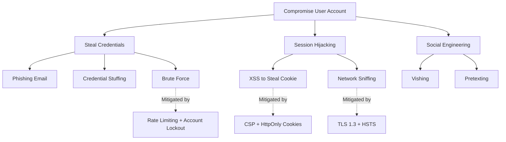

# Security — AuthN/AuthZ & Threat Modeling

## Authentication & Authorization Deep Dive

### OAuth 2.1

OAuth 2.1 consolidates best practices from OAuth 2.0 and its extensions. Key changes:

| Change | Detail |
|--------|--------|
| **PKCE mandatory** | Required for ALL grant types (not just public clients) |
| **Implicit grant removed** | No more token-in-URL — use Authorization Code + PKCE |
| **ROPC removed** | Resource Owner Password Credentials grant eliminated |
| **Exact redirect URI** | No wildcard redirects, exact string matching only |
| **Refresh token rotation** | Sender-constrained or rotated on each use |
| **Bearer token in header** | Token MUST be in Authorization header, not query params |

### Passkeys / WebAuthn

Passkeys are the FIDO2/WebAuthn credential type that replaces passwords. They are:
- **Phishing-resistant**: Bound to the relying party origin
- **No shared secrets**: Public key cryptography, nothing to steal from the server
- **Cross-device**: Synced via platform authenticators (iCloud Keychain, Google Password Manager)

**Registration flow**:
1. Server generates challenge + user info
2. Client calls `navigator.credentials.create()` with options
3. Authenticator creates key pair, returns public key + attestation
4. Server stores public key (never receives private key)

**Authentication flow**:
1. Server generates challenge
2. Client calls `navigator.credentials.get()` with challenge
3. Authenticator signs challenge with private key
4. Server verifies signature against stored public key

### Demonstration of Proof-of-Possession (DPoP)

DPoP binds access tokens to specific clients, preventing token theft and replay:
- Client generates ephemeral key pair
- Client signs a DPoP proof JWT with the private key
- Token endpoint binds the access token to the public key
- Resource server verifies both the access token AND the DPoP proof

### Authorization Models Comparison

| Model | Description | Best For | Complexity |
|-------|-------------|----------|------------|
| **RBAC** | Role-Based Access Control | Simple apps, well-defined roles | Low |
| **ABAC** | Attribute-Based Access Control | Complex policies, dynamic attributes | Medium |
| **ReBAC** | Relationship-Based Access Control | Social graphs, resource hierarchies | High |

**RBAC**: User → Role → Permissions (e.g., ADMIN can DELETE, USER can READ)
**ABAC**: Policies based on attributes (e.g., "department=engineering AND clearance>=SECRET")
**ReBAC**: Permissions based on relationships (e.g., "user is owner of document" or "user is member of team that owns project")

### Spring Security 7 Configuration Template

```java
@Configuration
@EnableWebSecurity
@EnableMethodSecurity
public class SecurityConfig {

    @Bean
    public SecurityFilterChain filterChain(HttpSecurity http) throws Exception {
        return http
            // CSRF protection — enabled for browser clients, token-based for SPAs
            .csrf(csrf -> csrf
                .csrfTokenRepository(CookieCsrfTokenRepository.withHttpOnlyFalse())
                .csrfTokenRequestHandler(new XorCsrfTokenRequestAttributeHandler()))
            // CORS — restrictive origin policy
            .cors(cors -> cors.configurationSource(corsConfigurationSource()))
            // Session — stateless for API, session for web
            .sessionManagement(session ->
                session.sessionCreationPolicy(SessionCreationPolicy.STATELESS))
            // Authorization rules
            .authorizeHttpRequests(auth -> auth
                .requestMatchers("/api/v1/auth/**").permitAll()
                .requestMatchers("/actuator/health", "/actuator/info").permitAll()
                .requestMatchers("/api/v1/admin/**").hasRole("ADMIN")
                .anyRequest().authenticated())
            // OAuth2 resource server with JWT
            .oauth2ResourceServer(oauth2 -> oauth2
                .jwt(jwt -> jwt
                    .decoder(jwtDecoder())
                    .jwtAuthenticationConverter(jwtAuthenticationConverter())))
            // Security headers
            .headers(headers -> headers
                .contentSecurityPolicy(csp ->
                    csp.policyDirectives("default-src 'self'; frame-ancestors 'none'"))
                .frameOptions(frame -> frame.deny())
                .httpStrictTransportSecurity(hsts ->
                    hsts.maxAgeInSeconds(31536000).includeSubDomains(true)))
            .build();
    }

    @Bean
    public CorsConfigurationSource corsConfigurationSource() {
        CorsConfiguration config = new CorsConfiguration();
        config.setAllowedOrigins(List.of("https://yourdomain.com"));
        config.setAllowedMethods(List.of("GET", "POST", "PUT", "DELETE", "OPTIONS"));
        config.setAllowedHeaders(List.of("Authorization", "Content-Type", "X-CSRF-TOKEN"));
        config.setAllowCredentials(true);
        config.setMaxAge(3600L);

        UrlBasedCorsConfigurationSource source = new UrlBasedCorsConfigurationSource();
        source.registerCorsConfiguration("/api/**", config);
        return source;
    }

    @Bean
    public JwtDecoder jwtDecoder() {
        // Use RS256 or ES256 — NEVER HS256 in multi-service architectures
        return NimbusJwtDecoder.withJwkSetUri("https://auth.yourdomain.com/.well-known/jwks.json")
            .build();
    }

    @Bean
    public JwtAuthenticationConverter jwtAuthenticationConverter() {
        JwtGrantedAuthoritiesConverter grantedAuthorities = new JwtGrantedAuthoritiesConverter();
        grantedAuthorities.setAuthoritiesClaimName("roles");
        grantedAuthorities.setAuthorityPrefix("ROLE_");

        JwtAuthenticationConverter converter = new JwtAuthenticationConverter();
        converter.setJwtGrantedAuthoritiesConverter(grantedAuthorities);
        return converter;
    }
}
```

### JWT Best Practices

| Practice | Recommendation |
|----------|----------------|
| **Algorithm** | RS256 or ES256 (asymmetric) — never HS256 for multi-service |
| **Access token TTL** | 5–15 minutes maximum |
| **Refresh token TTL** | 7–30 days with rotation |
| **Refresh rotation** | Issue new refresh token on each use, invalidate old one |
| **Token storage** | HttpOnly, Secure, SameSite=Strict cookies (web); secure storage (mobile) |
| **Claims** | Minimal — ID, roles, exp, iss, aud. No PII. |
| **Revocation** | Token blacklist (Redis) for immediate revocation needs |
| **Key rotation** | Rotate signing keys every 90 days, support multiple active keys |

---

## Threat Modeling

### STRIDE

| Threat | Description | Countermeasure |
|--------|-------------|----------------|
| **S**poofing | Pretending to be another user/system | Strong authentication (MFA, mTLS, Passkeys) |
| **T**ampering | Unauthorized modification of data | Integrity checks (HMAC, digital signatures, checksums) |
| **R**epudiation | Denying an action occurred | Audit logging, non-repudiation tokens |
| **I**nformation Disclosure | Unauthorized access to data | Encryption (transit + rest), access controls |
| **D**enial of Service | Making system unavailable | Rate limiting, autoscaling, circuit breakers |
| **E**levation of Privilege | Gaining unauthorized higher access | Least privilege, RBAC, input validation |

### PASTA (Process for Attack Simulation and Threat Analysis)

A 7-stage risk-centric threat modeling methodology:

| Stage | Activity | Output |
|-------|----------|--------|
| 1. Define Objectives | Business impact analysis | Security requirements |
| 2. Define Technical Scope | Architecture diagrams, data flows | Attack surface inventory |
| 3. Application Decomposition | Trust boundaries, entry points | DFD diagrams |
| 4. Threat Analysis | MITRE ATT&CK mapping, threat intelligence | Threat library |
| 5. Vulnerability Analysis | CVE review, code analysis | Vulnerability catalog |
| 6. Attack Modeling | Attack trees, kill chains | Attack scenarios |
| 7. Risk & Impact Analysis | DREAD scoring, business impact | Prioritized mitigations |

### LINDDUN (Privacy Threat Modeling)

| Threat | Description | Mitigation |
|--------|-------------|------------|
| **L**inkability | Linking data across contexts | Pseudonymization, data separation |
| **I**dentifiability | Identifying individuals from data | Anonymization, k-anonymity |
| **N**on-repudiation | Unable to deny actions (privacy risk) | Plausible deniability mechanisms |
| **D**etectability | Detecting that data exists | Encrypted storage, access controls |
| **D**isclosure of Information | Unauthorized data access | Encryption, access controls, DLP |
| **U**nawareness | Users unaware of data processing | Transparency, consent management |
| **N**on-compliance | Violating privacy regulations | GDPR controls, DPIAs, audits |

### Attack Trees

Use Mermaid diagrams for visual attack tree modeling:



### Threat-Model-as-Code

Use OWASP pytm for programmatic threat modeling:

```python
from pytm import TM, Server, Datastore, Dataflow, Boundary, Actor

tm = TM("Payment API Threat Model")
tm.description = "Threat model for payment processing API"

# Define boundaries
internet = Boundary("Internet")
dmz = Boundary("DMZ")
internal = Boundary("Internal Network")

# Define elements
user = Actor("Customer", inBoundary=internet)
api_gw = Server("API Gateway", inBoundary=dmz)
payment_svc = Server("Payment Service", inBoundary=internal)
db = Datastore("Payment DB", inBoundary=internal, isEncryptedAtRest=True)

# Define data flows
Dataflow(user, api_gw, "HTTPS Request", protocol="HTTPS", isEncrypted=True)
Dataflow(api_gw, payment_svc, "Internal API", protocol="gRPC", isEncrypted=True)
Dataflow(payment_svc, db, "SQL Query", protocol="TLS", isEncrypted=True)

tm.process()
```

### MITRE ATT&CK Integration

Map identified threats to MITRE ATT&CK techniques for standardized communication:

| Tactic | Common Techniques | Detection |
|--------|-------------------|-----------|
| Initial Access | T1190 (Exploit Public App), T1566 (Phishing) | WAF logs, email security |
| Execution | T1059 (Command Injection), T1203 (Exploit Client) | SAST, runtime monitoring |
| Persistence | T1078 (Valid Accounts), T1136 (Create Account) | Audit logs, IAM monitoring |
| Privilege Escalation | T1068 (Exploit Vulnerability), T1548 (Abuse Elevation) | Vulnerability scanning, least privilege |
| Credential Access | T1110 (Brute Force), T1539 (Steal Web Session) | Rate limiting, session monitoring |
| Lateral Movement | T1021 (Remote Services), T1550 (Use Alternate Auth) | Network segmentation, mTLS |

### When to Use Which Methodology

| Scenario | Methodology | Reason |
|----------|-------------|--------|
| New feature (general) | **STRIDE** | Comprehensive, well-understood |
| High-risk business feature | **PASTA** | Risk-centric, business-aligned |
| Privacy-sensitive feature | **LINDDUN** | Privacy-specific threats |
| Specific attack scenario | **Attack Trees** | Visual, focused analysis |
| Automated/CI analysis | **pytm** | Code-based, repeatable |

---

