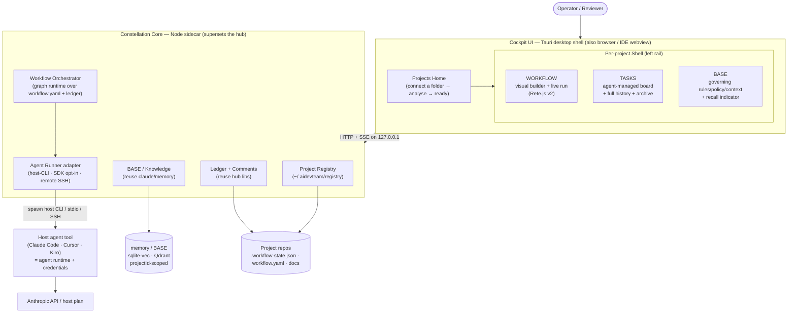

# Product Vision — Multi-Project Agent Control Plane

> **Consolidated by /tw (Technical Writer).** This is the single authoritative
> product-vision document, synthesised from five Wave-1/2 discovery docs:
> [ba-requirements.md](ba-requirements.md) (Anna), [architecture.md](architecture.md) (Jorge),
> [strategy.md](strategy.md) (Apex), [ui-design.md](ui-design.md) (Aura), and
> [frontend-approach.md](frontend-approach.md) (Finn).
>
> **Status:** Draft for **/po** (value & priority) and **/sm** (story breakdown & sprint).
> **Gate status:** No gates set yet. `ARCH_APPROVED` and `SECOPS_APPROVED` are pending
> (the architecture doc is the *input* to its gate, not the approval). This vision
> document does not itself approve anything — it reconciles the discovery into one
> place so /po can lock scope and /sm can schedule.
>
> **Naming note.** This document uses the neutral phrase **"the product"** and the
> codename the architecture used, **Constellation**, interchangeably. The *product
> name is an open decision for /po* (§4). The OSS framework keeps the name **AI Dev
> Team (ADT)**.

---

## 1. Executive summary

**What we're building.** A cross-platform desktop cockpit that runs the existing AI
Dev Team agent workflow across **many** projects (local and, later, remote) and makes
the process **visible, enforced, and auditable**. You point it at a project folder; it
analyses the project, stands up the agent team, and opens three governed surfaces per
project:

- **WORKFLOW** — a visual program (drag-and-drop graph) where events trigger agents,
  with loops, conditionals, and background agents; backed by gates that can *refuse* to
  proceed.
- **TASKS** — an agent-managed, human-readable board where every ticket carries the
  full, attributed, timestamped history of what each agent did.
- **BASE** — a per-project store of rules, policies, and context that agents *must*
  follow, indexed and surfaced to them via semantic recall.

**For whom.** The wedge user is **the Operator** — a solo developer or architect
running AI coding agents (Claude Code / Cursor / Kiro) across several personal or
client projects, who is tired of agents drifting, forgetting context, and skipping
their own rules. The growth audience is **small teams (2–15)** standardising how AI
ships software, and **agencies / regulated teams** who need a defensible audit trail.

**Why it wins.** It is a **layer, not a destination**. It governs the AI coding tool
you already use and pay for — no new model bill, no IDE migration, no SDK rewrite. The
category is **Agentic Dev Governance**: a control plane *on top of* your coding tool.
The defensible moat is **enforced, visible, tool-agnostic process across many
projects** — not the agents themselves (anyone can ship agents). Three things only this
product does in one screen: a *visible* workflow program, *rules with teeth* (a rule
known is a rule enforced, bound to a gate), and *on-top-of-your-tool* portability with
your own keys.

**Why it's buildable now.** It **reuses what already ships** in this repo — the
zero-dependency Node hub (the board/control-plane), the file-based workflow ledger with
typed comments, `workflow.yaml`, and the TypeScript memory subsystem. This is an
**integration + visualization layer over an existing engine** (a Strangler-Fig
extension of the hub), not a new engine. Roughly **80% of the Tasks view already
exists** in the hub today.

**The OSS-first contract (load-bearing across all five docs).** Open-source, zero-paid
by default, your keys, your files, your repo, exportable history. Paid/cloud backends
(Jira, KGB/Canon, remote memory) are optional adapters, never required. The zero-dependency
hub stays alive and shipping as the floor.

---

## 2. The product in one diagram

**Reading the diagram:** the host tool is the agent runtime *and* the credential holder
— Core never reads the host's token; it shells out to the host's own binary, which
authenticates itself. Core orchestrates and observes; the project repos remain the
source of truth (a project stays fully usable from the bare hub/CLI without the
cockpit).

---

## 3. Locked decisions (where the roles AGREE)

These are settled across the discovery docs. They are inputs to the (still-pending)
`ARCH_APPROVED` / `SECOPS_APPROVED` gates, but the roles are aligned and /po does not
need to re-open them.

| # | Decision | What's locked | Endorsed by |
|---|----------|---------------|-------------|
| **L1** | **Packaging** | **Tauri desktop shell that auto-spawns a Node "Core" sidecar** (supersets `hub/server.js`); same UI also reachable via a plain browser and an IDE webview thin client. Solves "don't run a server every time"; cross-platform Win/Mac. Electron is the fallback only if a WebView-incompatible dependency surfaces. | Jorge (decision), Aura, Finn |
| **L2** | **Subagent execution + key reuse** | **Drive the host tool's own CLI by default** (the *only* compliant way to reuse the user's plan credentials — the Agent SDK requires an API key per 2026 terms). One `AgentRunner` adapter seam with three backends: host-CLI (default, no new key), Agent SDK (opt-in, keychain-stored key), remote (SSH). Secrets never written to project files, knowledge store, workflow definition, UI, or logs. | Jorge (decision), Anna (NFR), Finn (bridge) |
| **L3** | **Workflow builder** | **Rete.js v2 canvas (official Angular renderer) + a thin custom runtime** that compiles a per-project graph definition (`workflow.graph.json`) to an execution plan **validated against `workflow.yaml`**; every step recorded as a typed ledger comment. Rete is chosen because the workflow is a *program that executes* (it has built-in dataflow/control-flow engines), with ngx-vflow as a contained fallback. **Reject** n8n / Node-RED / Windmill as the engine (they bring their own server + data model — the thing users dislike). | Jorge (decision), Aura, Finn, Apex |
| **L4** | **BASE = reuse `claude/memory`** | The project-scoped, gracefully-degrading semantic-recall subsystem already in the repo *is* BASE. No new vector subsystem is built. KGB/Canon and Bumbl are **optional adapters**, never hard dependencies. | Jorge (decision), Anna, Apex |
| **L5** | **Hub = reuse-not-replace** | Core is a **superset** of the hub: reuse `state.js`/`write.js`/`guard.js`/`comments.js`/`api.js` as the load-bearing internals; never bypass the atomic-CAS writer; never weaken the anti-CSRF/rebinding guard. New capability (registry, orchestrator, runner, analyzer) is *additive*. | Jorge (decision), all |
| **L6** | **Frontend = Angular 21 + TS, hub kept as the floor** | Build the cockpit in Angular 21 (standalone components, Signals, zoneless, Signal Forms; Angular CLI / esbuild-Vite build) — owner-locked for stack consistency with the KGB project (also Angular, to be aligned to the same version) and shared components/tooling — **but keep the zero-dependency `index.html` hub alive and served at `/legacy`** as the browser-MVP floor and graceful-degradation surface. Lift the hub's already-correct (framework-agnostic) presentation logic (status derivation, gate chips, agent badges, comment timeline, SSE diff→toast engine, dark theme) into Angular services + typed components, locked against regression by snapshot tests. Reuse the hub's SSE for realtime via RxJS (no WebSockets for MVP); Signals + services for lean state (NgRx SignalStore only where justified); reuse the server's CAS-409 reconcile for safe optimistic writes. | Finn (decision), Aura, Jorge |
| **L7** | **Per-project isolation + audit completeness (NFRs)** | Per-project data/governance strictly partitioned by `projectId` (only content explicitly marked global is shared); every state change emits an attributable, timestamped, human-readable history entry automatically; nothing silently lost or overwritten. | Anna (NFR), Jorge (security), Aura |
| **L8** | **Local-first, loopback-by-default** | All core functions work with no network; the tool binds to the local machine only unless remote access is deliberately enabled; remote writes require explicit authorization. Security gate mandatory before any remote-write capability. | Anna, Jorge, Finn |

---

## 4. Open decisions for /po

Where the roles **differ or defer**. Each is presented with the trade-off and the
recommending role's lean. **These are deliberately left for /po to decide — not decided
here.**

### D-A — Product name
- **The decision.** Keep "AI Dev Team / ADT" for the product, or introduce a distinct
  product name centred on orchestration/discipline?
- **Trade-off.** "ADT" has community equity but is SEO-weak and undersells the
  differentiator (it sounds like "a bunch of agents," the crowded lane). A new name
  carries the category claim ("orchestration & governance") but starts cold.
- **Apex's lean:** **dual-brand** — keep **ADT** as the OSS framework (community brand,
  MIT, GitHub) and introduce a product name for the app/control-plane; lead candidates
  **Conductor** or **Cadence**. Trademark + domain clearance required → flag to /legal
  before commit. *(Architecture used the working codename "Constellation"; not a
  recommendation, just a placeholder.)*

### D-B — Remote *execution* in v1, or only remote view/control?
- **The decision.** Does v1 run subagents on a *different* machine (remote execution
  over SSH), or only *view/control* locally-run agents remotely?
- **Trade-off.** Remote execution ("if it works locally it works remotely") is a real
  user ask, but the SSH runner is **remote code execution** — powerful and dangerous,
  needs a dedicated `/secops` threat model (allowlist, host-key pinning, opt-in).
  Remote *view/control* is much cheaper and lower-risk.
- **Leans:** Anna leans **(b) local execution + remote supervision** (remote is
  supervision/control, not necessarily remote execution) and lists remote execution as
  *Won't (this release)* pending this decision. Jorge designs the SSH runner but defers
  it past MVP. → If chosen, routes to a **mandatory /secops gate** before shipping.

### D-C — Visual workflow *editing* in MVP, or read-only-first?
- **The decision.** Is the visual workflow *builder* (create/edit/delete steps) a v1
  differentiator, or acceptable as a fast-follow after a read-only render of the
  default workflow?
- **Trade-off.** Editing is the headline "see the program" wow, but it's the largest,
  highest-uncertainty FE chunk (custom nodes, inspector, validation, lossless
  round-trip, a11y keyboard-connect). Read-only-first de-risks and still shows the
  enforced process.
- **Leans:** Anna's thin MVP **renders the default workflow read-only** and defers
  editing; Finn's plan **assumes read-only render in the thin MVP, full editing as
  fast-follow** (Phases 4–5). Apex leans to **edit a small set of templated workflows,
  not author-from-blank-canvas**. *Reconciled MVP (§5) adopts read-only-first.*

### D-D — KGB/Canon + Bumbl now, or later?
- **The decision.** Integrate the external knowledge/governance backbone (KGB/Canon) and
  the self-hosted personal stack (Bumbl) in v1, or defer?
- **Trade-off.** KGB/Canon's governed write-back (TrustGate + approval queue + cost
  receipts) is genuinely valuable for team/regulated use, but its MCP/tool surface lives
  in *other repos* and is unverified here; making it a hard dependency would break
  OSS-first.
- **Leans:** Jorge — **default BASE = `claude/memory`; KGB/Canon as an optional
  governance overlay (recommended for teams); Bumbl as an optional self-hosted target;
  none required.** Anna leans **defer to post-MVP** (evaluate-then-decide). *Reconciled
  MVP defers both; the adapter seam is designed so they can land later without rework.*

### D-E — Single-project-first vs multi-project-first sequencing
- **The decision.** Ship *one local project flawlessly* first (the activation proof), or
  build the multi-project shell into the MVP?
- **Trade-off.** Apex argues breadth dilutes the first impression — nail one local
  project, then "multiple projects" is the expansion/agency upsell. Anna and Jorge treat
  multi-project as first-class (it's the core JTBD — continuity across projects/machines).
- **Leans:** Apex — **single local project first**. Anna/Jorge — **multi-project in
  MVP**. *Finn shows the conflict is sequencing, not architecture:* Phase 1 ships a
  single-project Angular board (the Apex cut); Phase 2 wraps it in the multi-project shell
  **with no rework**. So /po can pick the cut without changing the design. *(See §10,
  reconciliation R3.)*

---

## 5. The MVP (one agreed thin slice)

**Reconciled across Anna (BA thin slice), Apex (market lens), and Finn (FE phases).**

> **The slice:** *"Connect a folder → see the enforced workflow + agent-written tasks +
> governing rules, on top of your existing tool."*
>
> One Operator, local, read-rich + minimal write, zero paid dependencies, reusing the
> hub end-to-end.

**What ships in the MVP:**

1. **Connect & analyse** — add a project by selecting its folder; auto-derive a title +
   description (degrading to a safe placeholder when no keys/analysis available); ingest
   existing ADT artefacts rather than overwrite them. *(Existing-files fast path reuses
   the hub's `buildState`.)*
2. **Per-project shell + live mirror** — open into the three sections; changes appear
   live within a few seconds; project state persists across restarts.
3. **TASKS — read the story** — board by status; click a ticket to read its full,
   attributed, timestamped history; archive done items with history retained. *(≈80%
   exists in the hub today.)*
4. **BASE — govern** — add/edit/remove text rules per project, indexed for semantic
   recall, isolated per project, **degrading gracefully** when the index/recall backend
   is down (core rules still injected deterministically; an agent run is never blocked
   solely because recall is down).
5. **WORKFLOW — read-only render** — render the default workflow visually (Rete.js v2),
   and run **one linear trigger → agent → gate chain** via the **host-CLI runner** to
   prove "graph → real agent." *(Editing is deferred — see D-C.)*
6. **Host key reuse + local-first + cross-platform** — no extra keys (host-CLI runner);
   loopback-only by default; reuse the hub's guard so the same UI works in a browser on
   loopback; Mac-first, Windows-second.

**Explicitly deferred from the MVP** (highest uncertainty / build cost, gated on the
§4 decisions):

- Visual workflow **editing** (create/edit/delete steps) — render default read-only first (D-C).
- **Loops, conditionals, background agents** in the builder.
- **Remote** access/execution — SSH runner, remote view/control (D-B); needs the /secops gate.
- **Agent SDK** backend and **cron/background** agents (headless auth + cost metering).
- **KGB/Canon / Bumbl** backbone — built-in store ships first (D-D).
- **Conveyor** task view (the "demo wow"; the Board is the workhorse) — ships last.
- **IDE-webview thin client** and Windows packaging polish.
- **Images/URLs in BASE** — *plan only*, documented as not-yet-available, never implied to work.

**Why this slice.** It delivers the durable, defensible value — auto-understand a new
project, multi-project continuity, readable audit, enforced governance, on top of your
tool — while pushing the visual-builder and remote-execution complexity behind explicit
decisions. It maps cleanly onto assets that already exist (hub board, ledger, comments,
memory), so the MVP **extends rather than rebuilds**, and it deliberately refuses to
compete on "most agents" or "best autonomy" (losing fights against Devin/Cursor/Anthropic).

> **MVP sequencing is the one place /po picks a cut (D-E).** Both cuts share the same
> design: Phase 1 = single-project board (Apex's "one project flawlessly"); Phase 2 =
> the multi-project shell wrapped around it (Anna/Jorge), with no rework.

---

## 6. Glossary

| Term | Meaning |
|------|---------|
| **Core / sidecar** | "Constellation Core" — the local Node service that supersets the hub. The Tauri shell *auto-spawns* it as a bundled sidecar binary (no manual `node server.js`), manages its lifecycle, and reaps it on quit. |
| **Cockpit** | The cross-platform UI (Projects Home + per-project Shell). Runs in a Tauri WebView, a plain browser, or an IDE webview — same bundle, served by Core over HTTP/SSE. |
| **Host tool** | The user's AI coding tool (Claude Code / Cursor / Kiro). It is the **agent runtime and the credential holder**; Core drives its CLI rather than embedding an LLM client. |
| **WORKFLOW / TASKS / BASE** | The three governed surfaces per project (visual process builder; agent-managed task board; governing knowledge store). |
| **BASE** | A project's rules/policy/copyright/style/context docs, indexed and semantically recalled into agent context so agents *must* follow them. Implemented by reusing `claude/memory`. |
| **Registry** | The user-level index of connected projects (`~/.aidevteam/registry.json`). An index only — the source of truth stays inside each project's repo. |
| **projectId** | The isolation key for a project (derived from the git-toplevel/realpath). Every ledger read/write and every vector row is scoped by it, so projects can't bleed into each other. Limitation: path-based, so moving/renaming a folder orphans history (R6). |
| **Gate** | A must-pass barrier in the workflow (`ARCH_APPROVED`, `SECOPS_APPROVED`, `CODE_REVIEWED`, etc.). Some are *hard* (block progress) / some *soft*; security gates are a **safety override** — never downsized or skipped. Gates are what give the process "teeth." |
| **Ledger** | The file-based workflow state (`.workflow-state.json`) plus typed comments — the append-in-effect record of every ticket's state and history. The atomic-CAS writer is the only path that mutates it. |
| **Recall** | Semantic retrieval of relevant BASE content into an agent's context at the right moment (the "rule known → rule enforced" mechanic). The UI shows a **recall indicator** (indexed / active / recalled-now) so the human can see rules actually steering work. |
| **AgentRunner** | The single adapter seam with three backends: **host-CLI** (default, reuses the host login, no new key), **Agent SDK** (opt-in, API key in OS keychain), **remote** (SSH runner on the remote host). |
| **Graph / `workflow.graph.json`** | The per-project visual workflow definition (nodes/edges/loops/conditions/background agents). It **compiles to** the existing `workflow.yaml`/ledger semantics; the graph file is the source of truth, the Rete.js canvas is the editor view. Round-trip must be lossless. |
| **Token (live-run)** | The glowing dot that animates along the active edge during a workflow run — the literal "where are we / which agent is active" indicator. |
| **Conveyor** | An optional playful TASKS view where tickets ride a belt toward the agent (or human) who acts next. A skin over the same data as the Board; ships last. |
| **Host-CLI / Agent SDK / SSH runner** | The three execution backends (see AgentRunner). Only host-CLI reuses the plan's credentials. |

---

## 7. Risks & unknowns (consolidated, deduped, severity-ranked)

Merged from architecture R1–R10 and frontend F1–F8; deduped and ranked.

| # | Risk / unknown | Severity | Source | Mitigation / what resolves it |
|---|----------------|----------|--------|-------------------------------|
| **K1** | **Agent SDK ≠ plan reuse.** The Agent SDK needs an API key (2026 terms); only driving the host CLI reuses the login. If host-CLI headless is rate-limited or awkward, the "no new key" promise weakens. | **High** | Arch R1 | Spike `claude -p` headless throughput + auth on a logged-in machine; confirm per-host login persistence. |
| **K2** | **Headless cost / separate credit pool.** From mid-2026 headless/SDK usage draws a separate, smaller credit pool — background/loop agents can exhaust it. | **High** | Arch R2 | Cost metering + budget guard from day one (per-run token/cost recorded as ledger comments; budget indicator in UI). |
| **K3** | **Remote = remote code execution.** The SSH runner is powerful and dangerous. | **High** | Arch R3 | **Dedicated /secops threat model**; opt-in, host allowlist, known-hosts pinning, no arbitrary shell (only the agent command) before shipping remote. (Ties to decision D-B.) |
| **K4** | **Lossless round-trip** (graph ↔ `workflow.graph.json`) silently breaks, losing user config. | **High** | FE F2 | Property test `serialize ∘ parse = identity` in CI from the Workflow phase. |
| **K5** | **Canvas perf on WKWebView** — the live token + 50+ nodes (transform-heavy animation on the macOS system WebView; applies to the Rete.js canvas). | **High** | FE F1, Arch R8 | Spike a 50-node canvas + token animation on WKWebView before committing to animation richness; `transform`/`opacity` only; respect reduced-motion. |
| **K6** | **Node sidecar packaging in Tauri** across Win+Mac (SEA bundling, signing, notarization) is fiddly. | **Med** | Arch R4 | Spike Node SEA + Tauri sidecar on both OSes early; fallback = Electron if blocked (the zero-dep hub remains a working browser MVP regardless). |
| **K7** | **Headless auth for cron/background agents** — unattended runs need a non-interactive credential the host CLI may not provide. | **Med** | Arch R5 | Define a "needs-auth" pause state; SDK-key fallback for unattended projects. |
| **K8** | **`projectId` is path-based** — move/rename orphans a project's history. | **Med** | Arch R6 | Add a re-link/migrate action in the registry UI. |
| **K9** | **KGB/Canon/Bumbl interfaces unverified** — their MCP/tool surface lives in *other repos*, not this one; the adapter contract is specified against *capabilities named in plans*, not a confirmed schema. | **Med** | Arch R7 | Confirm TrustGate "evaluate" + propose/approve MCP signatures before building the adapter. (Ties to D-D.) |
| **K10** | **Keyboard a11y for node-connect (WCAG 2.5.7)** is non-trivial with any canvas pointer model (incl. the Rete.js interaction layer). | **Med** | FE F3 | Budget explicit time; ship the accessible graph **list-view** alternative regardless. |
| **K11** | **Status-derivation regression** during the vanilla→Angular port (the blocked-by-hard-gate rule). | **Med** | FE F4 | Snapshot tests against current vanilla output *before* porting each pure function. |
| **K12** | **Browser host can't read arbitrary folder paths** for "connect a project." | **Med** | FE F5 | Bridge: browser uses a host-known project or a user-typed path; native picker only in Tauri/IDE. |
| **K13** | **Remote-write auth layering** (bearer token on top of the CSRF header) not yet specified server-side. | **Med** | FE F8 | Coordinate /be + /secops contract before any remote-write work; the guard already refuses remote writes by default. |
| **K14** | **Scope creep** — this can balloon into "build n8n + Kiro." | **Med** | Arch R10 | The MVP (§5) is the contract; defer everything on the deferred list. |
| **K15** | **Multiple Cores / port collisions** when the IDE webview and desktop app both run. | **Low** | Arch R9, FE | Single-instance lock + a discovery file in `~/.aidevteam/` so views attach to one Core. |
| **K16** | **Per-project SSE fan-out** (N connections) resource use with many projects. | **Low-Med** | FE F6 | MVP is few projects; move to a multiplexed Core stream when project counts justify it. |
| **K17** | **Bundle creep** from the canvas library (Rete.js v2) on non-workflow routes. | **Low** | FE F7 | Route-level code-splitting; Workflow is its own lazy chunk. |
| **K18** | **Supply chain** — new deps (Tauri, Angular, Rete.js v2). | **Low** | Arch | Pin + SBOM; Core default stays zero-runtime-dep like the hub; deps live in the UI/shell layer. |

**Two unknowns to call out explicitly (per the brief):**
- **The Agent-SDK key / credit-pool constraint (K1+K2)** is the single most
  consequential finding. "Reuse the host's keys" is achievable *only* by driving the
  host's CLI; the SDK cannot silently reuse a subscription. And headless now meters
  against a separate pool — so cost accounting is a **day-one cross-cutting concern**,
  not a nice-to-have.
- **KGB/Bumbl live in other repos (K9).** Their interfaces are unverified here; treat
  any KGB/Canon/Bumbl integration as evaluate-then-decide behind an optional adapter.

**Security gate is mandatory.** This system touches **secrets, network, external input,
and file access** — four gate triggers — plus remote code execution. `SECOPS_APPROVED`
is required before implementation, with a dedicated pass on the SSH runner.

---

## 8. Proposed EPIC + ticket backlog (behavior-only)

Behavior-only (WHAT not HOW), grouped by epic, each ticket a one-line behavioral
description + a MoSCoW tag, sized for /sm to schedule. The **MoSCoW tags reconcile
Anna's prioritisation with the §5 reconciled MVP** (e.g. workflow *editing* is *Should*,
not *Must*, per D-C).

**Legend.** MoSCoW: **[M]** Must · **[S]** Should · **[C]** Could · **[W]** Won't (this
release). **Builds on existing hub work** (the board / control-plane / ledger / memory):
marked **★**. **Gated** on an open decision or a mandatory approval: marked **⛒**.

### EPIC A — Project Registration, Connection & Auto-Analysis
- **A1** Connect a project by selecting its folder; it persists across restarts. **[M]** ★
- **A2** Refuse an invalid/unreadable folder with a clear reason and no partial project. **[M]**
- **A3** Detect and offer to open an already-registered folder instead of duplicating it. **[M]**
- **A4** Auto-derive a title + description on connect and show them in the project header. **[M]**
- **A5** Show analysis-in-progress status; project becomes fully usable only after it completes or is skipped. **[M]**
- **A6** Let the Operator edit title/description; preserve edits over later re-analysis. **[S]**
- **A7** On analysis failure, connect anyway with a safe placeholder + a "re-run analysis" path. **[M]**
- **A8** Ingest existing ADT artefacts (workflow/tasks/knowledge) instead of overwriting them. **[M]** ★
- **A9** Fall back missing artefact parts to defaults, with each part's source visible. **[S]** ★
- **A10** When artefacts and analysis disagree, on-disk wins; analysis values offered non-destructively. **[S]**
- **A11** Remove a project from the tool while leaving its on-disk files intact (and say so). **[M]**
- **A12** Re-connecting a removed folder restores its prior on-disk history into the view. **[S]** ★

### EPIC B — Per-Project Shell & Live Mirroring
- **B1** Open a project into a header + three navigable sections (WORKFLOW / TASKS / BASE). **[M]**
- **B2** Switching sections never loses unsaved edits silently (preserve or prompt). **[M]**
- **B3** Switch the active project; the whole view reflects it; the previous project keeps its state. **[M]**
- **B4** Reflect agent-made task/workflow changes live within a few seconds, no manual refresh. **[M]** ★
- **B5** Show an at-a-glance indicator of which project changed, even when not viewing it. **[S]** ★
- **B6** Show a project as stale/unavailable when its source is moved/unmounted (no silent stale data). **[M]**

### EPIC C — WORKFLOW: Visual Agent-Process Builder
- **C1** Render the default workflow visually (read-only) as steps with their agents and gates. **[M]** ★⛒ *(D-C: read-only-first)*
- **C2** Show, per step, which agent it triggers and any condition/gate attached. **[M]** ★
- **C3** Run one linear trigger → agent → gate chain from the graph via the host-CLI runner. **[M]** ★
- **C4** Add a step (assign agent + trigger); it persists to *this* project only. **[S]** ⛒ *(D-C: editing is fast-follow)*
- **C5** Edit a step's agent/trigger/condition; subsequent runs use the new definition. **[S]** ⛒
- **C6** Delete a step; references to it (e.g. loop targets) are updated or flagged before save. **[S]** ⛒
- **C7** Reorder steps; saved execution order reflects the new arrangement. **[S]** ⛒
- **C8** Define a loop (return to an earlier step) shown visually, repeating until its exit. **[C]** ⛒
- **C9** Attach a conditional; runtime follows the chosen branch, both branches visible. **[C]** ⛒
- **C10** Define a background agent that runs on a condition without blocking the main flow. **[C]** ⛒
- **C11** Warn before saving a loop with no reachable exit condition. **[C]** ⛒
- **C12** Provide a deterministic, human-readable underlying definition of the visual workflow. **[S]** ⛒
- **C13** Render an externally-authored definition faithfully; visual↔definition round-trip is lossless. **[S]** ⛒
- **C14** Report the specific problem on an invalid definition; never silently drop steps. **[S]** ⛒
- **C15** Preserve project-specific workflow customizations when the bundled default changes. **[S]** ⛒

### EPIC D — TASKS: Agent-Managed, Human-Readable Board
- **D1** Show each task with a human-readable title and a clearly indicated status. **[M]** ★
- **D2** Sort/group tasks by status with stable, predictable ordering. **[M]** ★
- **D3** Reflect an agent-driven status change on the board in near-real-time. **[M]** ★
- **D4** Click a ticket to read its description + chronological comment/event history. **[M]** ★
- **D5** Attribute and timestamp every history entry (agent or human). **[M]** ★
- **D6** Record a human-readable history entry automatically for every agent action. **[M]** ★
- **D7** Preserve all entries under near-simultaneous updates (no lost/overwritten history, order kept). **[M]** ★
- **D8** Archive a done task off the active board while keeping it retrievable. **[M]**
- **D9** Read an archived task's full description + complete history. **[M]**
- **D10** Show when each archived task was completed. **[S]**
- **D11** Convey status/progress with more than colour (labels/glyphs), readable in monochrome. **[S]** ★
- **D12** Keep a long/busy ticket history readable (scannable timeline). **[S]**
- **D13** Offer a playful "Conveyor" task view as a toggle over the same data model. **[C]**

### EPIC E — BASE: Governing Knowledge Store
- **E1** Add a text rule/policy document; it's saved to this project and listed in BASE. **[M]** ★
- **E2** Edit/remove a BASE document; agents start/stop being governed by it on subsequent runs. **[M]** ★
- **E3** Distinguish categories of BASE content (code rules / policy / copyright / context). **[M]**
- **E4** Make added/edited BASE content available to agents via semantic recall once indexed. **[M]** ★
- **E5** Surface relevant BASE content to an agent whose task matches a rule (semantic trigger). **[S]** ★
- **E6** Show provenance — that a rule *was applied* — linking the ticket history entry. **[C]** ★
- **E7** Degrade gracefully when indexing/recall is down (deterministic core-rule injection; never block a run). **[M]** ★
- **E8** Isolate BASE per project (no cross-project recall) except content explicitly marked global. **[M]** ★
- **E9** Document that images/URLs in BASE are planned and not yet available (no false implication). **[W]** *(plan-only)*

### EPIC F — Host-Tool Integration & API-Key Reuse
- **F1** Integrate with a supported host (Claude Code first) rather than a disconnected app. **[S]**
- **F2** Offer the host's current project/workspace for connection without re-typing the path. **[S]**
- **F3** Reuse the host's existing credentials for agent/embedding ops with no new key prompt. **[M]** ⛒ *(host-CLI; security gate)*
- **F4** When no reusable credential exists, name the degraded capability and offer a non-blocking path. **[M]**
- **F5** Never persist secrets to project files, the knowledge store, the workflow definition, UI, or logs. **[M]** ⛒ *(/secops, hard)*

### EPIC G — Local & Remote Operation
- **G1** Run fully locally (connect, view three sections, run local workflow) with no network. **[M]** ★
- **G2** Bind to the local machine only by default unless remote access is deliberately enabled. **[M]** ★
- **G3** View projects + their three sections remotely, mirrored live, when remote access is enabled. **[S]** ⛒ *(D-B; /secops)*
- **G4** Subject any remote state-changing action to explicit authorization; allow read-only remote without write. **[S]** ⛒ *(/secops)*
- **G5** Refuse a remote connection when remote access is not enabled. **[M]** ★
- **G6** Behave functionally equivalently on Windows and Mac (folder selection + path handling). **[M]**
- **G7** Run subagents on a *remote* machine (remote execution). **[W]** ⛒ *(D-B; /secops)*

### EPIC H — Cross-Cutting: Cost/Audit, Execution Backends, Knowledge Governance
- **H1** Record per-run token/cost as ledger comments and surface a per-project budget indicator. **[M]** *(K2)*
- **H2** Offer the Agent SDK as an opt-in execution backend with its key stored in the OS keychain. **[C]** ⛒
- **H3** Pause a project's unattended agents with a clear "needs-auth" state when no non-interactive credential exists. **[S]** *(K7)*
- **H4** Re-link/migrate a project whose folder moved or was renamed. **[S]** *(K8)*
- **H5** Offer KGB/Canon as an optional BASE governance overlay with graceful fallback to the built-in store. **[C]** ⛒ *(D-D)*
- **H6** Offer Bumbl as an optional self-hosted memory/KB target via the same adapter contract. **[W]** ⛒ *(D-D)*
- **H7** Offer an IDE-webview thin client that attaches to the running Core (a view, not a second runtime). **[C]**

**Scheduling guidance for /sm.** The **Must** tickets in **A, B, D, E (E7/E8), F (F3–F5),
G (G1/G2/G5/G6)** plus **C1–C3** and **H1** constitute the §5 MVP. The richest reuse —
and therefore the fastest, lowest-risk wins — is in **EPIC D and the Must of B/E**
(marked ★), which lift directly from the existing hub board, ledger, comments, and
memory. Sequence Tasks first (Finn Phase 1), then Shell (Phase 2), then Base (Phase 3),
then Workflow read-only/run; defer all **⛒** editing/remote/SDK/KGB tickets behind their
§4 decisions and the mandatory /secops gate.

---

## 9. Reconciliation log — where the five docs contradicted, and how I resolved it

Per the brief, every place the docs disagree, flagged with the resolution.

| # | Contradiction | How reconciled |
|---|---------------|----------------|
| **R1** | **Working name.** Arch uses "Constellation"; Anna uses "ADT Studio"; Aura uses "AI Dev Team Studio"; Apex recommends "Conductor/Cadence" and dual-branding. | **Left open for /po (D-A).** This doc uses neutral "the product" / the codename "Constellation" as a placeholder only, and records Apex's dual-brand lean. No name decided here. |
| **R2** | **Visual workflow editing in MVP?** Anna's thin MVP **defers editing** (render default read-only); Aura fully specs the *editing* builder; Apex says "edit templates, not blank canvas." | **Reconciled to read-only-first in the MVP (§5), editing as a Should/fast-follow (C4–C15).** Aura's editing spec is honoured as the design for the fast-follow, not dropped. Surfaced to /po as D-C. |
| **R3** | **Single- vs multi-project in MVP.** Apex: ship **one local project flawlessly** first. Anna/Jorge: **multi-project is first-class** in the MVP. | **Reconciled via Finn's phasing:** Phase 1 = single-project board (Apex's cut), Phase 2 = multi-project shell wrapped around it with **no rework**. So it's a *sequencing* choice, not an architecture fork. Surfaced to /po as D-E. |
| **R4** | **Remote execution scope.** Anna lists remote *execution* as **Won't (this release)** pending decision; Jorge **designs** the SSH runner (deferred past MVP); the vision implies "if local works, remote works." | **Reconciled:** remote *execution* is **Won't** in this release (G7 [W]); remote *view/control* is a **Should** gated on /secops (G3/G4). The SSH-runner design is preserved for when D-B says "go." |
| **R5** | **BASE backbone.** The brief frames KGB/Canon + Bumbl as candidates; Anna leaves it an open decision (D7); Jorge **decides** default = `claude/memory`, KGB/Canon optional overlay, Bumbl optional target. | **Adopted Jorge's decision as locked (L4)** — default BASE = `claude/memory`, externals optional — because it's the only reading that preserves OSS-first/no-mandatory-dependency, which all five docs share. *Whether to integrate the externals at all* remains /po's call (D-D); the *default* is settled. |
| **R6** | **Packaging surface.** Anna's D1 leans browser-UI/hybrid; Aura says "desktop-first studio (Tauri/Electron-class) **or** a local web app" (open Q); Jorge **decides** Tauri + Node sidecar (browser + IDE webview as additional surfaces). | **Adopted Jorge's decision as locked (L1).** Aura's "desktop or web app?" open question is *answered* by it — and Finn's one-bundle-three-hosts bridge makes browser + IDE webview first-class anyway, satisfying Anna's browser lean *and* Jorge's desktop decision simultaneously. No real conflict once phased. |
| **R7** | **Workflow definition form.** Anna's D5 leans **declarative data** (safer round-trip) and is wary of "actual TS program"; the user's phrasing was "expressible in code, e.g. TypeScript"; Jorge/Finn settle on a **declarative graph file** that *compiles to* `workflow.yaml` semantics. | **Reconciled (L3):** a declarative graph definition satisfies "expressible in code" via a deterministic textual form, *and* gives the lossless round-trip Anna requires — matching her own lean. No executable-TS workflow is adopted. |
| **R8** | **Tauri vs Electron.** Aura writes "Tauri/Electron-class"; Jorge **decides Tauri** (Electron as fallback); Finn plans against Tauri WebView specifics. | **Adopted Tauri as locked (L1)** with Electron as the explicit fallback if a WebView-incompatible dependency surfaces (K6). No contradiction — Aura was deliberately shell-agnostic at design stage. |
| **R9** | **Tailwind?** Finn keeps **CSS-as-tokens** (lifted hub theme), Tailwind "optional, not required"; Aura specs OKLCH design tokens. | **No conflict — reconciled as CSS custom properties** (the hub already proves zero-dep theming); Aura's tokens map straight onto them. Tailwind left as a non-load-bearing team preference. |

**Net:** the five docs are **strongly aligned** on the architecture, the reuse strategy,
OSS-first, and the MVP's shape. The genuine open items are all **value/priority/scope**
choices (the §4 decisions) — exactly what /po owns — not architectural disagreements.

---

## 10. Hand-offs

- **→ /po (Max):** Decide D-A…D-E (§4); ratify the reconciled MVP (§5) and the
  MoSCoW tags in the backlog (§8); confirm the v1 host (Claude Code first?) and whether
  the Reviewer/Stakeholder is a v1 audience.
- **→ /sm (Luda):** Convert the §8 backlog into INVEST-sized stories; schedule the MVP
  Must-set first (reuse-heavy ★ tickets in D/B/E lead); carry every ⛒ ticket as blocked
  on its §4 decision and/or the /secops gate.
- **→ /arch (Jorge) + /secops (Soren):** `ARCH_APPROVED` is pending review of
  [architecture.md](architecture.md); `SECOPS_APPROVED` is **mandatory** before
  implementation (secrets + network + external-input + file triggers, plus the SSH
  runner's remote-code-execution threat model).

---

*Sources: [ba-requirements.md](ba-requirements.md) · [architecture.md](architecture.md) ·
[strategy.md](strategy.md) · [ui-design.md](ui-design.md) ·
[frontend-approach.md](frontend-approach.md).*
