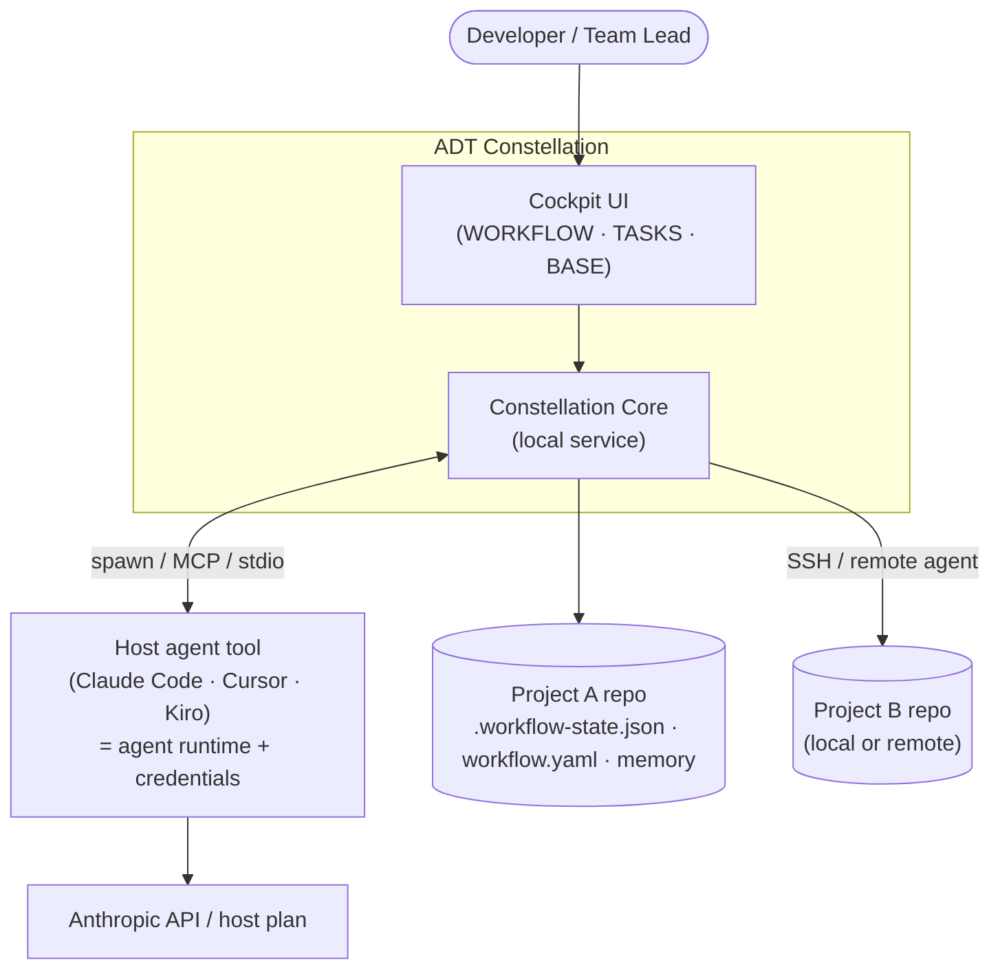
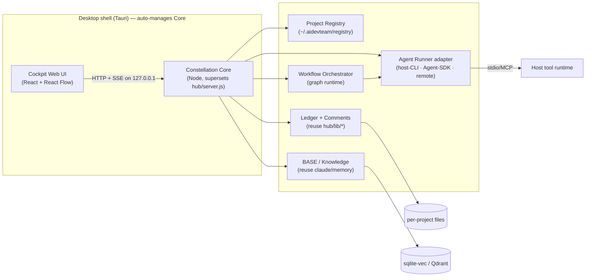
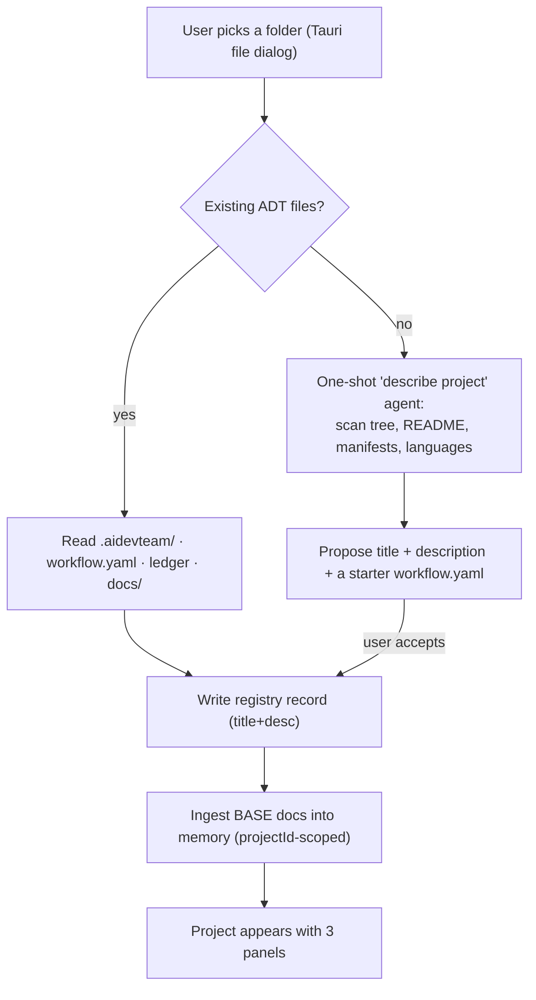
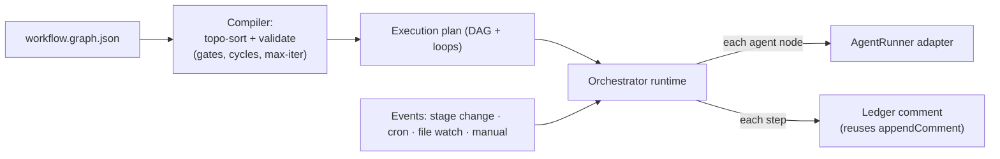
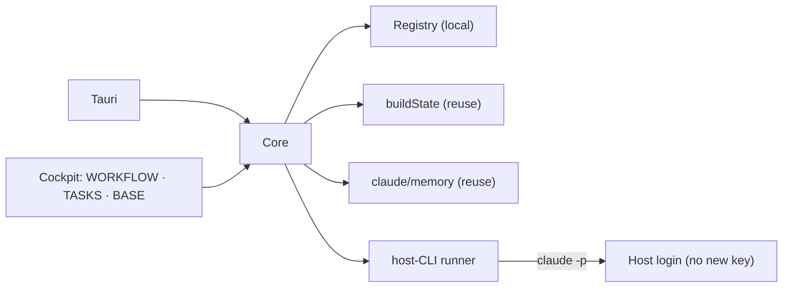

# ADT Constellation — Architecture (Multi-Project Agent Cockpit)

> **/arch (Jorge) — Architecture design.** Design only; no code in this document.
> Status: **Proposal** for review. Gate: `ARCH_APPROVED` is **not yet** set — this
> document is the input to that gate, not the approval itself.

## 0. Naming & scope

Working name: **ADT Constellation** — a cross-platform cockpit that runs the
existing AI Dev Team (ADT) agent workflow across **many** projects (local or
remote) and observes everything. Each project exposes three panels:
**WORKFLOW** (visual orchestration builder), **TASKS** (agent-managed board with
full history + archive), **BASE** (semantically-recalled rules/context).

The guiding constraint from the vision: **reuse what already ships** in this
repo — the `hub/` control-plane, the `.workflow-state.json` ledger + typed
comments, `workflow.yaml`, and the `claude/memory/` TS subsystem. We are
building an **integration + visualization layer over an existing engine**, not a
new engine. This is a Strangler-Fig-style extension of the hub, not a rewrite.

---

## 1. Business drivers & quality attributes

| Driver | Implication |
|---|---|
| Observe N projects at once | Multi-project registry + isolation as a first-class concern |
| "Don't run a server every time" | Runtime must **auto-spawn/auto-manage** its backend; no manual `node server.js` |
| Single whole with host tool (Kiro/Claude Code/Cursor) | Reuse the **host's agent runtime + credentials**, don't ask for a new key |
| Local-first but remote-capable | Same control-plane works over loopback and (guarded) over a network |
| Reuse existing assets | Hub ledger, `workflow.yaml`, `claude/memory/`, typed comments are the substrate |
| Cross-platform Win + Mac | No platform-specific core; web UI; portable Node/Rust runtime |

**Utility tree (top scenarios, (Importance, Difficulty)):**

```
Usability (30%)
├── Open app → see all projects' boards with zero manual server start   (H, M)
└── Build a workflow visually → it actually drives real agents          (H, H)
Reuse/Integration (25%)
├── Reuse host tool credentials, no new API key requested               (H, H)
└── Remote project observed identically to local                        (H, M)
Isolation/Safety (25%)
├── Project A's agents/keys/memory never bleed into project B           (H, M)
└── Off-loopback writes are authenticated, not open                     (H, H)
Maintainability (20%)
└── Constellation rides hub/memory upgrades without forking them        (M, M)
```

---

## 2. C4 — Context & Containers

### 2.1 System context (C1)



The host tool is the **agent runtime and the credential holder**. Constellation
Core is an orchestrator + observer that *drives* the host and *reads/writes* the
file-based project state. It does not embed an LLM client of its own in the
default path.

### 2.2 Container view (C2)



### 2.3 Component view (C3) of Constellation Core

| Component | Responsibility | Reuses |
|---|---|---|
| **Project Registry** | Register/connect a folder, store title+description from analysis, list/isolate projects | NEW (`~/.aidevteam/registry.json` + per-project `projectId`) |
| **Analyzer** | On connect, detect existing `.aidevteam/`/`claude/`/`.workflow-state.json`; if absent, run a one-shot "describe this project" agent (Kiro-style) | host agent + memory ingestion |
| **Ledger + Comments service** | Read multi-ticket projection; advance/assign/gate/comment with atomic CAS | `hub/lib/state.js`, `api.js`, `write.js`, `comments.js` (as-is) |
| **Workflow Orchestrator** | Compile the visual graph → an execution plan; fire triggers; run loops/conditions/background agents; record each step as ledger comments | NEW thin runtime over `workflow.yaml` semantics |
| **Agent Runner adapter** | One seam, three backends: host-CLI (default), Agent SDK (metered), remote (SSH) | NEW adapter contract (mirrors `workflow/adapters`) |
| **BASE / Knowledge service** | Index rules/policy docs; semantic recall into agent context | `claude/memory/` (stores, embeddings, hooks) **as-is** |
| **Control-plane HTTP/SSE** | Same POST API + SSE the hub already exposes, scoped per project | `hub/server.js` superset |

---

## 3. Open Question 1 — Packaging / runtime

### Decision: **Tauri desktop shell that auto-spawns a Node "Constellation Core" sidecar**, with the **browser UI reachable as a fallback** and an **optional IDE-webview thin client**.

**Why a desktop shell at all** — it is the only option that satisfies "don't run
a server every time": the app *is* the lifecycle manager. Launching the app
spawns Core; closing it (or a menubar "keep running" toggle) stops it. The user
never types a server command.

**Why Tauri over Electron** (current 2026 trade-offs):

| Criterion | Tauri (chosen) | Electron | Bare Node service | IDE extension only |
|---|---|---|---|---|
| Bundle size | ~3–10 MB | 100–150 MB+ | n/a (no shell) | small |
| Idle RAM | ~30–50 MB | 150–300 MB | n/a | host's |
| "No manual server" | **Yes** (sidecar lifecycle) | Yes | **No** | Yes |
| Cross-platform Win/Mac | Yes (native WebView) | Yes (bundled Chromium) | Yes | host-dependent |
| Sidecar Node service | **First-class `sidecar` concept** (lifecycle-managed) | trivial (Node already in main) | itself | awkward |
| UI consistency | per-OS WebView quirks (manageable for a dashboard) | pixel-perfect | n/a | host UI |
| Security posture | capability-based perms, small attack surface | larger surface | n/a | host sandbox |
| Remote-capable | UI is web → also serve to a browser | same | yes | no |

A dashboard does not need Chromium's pixel-perfect guarantees, so Tauri's only
real downside (per-OS WebView quirks) is acceptable, and we gain a 20–30× smaller
footprint and a clean menubar/tray lifecycle. **The cross-platform Win/Mac target
is met by Tauri's native-WebView model.** Electron remains the fallback only if a
WebView-incompatible UI dependency surfaces.

**Why the Core is a Node sidecar, not Rust:** the assets we must reuse — `hub/`
and `claude/memory/` — are **already Node/TS**. Rewriting them in Rust would
violate "reuse what ships." Tauri ships the Node Core as a **bundled
sidecar binary** (e.g. via a Node SEA / `pkg`-style single executable), and
manages its spawn/health/shutdown. The Tauri Rust layer stays thin: window,
tray, sidecar lifecycle, secure storage, file-picker, and OS keychain access.

**How "no manual server" is achieved, concretely:**
1. Tauri launches → starts the Core sidecar on `127.0.0.1:<ephemeral>`.
2. The Cockpit web UI (served by Core) loads in the Tauri WebView.
3. A **tray/menubar item** lets Core keep running headless after the window
   closes (so background/cron agents keep firing) — opt-in, off by default.
4. Quitting the app reaps the sidecar. No terminal, no `node server.js`.

**Browser + remote fallback:** because the UI is plain web served over HTTP/SSE
(exactly as `hub/server.js` does today), the same Core can be reached from a
browser, and — bound to a non-loopback host **behind the existing C3
anti-CSRF/anti-DNS-rebinding guard** (`hub/lib/guard.js`) plus a token — observed
remotely. Local and remote share one code path.

**IDE-webview thin client (secondary):** Kiro/VS Code/Cursor can host the same UI
in a webview panel that points at the running Core. This is a *view*, not a
second runtime — it reuses the host's running Core, reinforcing "single whole."

---

## 4. Open Question 2 — Subagent execution model + key reuse

### Decision: **Default to driving the host tool's own CLI/runtime (which already holds the user's credentials); offer the Claude Agent SDK as a metered, opt-in backend; reach remote projects by running that same runner over SSH on the remote host.** All three sit behind **one `AgentRunner` adapter seam.**

This is the single most consequential finding, because **the credential rules
changed in 2026** and they constrain the design:

- **The Claude Agent SDK requires an API key.** As of Feb 19 2026, Anthropic's
  terms state the Agent SDK **may not** authenticate with Free/Pro/Max
  *subscription* OAuth tokens — it needs an API key. So the SDK path **cannot**
  silently "reuse the host's plan."
- **The `claude` CLI binary is permitted on any machine** (local, VPS, CI) and,
  when the user has authenticated Claude Code with their plan, **invoking that
  CLI reuses their existing login/credentials** — no new key requested.
- Therefore **"reuse the host's keys" is achievable only by driving the host's
  own CLI/runtime**, not by embedding the SDK. This is exactly what makes
  Constellation "a single whole with the host tool."
- Note: from June 15 2026, headless/SDK and `claude -p` usage on a plan draws
  from a **separate Agent-SDK credit pool** ($20 Pro / $100 Max5x / $200 Max20x
  at API rates) — so even the host-CLI path has metered headless cost the UI
  should surface.

**The three backends:**

| Backend | How it runs agents | Credentials | When |
|---|---|---|---|
| **Host-CLI (default)** | Spawn `claude -p`/host headless command (or MCP/stdio into the host) per agent step | **Reuses host login** — no new key | Default; satisfies "reuse keys + single whole" |
| **Agent SDK (opt-in)** | TS/Python Agent SDK in-process | **Requires API key** (entered once, stored in OS keychain) | Power users wanting richer programmatic control / parallelism |
| **Remote (SSH)** | Run the host-CLI runner *on the remote machine* over SSH; stream results back | Remote host's own login | "Remote works if local does" |

**Key-reuse mechanics (no new key in the default path):**
- We never read the host's token. We **shell out to the host's own binary**,
  which authenticates itself. Constellation only sees stdout/stdin (results,
  tool calls), never the secret. This is both the compliant path and the
  privacy-correct one.
- If the user *opts into* the SDK backend, the API key is captured once and
  stored in the **OS keychain** via Tauri's secure-storage (Keychain on macOS,
  Credential Manager on Windows) — never in a repo file, never in
  `config.json` (which by contract holds *selection, not secrets*).

**Local vs remote, symmetric:** "remote" is just "run the runner there instead
of here." For a remote project, Core opens an SSH session, ensures the host CLI
is present, runs the same headless agent command in the remote repo, and streams
ledger/comment updates back over the existing SSE channel. The Cockpit cannot
tell local from remote apart from a badge.

**Limits / constraints to design around:**
- **Headless/cron auth:** unattended runs (background/conditional/cron agents)
  need a non-interactive credential. Host-CLI works if the host is already
  logged in on that machine; otherwise that project's background agents fall
  back to the SDK key (or are paused with a clear "needs auth" state).
- **Cost metering:** because headless now bills a separate pool, the
  Orchestrator must record per-run token/cost as ledger comments and surface a
  budget indicator (cross-cutting concern — see §11).
- **Concurrency:** host-CLI is process-per-step (heavier); SDK is in-process
  (lighter, better for fan-out loops). The adapter lets a workflow pick.

---

## 5. Open Question 3 — Project registry + analysis ("like Kiro")

### Decision: **A user-level registry at `~/.aidevteam/registry.json`; each project keyed by the existing `projectId` (sha1 of git-toplevel/realpath); isolation enforced by that id across ledger, comments, and vector rows — exactly the key `claude/memory/` already uses.**

**Registry record (per project):**

```jsonc
{
  "id": "a1b2c3d4e5f6",          // projectId(root) — already implemented
  "root": "/abs/path | ssh://user@host/abs/path",
  "title": "…",                 // from analysis
  "description": "…",           // from analysis
  "transport": "local | ssh",
  "lastSeen": "ISO-8601",
  "agentBackend": "host-cli | sdk | remote",
  "status": "connected | analyzing | needs-auth | offline"
}
```

The registry is **just an index**. The source of truth for each project stays
**inside that project's repo** (`.workflow-state.json`, `.aidevteam/`,
`workflow.yaml`, memory db) — so a project remains fully usable from the bare
hub/CLI without Constellation, and nothing about Constellation is committed into
the user's product repos.

**Connect / analyze flow (Kiro-style):**



- **Existing-files fast path** reuses `hub/lib/state.js::buildState()` verbatim:
  it already derives title/description/tickets/kb from a project dir.
- **Analysis path** runs a bounded read-only agent (the Analyzer) via the same
  AgentRunner used for everything else — no special-case code path — and writes
  nothing into the repo unless the user accepts the proposed `workflow.yaml`.

**Multi-project isolation (the hard requirement):**
- **State/comments:** every read/write is parameterized by project `root`
  (`buildState(project)`, `appendComment(project, …)` already are).
- **Memory/BASE:** every vector row is filtered by `project_id` with
  `scope: "project"` (already implemented in `restore-context.ts`); global rules
  use `scope: "global"`. Two projects can never recall each other's BASE.
- **Credentials:** per-project `agentBackend`; SDK keys are per-project entries
  in the OS keychain, never shared in process memory across projects.
- **Process:** each agent run is a child process/SSH session scoped to one
  project root; no shared mutable global.

---

## 6. Open Question 4 — WORKFLOW builder ↔ executable orchestration

### Decision: **Build a thin custom graph runtime on top of `React Flow` for the canvas, with a graph data model that *compiles to* the existing `workflow.yaml`/ledger semantics. Do NOT adopt n8n/Node-RED/Windmill as the engine.**

**Why not adopt a heavyweight engine:**
- **n8n / Node-RED / Windmill** are full execution *platforms* (their own
  runtime, persistence, auth, node catalog, server). Embedding one means running
  *their* server (the very thing the user dislikes), adopting their data model,
  and bending our agent/gate/ledger semantics to theirs. Heavy lock-in for a
  capability we mostly already have in `workflow.yaml` + the ledger.
- Notably, **n8n's editor is itself built on React Flow** — so the canvas we'd
  copy from is the library we'd use directly, minus the server baggage.
- **Rete.js** is a fine dataflow framework but TypeScript-first node-compute
  oriented; we want *agent orchestration*, not in-browser dataflow compute.

**Why React Flow (canvas) + custom runtime (execution):**
- React Flow is MIT, embeddable, infinitely customizable, and the de-facto
  standard for node UIs — it gives us the *visual* layer only.
- The *execution* layer is small because we already own the primitives: gates,
  tracks, owners, refusal policy, ledger, typed comments. The graph is a
  **richer front-end over the same engine**, and "essentially a visual program
  expressible as TypeScript" (the vision's words) maps cleanly to a compiled
  plan.

**Graph data model (`workflow.graph.json`, per project, stored in `.aidevteam/`):**

```jsonc
{
  "version": 1,
  "nodes": [
    { "id": "n1", "type": "trigger",  "on": "ticket.stage=implement" },
    { "id": "n2", "type": "agent",    "agent": "/be", "mode": "foreground",
      "input": "ticket", "writesGate": "—" },
    { "id": "n3", "type": "agent",    "agent": "/rev", "writesGate": "CODE_REVIEWED" },
    { "id": "n4", "type": "condition","expr": "gate.CODE_REVIEWED == 'rejected'" },
    { "id": "n5", "type": "loop",     "over": "rejected_findings", "maxIters": 3 },
    { "id": "n6", "type": "agent",    "agent": "/secops", "mode": "background" }
  ],
  "edges": [
    { "from": "n1", "to": "n2" },
    { "from": "n2", "to": "n3" },
    { "from": "n3", "to": "n4" },
    { "from": "n4", "to": "n5", "when": "true" },
    { "from": "n5", "to": "n2" }
  ]
}
```

**Node taxonomy:** `trigger` (event/stage/cron/file-change/manual),
`agent` (foreground/background/conditional, by `/role`), `condition`
(expression over gate/ledger state), `loop` (bounded iteration over a set),
`gate` (must-pass barrier mapping to `workflow.yaml` gates), `parallel`
(fan-out), `human` (approval pause).

**How the graph triggers agents (compile → run):**



- The **compiler** validates against `workflow.yaml` (a node can't claim a gate
  that doesn't exist; `safety_override` gates can't be bypassed; loops are
  bounded). This keeps the proportional-workflow contract authoritative — the
  visual graph **extends** it, never overrides safety gates.
- The **runtime** is event-driven: triggers come from the hub's existing SSE/file
  watchers (`fs.watch` on `.workflow-state.json`, ledger, file changes) and from
  a cron scheduler for background/scheduled nodes.
- **Every node execution is recorded as a typed ledger comment** — so TASKS gets
  its "full agent-written history" for free, and the audit trail stays uniform
  with CLI runs (the `AC-B6` property the hub already guarantees).

**TASKS panel** is then a *projection*: the existing multi-ticket `buildState`
board + the comment stream as human-readable history, plus an **archive** view
(done tickets + their full comment log). No new data store — TASKS is a view
over the ledger + comments that already exist.

---

## 7. Open Question 5 — BASE / knowledge layer (+ KGB/Canon/Bumbl evaluation)

### Decision: **BASE is `claude/memory/` reused as-is** — sqlite-vec by default, Qdrant optional, Voyage/Gemini embeddings, `projectId`-scoped collections, recalled via the existing SessionStart hook. **Do NOT couple Constellation to KGB/Canon or Bumbl in the core**; expose them as **optional adapters** for users who already run them.

**What BASE is:** the project's rules/policy/context docs, indexed and
semantically recalled into agent context. The `claude/memory/` subsystem already
delivers exactly this:
- Collections incl. `dev-rules` (global) and `decisions`/`learnings`/
  `session-context` (project-scoped) — `stores/collections.ts`.
- Pluggable store ladder qdrant→sqlite-vec→null that **never breaks a session**
  — `stores/factory.ts`.
- Recall on session start, filtered by `project_id`+`scope` — `restore-context.ts`.

So BASE in Constellation = **(a)** a UI to add/edit rule docs into a project's
`docs/`/`.aidevteam/kb`, **(b)** an ingestion step that chunks+embeds them into
the project-scoped collections (extending the existing transcript ingestion to
arbitrary docs), and **(c)** the existing recall feeding agent runs. **No new
vector subsystem is built.**

**KGB / Canon / Bumbl — what they are (from this repo + `~/.claude/plans/`):**
- **KGB (Knowledge General Base)** and **Canon** are the founder's
  **knowledge + governance backbone**: a Java service (`com.company.kb.*`) with
  RAG, a **governed write-back** model — proposals land in an **approval queue**
  as PENDING, are **TrustGate-evaluated**, carry a **per-proposal cost receipt**,
  and a **named senior approves/rejects**. Canon is the commercial fork; KGB the
  personal base. They appear in this repo only as an **optional cloud KB overlay**
  ("KGB-Canon") in `workflow/adapters/README.md` and the workflow-engine skill.
- **Bumbl** is the founder's **personal, privacy-first, self-hosted stack**
  (the `olehsvyrydov/knowledge-base` repo), a multi-purpose personal AI
  knowledge+automation system, developed passively.

**Recommendation on KGB/Canon/Bumbl backing BASE:**
- **Default BASE = `claude/memory/` (local, zero-account).** This is the OSS-first
  contract and keeps Constellation shippable without any external service. KGB,
  Canon, and Bumbl are *not present by default* and must not become hard
  dependencies.
- **Make KGB/Canon a first-class *optional* BASE adapter.** Its governed
  write-back (TrustGate + approval queue + cost receipts) is genuinely valuable
  for **team/regulated** use: agent-proposed rules become *governed* knowledge
  rather than silent writes. Wire it behind the existing adapter seam
  (`knowledge_base: { default: kgb-canon }`), health-checked, falling back to
  `claude/memory/` when absent — mirroring how the framework already treats
  Confluence/Obsidian.
- **Bumbl: treat as a personal deployment target, not a dependency.** If a user
  runs Bumbl as their self-hosted memory/KB, expose it via the same adapter
  contract (it would present as a `local-service` memory/KB backend). Do not
  build Constellation *on* Bumbl — that would couple a shared tool to one
  person's private stack.
- **One sentence:** *BASE is `claude/memory/` by default; KGB/Canon is the
  recommended optional governance overlay for teams; Bumbl is an optional
  self-hosted deployment target. None are required.*

**What I'd need to firm this up:** the KGB/Canon MCP tool surface
(search/propose/approve signatures) and whether TrustGate exposes a callable
"evaluate proposal" endpoint — these live in the Canon repo/Confluence, not this
repo, so the adapter contract above is specified against the *capabilities*
named in the plans, to be confirmed against the actual MCP schema.

---

## 8. Open Question 6 — Integration boundary with the existing hub

### Decision: **Reuse, don't replace. Constellation Core is a *superset* of `hub/server.js`.** The hub's libs are the load-bearing internals; Constellation adds the multi-project, orchestration, analyzer, and agent-runner layers around them.

| Existing asset | Verdict | Boundary |
|---|---|---|
| `hub/lib/state.js` (`buildState`) | **Reuse as-is** | The per-project projection — call it once per registered project |
| `hub/lib/api.js` (POST routes) | **Reuse + extend** | Keep advance/assign/gate/comment; add `workflow/run`, `project/connect`, `agent/invoke` routes |
| `hub/lib/write.js` (atomic CAS ledger, overlay, comments) | **Reuse as-is** | The only writer to the ledger — orchestrator writes go through it |
| `hub/lib/guard.js` (C3 anti-CSRF/rebinding) | **Reuse as-is** | The remote-access security floor; required before any off-loopback write |
| `hub/lib/comments.js` | **Reuse as-is** | TASKS history + agent-written log |
| `hub/server.js` HTTP/SSE | **Supersede** | Core keeps the same routes but multiplexes by project + manages the registry |
| `hub/public/index.html` | **Replace** | The read-only single-board UI becomes the multi-project Cockpit (React + React Flow) |
| `workflow.yaml` + engine semantics | **Reuse as authority** | The graph compiler validates against it; gates/refusal stay authoritative |
| `claude/memory/` | **Reuse as-is** | BASE = this subsystem |

**Boundary rule:** Constellation **never bypasses** `write.js` for ledger
mutations and **never weakens** `guard.js` for remote access. New capability is
*additive* (registry, orchestrator, runner, analyzer); the proven core is
*unchanged*. This is the Strangler-Fig seam — the new shell grows around the hub
without forking it.

---

## 9. Build-vs-reuse table (OSS candidates)

| Need | Candidates | Decision | Rationale |
|---|---|---|---|
| Desktop shell | **Tauri**, Electron | **Tauri** | 20–30× smaller, tray lifecycle, capability security, native WebView |
| Core runtime | **reuse `hub/` Node**, rewrite in Rust/Go | **Reuse Node** | Hub + memory already Node/TS; rewrite violates reuse |
| Visual canvas | **React Flow**, Rete.js, raw SVG | **React Flow (MIT)** | Standard, embeddable, what n8n itself uses |
| Workflow engine | **custom over `workflow.yaml`**, n8n, Node-RED, Windmill | **Custom thin runtime** | Avoid a second server + foreign data model; we own gates/ledger |
| Agent runtime | **host-CLI**, Claude Agent SDK, standalone | **host-CLI default + SDK opt-in** | Only host-CLI reuses the plan's credentials (SDK needs API key per 2026 terms) |
| Vector/BASE | **`claude/memory/` (sqlite-vec/Qdrant)**, LanceDB, pgvector | **Reuse `claude/memory/`** | Already implements project-scoped recall + graceful fallback |
| KB governance | **KGB/Canon adapter (optional)**, Confluence, Obsidian | **Optional adapter** | Governed write-back valuable for teams; never a hard dep |
| Secrets | **OS keychain via Tauri**, dotfile, env | **OS keychain** | config.json holds selection-not-secrets by contract |
| Remote transport | **SSH**, custom agent, Tailscale | **SSH (v1)** | Ubiquitous, no extra infra; runner runs remote-side |
| Scheduler | **node-cron in Core**, system cron | **node-cron in Core** | Cross-platform, lives with the lifecycle owner |

---

## 10. Security considerations

Threat model (STRIDE-lite) for a tool that runs agents across many repos and can
be reached remotely:

| Threat | Concern | Mitigation |
|---|---|---|
| **Spoofing / CSRF / DNS-rebinding** | Browser/remote UI mutating the ledger | **Reuse `hub/lib/guard.js`**: writes refused off-loopback unless `--allow-remote` + token; Origin/Host checks already implemented |
| **Tampering** | Concurrent/racy ledger writes | Atomic CAS via `write.js` (`expectedRev`) — already enforced |
| **Info disclosure (cross-project)** | Project A recalling B's BASE; key bleed | Hard `project_id`+`scope` filter on every recall; per-project keychain entries; no shared global creds |
| **Credential theft** | API keys in repo/config | Default path holds **no key** (host-CLI); SDK keys only in OS keychain; `config.json` = selection, not secrets |
| **Elevation via remote exec** | SSH runner = remote code execution | Explicit per-project opt-in, host allowlist, known-hosts pinning, no arbitrary shell — only the agent command |
| **Repudiation** | "who advanced this gate?" | Every mutation emits a typed comment with author (`AC-B6`) — uniform audit trail |
| **DoS / runaway agents** | Loop nodes, background fan-out, cost blow-up | Bounded `maxIters`, concurrency caps, per-run cost receipts + budget guard (cron agents pausable) |
| **Supply chain** | New deps (Tauri, React Flow) | Pin + SBOM; Core default stays zero-runtime-dep like the hub; deps live in the UI/shell layer |

**`/secops` (`SECOPS_APPROVED`, hard, safety-override) is mandatory** before
build: this system touches **secrets, network, external input, and file access**
— four of the gate's triggers. Remote exec (SSH runner) in particular needs a
dedicated threat-model pass.

---

## 11. Cross-cutting concerns (per skill guidance)

Timing, **token/cost accounting**, logging, tracing, and audit are cross-cutting
— route them uniformly, not hand-woven per agent call:
- **Cost/usage accounting** (now first-class given the June-2026 separate credit
  pool): wrap every `AgentRunner` invocation in a metering decorator that records
  tokens/cost as a ledger comment and updates a per-project budget indicator.
- **Audit:** the typed-comment emission is the audit aspect — one path, every
  mutation (already true in `api.js`/`write.js`).
- **Do not** bury orchestration *decisions* (which agent, which branch) in these
  wrappers — that is domain logic and must stay visible in the graph/plan.

---

## 12. MVP architecture (thin vertical slice)

Ship the smallest thing that proves the whole loop, reusing the hub end-to-end:

1. **Tauri shell** that spawns the Node Core sidecar (reuse `hub/server.js`
   superset) — proves "no manual server."
2. **Registry + connect** for **local** projects only; existing-files fast path
   via `buildState`; basic analyzer (title+desc) — proves multi-project.
3. **Cockpit** with the three panels, but:
   - **TASKS** fully functional (it's the existing board + comments + archive).
   - **BASE** = add docs → ingest into `claude/memory/` → recall (reuse memory).
   - **WORKFLOW** = React Flow canvas that **reads/writes `workflow.graph.json`**
     and can run **one linear trigger→agent→gate chain** via the **host-CLI
     runner** — proves graph→real-agent.
4. **host-CLI AgentRunner only** (no SDK, no SSH yet) — proves credential reuse.
5. **Reuse `guard.js`** so the same UI works in a browser on loopback.

**Deliberately deferred past MVP:** SSH/remote runner, Agent SDK backend, cron
background agents, loops/conditions/parallel nodes, KGB/Canon adapter, IDE
webview client, Windows packaging polish (target Mac first, Win second).



---

## 13. Risks & unknowns (explicit)

| # | Risk / unknown | Severity | Notes / what would resolve it |
|---|---|---|---|
| R1 | **Agent-SDK ≠ plan reuse.** SDK needs an API key (2026 terms); only host-CLI reuses the login. If host-CLI headless is rate-limited/awkward, the "no new key" promise weakens. | **High** | Spike `claude -p` headless throughput + auth on a logged-in machine; confirm per-host login persistence |
| R2 | **Headless cost.** From Jun 15 2026 headless draws a separate, smaller credit pool — background/loop agents can exhaust it. | **High** | Cost metering + budget guard from day one (§11); surface spend in UI |
| R3 | **Remote = remote code execution.** SSH runner is powerful and dangerous. | **High** | Dedicated `/secops` threat model; opt-in, allowlist, host-key pinning before shipping remote |
| R4 | **Node sidecar packaging in Tauri.** Bundling a Node runtime/SEA as a Tauri sidecar across Win+Mac (signing, notarization) is fiddly. | **Med** | Spike Node SEA + Tauri sidecar on both OSes early; fallback = Electron if blocked |
| R5 | **Headless auth for cron/background agents.** Unattended runs need a non-interactive credential the host CLI may not provide. | **Med** | Define "needs-auth" pause state; SDK-key fallback for unattended projects |
| R6 | **`projectId` is path-based** — move/rename orphans history (documented limitation in `project-id.ts`). | **Med** | Add a re-link/migrate action in the registry UI |
| R7 | **KGB/Canon/Bumbl interfaces unverified** here — their MCP/tool surface lives in other repos. | **Med** | Confirm TrustGate "evaluate" + propose/approve MCP signatures before building the adapter |
| R8 | **Tauri WebView quirks** for a complex React Flow canvas across OS WebViews. | **Low-Med** | Test canvas on WKWebView (Mac) + WebView2 (Win) early |
| R9 | **Multiple Cores / port collisions** when IDE webview + desktop app both run. | **Low** | Single-instance lock + discovery file in `~/.aidevteam/` so views attach to one Core |
| R10 | **Scope creep** — this can balloon into "build n8n + Kiro." | **Med** | The MVP (§12) is the contract; defer everything in the deferred list |

---

## 14. Decision summary (for the ARCH gate)

1. **Packaging:** Tauri desktop shell that **auto-spawns a Node Core sidecar**
   (a superset of the existing hub); same UI also reachable via browser/remote
   and via an IDE webview thin client. Solves "no manual server"; Win+Mac.
2. **Execution + keys:** **host-CLI runner by default** (reuses the host's
   login — the *only* compliant way to reuse the plan; SDK requires an API key
   per 2026 terms), **Agent SDK opt-in (keychain-stored key)**, **remote via SSH
   runner** — one `AgentRunner` seam; local and remote symmetric.
3. **Registry/analysis:** user-level `~/.aidevteam/registry.json` keyed by the
   existing `projectId`; existing-files fast path via `buildState`, else a
   one-shot analyzer; isolation via `project_id`+`scope` everywhere; SoT stays in
   each repo.
4. **WORKFLOW:** **React Flow** canvas + **thin custom runtime** that compiles
   `workflow.graph.json` to a plan validated against `workflow.yaml`; every step
   is a typed ledger comment. **Reject n8n/Node-RED/Windmill** as the engine.
5. **BASE:** **reuse `claude/memory/` as-is**; **KGB/Canon as an optional
   governance overlay** (recommended for teams), **Bumbl as an optional
   self-hosted target** — none required.
6. **Hub boundary:** **reuse, don't replace** — Core supersets `hub/server.js`
   and never bypasses `write.js`/`guard.js`.

**Gate status:** `ARCH_APPROVED` pending review of this document. **`SECOPS_APPROVED`
is mandatory next** (secrets + network + external-input + file triggers, plus
remote code execution) before any implementation.
