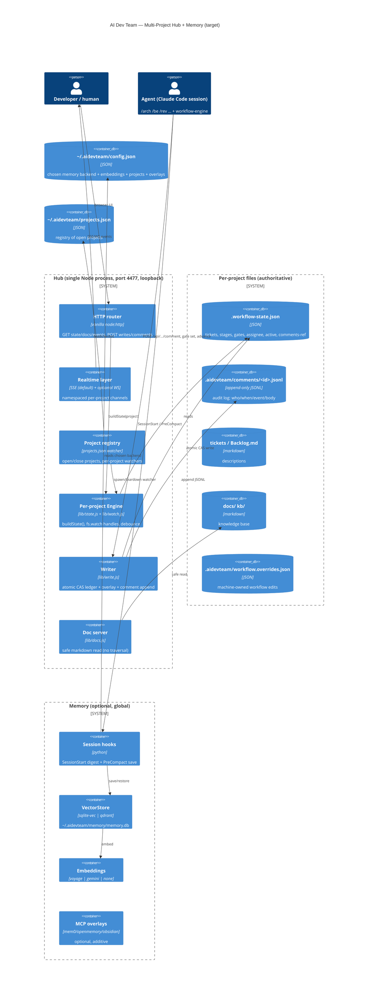

# ARCHITECTURE — Multi-Project Hub, Ticket Comments, Realtime Push & Pluggable Memory

*Author: Jorge (Solution Architect). Status: design only (plan mode). Folds into `~/.claude/plans/imperative-mapping-prism.md` as the architecture section. Extends — does not restart — that draft (Phases 1–3 stand; this adds Phase 4 multi-project + control-plane surface).*

---

## 0. Architectural principles (the guardrails this design must honor)

These are the existing project invariants; every decision below is justified against them.

1. **Zero paid by default / OSS-first.** Defaults need no paid account, no Docker, no `npm install`. Optional overlays only (`claude/workflow/adapters/README.md`).
2. **Zero runtime dependencies for the hub.** `hub/server.js:1-12` is vanilla Node `http`/`fs`/`path`/`os`. Any new transport (WebSocket) must be evaluated against this — see §5.
3. **Proportional workflow / file-based authoritative.** The ledger (`.workflow-state.json`), tickets (markdown), KB (`docs/`) are the source of truth; the hub *reflects* and now *appends to* them but never becomes a second database (`hub/server.js:133-196`).
4. **Loopback-default security.** `HOST='127.0.0.1'` (`hub/server.js:22`); any write/comment endpoint or WS exposure must stay loopback-only unless explicitly opted in (§7).
5. **Never break a session / degrade gracefully.** Memory hooks `exit 0`; missing backend → file-based fallback (carried from Phase 1 of the existing plan).
6. **Pristine YAML.** Machine writes never touch the commented `workflow.yaml`; they go to a JSON overlay (existing plan §Phase 3; reused here).

---

## 1. C4 Container view (target)



The whole runtime stays **one Node process** — multi-project is achieved by namespacing inside it, not by N servers. This preserves the 5-minute first run (`node hub/server.js`) and the zero-dep ethos.

---

## 2. Multi-project model + project registry (Requirement 4 — the big one)

### 2.1 Registry

- **Location:** `~/.aidevteam/projects.json` (sits beside the existing `~/.aidevteam/workflow.yaml` and the planned `memory/memory.db`). One global, user-owned file.
- **Shape:**
  ```json
  {
    "version": 1,
    "projects": [
      { "id": "a1b2c3", "path": "/home/oleh/git/acme", "label": "acme", "color": "#6e56cf", "pinned": true, "lastSeen": "2026-06-07T10:00:00Z" }
    ]
  }
  ```
- **`id`** = stable short hash of the **canonical** project path (`git rev-parse --show-toplevel` else realpath of dir). This is the **same `project_id` the memory layer uses** (existing plan §1b) — one identity across hub + memory, so a project's board and its vector rows line up. Add `lib/project-id.js` and have the Python `state_digest`/store share the algorithm (documented, both sides hash `realpath`).
- **Bootstrapping:** the project passed on the CLI (`node hub/server.js [projectDir]`, `server.js:30`) is auto-registered (upsert by id). Additional projects are added via `POST /api/project/open {path}` or by editing `projects.json` (the file is watched, so external edits appear live). `--no-registry` keeps today's single-project behavior for purists.

### 2.2 Per-project engine + watcher lifecycle

Refactor the current global singletons (`clients`, `watched`, `buildState` over one `PROJECT` — `server.js:199-267`) into a **`ProjectInstance`** class (`hub/lib/project.js`), one per open project:

```
ProjectInstance {
  id, path, color
  state()        -> buildState(path)        // lib/state.js, path-parameterized
  watchers Set   // its own fs.watch handles, torn down on close
  rev            // ledger+overlay mtime:size, for CAS
  subscribers Set<conn>   // SSE/WS connections subscribed to THIS project
}
```

A **`ProjectManager`** (`hub/lib/registry.js`) owns the `Map<id, ProjectInstance>`, reads/writes `projects.json`, and spawns/tears down instances. `buildState()` and all the file readers in `server.js:42-241` move to `lib/state.js` **path-parameterized** (this is already a planned Phase-2 extraction — we just make `PROJECT` an argument instead of a module global).

### 2.3 Resource / scale considerations (many fs.watch handles)

This is the real risk. Each project today registers ~12 `fs.watch` targets (`server.js:261-266`). With N projects that is 12N inotify watches plus recursive churn.

Mitigations (ordered):
1. **Lazy activation.** A registered project is **cold** (no watchers) until a client subscribes to it or it's the CLI project. On last-unsubscribe + idle timeout (e.g. 5 min) it goes cold again and releases watches. `projects.json` shows all; only *active* ones hold handles.
2. **Cap active projects** (default 8, `--max-active`). Beyond the cap, fall back to **poll-on-demand**: rebuild state only when `/api/state?project=` is requested (no live push for cold projects) — still correct, just not live.
3. **Watch fan-in.** Keep the existing debounce (`server.js:250-252`) but make it **per-project** so one noisy project doesn't coalesce another's events.
4. **EMFILE guard.** Wrap `fs.watch` (already `try/catch` at `server.js:255`); on `EMFILE`/`ENOSPC` degrade that project to polling and surface a `project.degraded` event rather than crashing the process.

Trade-off: lazy/cold projects sacrifice instant liveness for bounded resource use — acceptable because a developer actively watches 1–3 boards at once; the rest are tiles that hydrate on click.

### 2.4 Isolation

- **Path isolation:** every project access is keyed by registry `id` → resolved `path`; the API never accepts a raw filesystem path for reads except `POST /api/project/open` (validated: must exist, be a dir, be canonicalized; optional `--project-root` allowlist confines openable paths). Doc/comment reads are confined to within that project's resolved root (§3.3, §6).
- **State isolation:** no shared mutable state between instances except the registry file; a malformed ledger in project A (`server.js:141-143` already tolerates this) cannot affect B.
- **Channel isolation:** realtime events carry `projectId`; a subscriber only receives events for projects it subscribed to (§5.3).

---

## 3. Ticket description + append-only comment log (Requirement 1)

### 3.1 Where it lives — decision

| Option | Verdict |
|---|---|
| Inline in ledger `.workflow-state.json` | **No** for comments. The ledger is rewritten wholesale on every gate change (CAS); an unbounded comment array there bloats it, fights the CAS rev, and pollutes PR diffs. |
| Inside the ticket markdown | **Description: yes** (it already is — `server.js:158-168` reads `title`/`status`; description is just the markdown body). **Comments: no** — agents appending to prose markdown is lossy and unstructured. |
| **Sidecar append-only JSONL per ticket** | **Yes for comments.** `\.aidevteam/comments/<ticketId>.jsonl`. Append-only = no read-modify-write race, cheap concurrent writes (O_APPEND), naturally an audit trail, diff-friendly, git-ignorable per team. |

**Decision:**
- **Description** = the ticket's markdown body (the file already located by `readTickets()` at `server.js:147-185`), or `ledger[id].description` if a ticket has no markdown file (ledger-only tickets). The detail popup shows: title + description (rendered markdown) + the gate strip + the comment log.
- **Comments** = `.aidevteam/comments/<ticketId>.jsonl`, one JSON object per line.

### 3.2 Comment record (the audit-trail unit)

```json
{ "id": "c-01J...", "ticket": "ADT-124", "ts": "2026-06-07T10:00:00Z",
  "author": "/rev", "kind": "gate", "gate": "CODE_REVIEWED", "state": "rejected",
  "body": "Reset endpoint not rate-limited — see ADT-130 before re-review.",
  "rev": "1717752000000:842" }
```

- `kind ∈ comment | gate | handoff | assign | advance | system`. **This is the tie-in to the workflow-engine**: every gate decision and handoff the engine records in the ledger *also* appends a `kind:"gate"`/`"handoff"` comment, so the popup is a chronological audit trail of who-did-what-when, reconciling with `ledger.gates[G].{by,at,note}` (`ledger.md:31-33`). Free-text agent/human notes are `kind:"comment"`.
- `author` = agent command (`/rev`) or `hub`/`human`. `ts` ISO-8601. `id` = ULID/uuid for client de-dup. `rev` snapshots the ledger rev at write time for ordering.
- Append is **atomic** via `fs.appendFile` with a trailing `\n` (single-line writes under `PIPE_BUF`/typical sizes are atomic on POSIX; cap body at 8 KB to stay safe — oversized bodies are written via the CAS path with a lock).

### 3.3 APIs (agents AND hub append; both go through `lib/write.js`)

| Endpoint | Body | Effect |
|---|---|---|
| `POST /api/ticket/comment` | `{project, id, author, body, kind?}` | append one comment line |
| `GET /api/ticket/:id?project=` | — | `{description, gates, assignee, active, comments[]}` for the popup |
| (existing) `POST /api/gate/set` | `{project,id,gate,state,note,expectedRev}` | sets gate in ledger **and** auto-appends a `kind:"gate"` comment |

**Agent path:** agents don't speak HTTP naturally, so provide a tiny CLI `node hub/lib/comment.js <project> <ticket> <author> <body>` (and the engine calls it on gate/handoff) — this is the same pattern as the planned `digest.js` CLI. The CLI writes the JSONL **directly** (file-based authoritative) and, if a hub is running, the hub's `fs.watch` on `.aidevteam/comments/` picks it up and pushes `comment.added`. So comments work with or without the hub running — faithful to file-based-authoritative.

**Watcher addition:** add `.aidevteam/comments` to the per-project watch list (extends `server.js:261-264`).

---

## 4. Status state machine + active-agent signal (Requirement 2)

### 4.1 Canonical stage/status state machine

Stages already exist implicitly as ledger `stage` strings and track arrays (`workflow.yaml:28-32`). Make them canonical in **`hub/lib/stage-map.js`** (already planned Phase-2) by enumerating the stage tokens and their gate + owner:

```
vision→/po  architecture→ARCH_APPROVED(/arch)  security→SECOPS_APPROVED(/secops)
design→DESIGN_APPROVED(/ui)  approval_gate→APPROVAL_GATE(/verify)
implement|tdd→/be|/fe  code_review→CODE_REVIEWED(/rev)  design_qa→/ui
qa→/qa  reliability→RELIABILITY_OK(/sre)  verify→VERIFIED(/verify)  done→—
```

**Status label + color** (UI): a derived `statusClass` per ticket, reusing the existing CSS state palette (`index.html:36-50`, `--ok/--pend/--rej`):
- `blocked` (red) — any **hard** gate `rejected` for the current stage.
- `in_progress` (accent/purple) — an agent is active (§4.2) **or** current-stage gate `pending` with an assignee.
- `waiting` (amber) — current-stage gate `pending`, no assignee (needs pickup).
- `done` (green) — `stage==="done"`.
Color is a function of `(stage gate-state, active flag)` — deterministic, computed in `lib/state.js`, so SSE/WS just carries it.

### 4.2 "Which agent is working right now" — assignee + heartbeat

Two distinct signals, both optional and backward-compatible (old ledgers parse unchanged — `server.js:203-210`):

1. **`assignee`** (durable, who *owns* the stage) — planned Phase-2 ledger field. `{assignee, assigned_at}` per ticket. If absent, fall back to `expectedOwner(stage)` from the stage-map (greyed in UI — planned).
2. **`active`** (ephemeral, who is *touching it now*) — a heartbeat:
   ```json
   "active": { "agent": "/rev", "since": "2026-06-07T10:00:00Z", "heartbeat": "2026-06-07T10:00:30Z" }
   ```
   Written to the ledger ticket entry (small, latest-wins, fits the CAS write). An agent (via the workflow-engine handoff or the comment CLI) stamps `active` when it starts on a ticket; `heartbeat` is refreshed on each comment/gate write. The hub treats `active` as **stale after 90 s** (no heartbeat) and renders it as idle — this avoids a ghost "working now" when a session dies. No separate process needed; the heartbeat rides existing writes. A `--heartbeat` ping endpoint (`POST /api/ticket/active {project,id,agent}`) lets a long-running agent refresh without a comment.

UI: the card shows a colored status pill + an **avatar/agent chip** (`/rev` working now, pulsing) when `active` is fresh; the existing live-dot pulse animation (`index.html:25-27`) is reused for the "active now" indicator.

---

## 5. Realtime transport — SSE vs WebSocket (Requirement 5)

### 5.1 Decision: **keep SSE as the default/primary; add an optional, dependency-free minimal WebSocket upgrade for bi-directional/low-latency clients.** Recommend **SSE-primary, WS-optional**.

**Justification under the zero-dep ethos:**
- SSE already works, is one-directional server→client (exactly the push the board needs), auto-reconnects natively (`index.html:119-121`), and is pure `http` (`server.js:278-291`). For *push notifications + immediate reaction to status changes*, SSE is sufficient and free.
- The only thing SSE can't do is **client→server over the same socket** and sub-frame latency. But the hub already has a **POST API** (Phase 3) for client→server. So we don't *need* WS for writes.
- A **WebSocket server in vanilla Node is feasible** with zero deps: `http`'s `upgrade` event + a ~150-line RFC 6455 frame coder (handshake = SHA-1 of `Sec-WebSocket-Key + GUID` via `crypto`; mask/unmask; opcodes text/ping/pong/close). This is well-trodden. **Risk:** correctly handling fragmentation, large frames, backpressure, and ping/pong is easy to get subtly wrong, and it's security-sensitive surface (§7). A vetted micro-dep (`ws`) would be safer but breaks "no `npm install`".

**Recommendation:** ship **SSE as the guaranteed-zero-dep default** that fully satisfies all five requirements today. Add a **minimal vanilla-Node WS** behind a flag (`--ws`) as a progressive enhancement for clients wanting a single duplex channel and instant client→server intents (e.g. live "agent active" pings) — implemented as `hub/lib/ws.js`, ~150 LOC, no dependency, **off by default**, loopback-only, and the UI auto-falls-back to SSE+POST if the WS handshake fails. This honors zero-dep (default path unchanged) while giving the duplex option. **Do not** take a runtime dependency; if the vanilla WS proves fiddly in review, the SSE+POST path already meets every functional requirement, so WS can be dropped without loss.

### 5.2 Unified event model (transport-agnostic)

Both SSE and WS carry the same envelope so the frontend renderer is transport-agnostic:

```json
{ "type": "ticket.updated", "projectId": "a1b2c3", "ts": "...", "data": { ...ticket } }
```

Event types: `state.snapshot` (full board on connect), `ticket.updated`, `gate.changed`, `comment.added`, `agent.active`, `project.added`, `project.removed`, `project.degraded`. (`ticket.updated`/`gate.changed` can also be coalesced into a project-scoped `update` for parity with today's single `update` event — keep `update` as the catch-all so existing `index.html:120` still works.)

### 5.3 Subscription / namespacing protocol

- **SSE:** `GET /api/events?projects=a1b2c3,d4e5f6` (CSV of project ids; `*` = all active). The connection is added only to those `ProjectInstance.subscribers` sets. Subscribing to a cold project warms it (§2.3). Backward compatible: `/api/events` with no `projects` → the CLI/default project (today's behavior).
- **WS:** client sends `{op:"subscribe", projects:[...]}` / `{op:"unsubscribe", ...}` / `{op:"active", project, ticket, agent}` (heartbeat). Server pushes the same envelopes. One socket, many projects.
- **Fan-out:** `broadcast(projectId, event)` iterates `instance.subscribers` only (replaces the global `clients` set at `server.js:244-249`), so project A's churn never wakes project B's clients.

---

## 6. Knowledge-base doc serving (Requirement 3)

- **API:** `GET /api/doc?project=<id>&path=<relpath>` → `{ name, path, markdown }` (raw markdown; the client renders it — keep server zero-dep, no markdown lib needed; a tiny client-side renderer or `<pre>` fallback).
- **Safe path handling (no traversal) — the critical part:**
  1. Resolve `root` = the project's KB dir as `readKb()` already does (`server.js:188-196`): `docs/` → `kb/` → `.aidevteam/kb/`.
  2. `const abs = path.resolve(root, userPath)`.
  3. **Reject unless** `abs === root || abs.startsWith(root + path.sep)` (the same containment check `wfLabel` uses at `server.js:68`). This defeats `../`, absolute paths, and symlink-escape (resolve with `fs.realpathSync` then re-check containment).
  4. Allowlist extension: `.md` only (matches the KB filter `server.js:193`). Cap file size (e.g. 1 MB).
  5. Never echo absolute paths back over the API (consistent with `server.js:229` "don't leak the absolute path").
- **Watcher:** `docs/` is already watched (`server.js:263`); a `doc.changed` event can refresh an open viewer.
- KB list items become clickable in the UI (`index.html:111-114`), opening the popup that fetches `/api/doc`.

---

## 7. Security

| Surface | Control |
|---|---|
| **Bind** | Loopback `127.0.0.1` default (`server.js:22`) unchanged. |
| **Writes/comments** | All `POST` (advance/assign/gate/comment/active/project-open) allowed **only on loopback**. If `--host 0.0.0.0`/`::`, POST returns `403` unless `--allow-remote-writes` is explicitly passed (carried from existing plan §Phase 3). |
| **WS exposure** | `--ws` honors the same rule: off-loopback WS upgrades are refused unless `--allow-remote-writes`. WS `Origin` header checked against an allowlist (`http://localhost:PORT`, `127.0.0.1`) to block cross-site WS hijacking from a browser tab. |
| **Multi-project path validation** | `POST /api/project/open` canonicalizes + must be an existing dir; optional `--project-root <dir>` allowlist confines openable roots. Doc/comment reads confined to the project's resolved root (§6). Registry ids, not raw paths, used in every other endpoint. |
| **Body limits** | 64 KB request cap (existing plan); comment body 8 KB; doc 1 MB. Reject oversized with `413`. |
| **Input validation** | Unknown project id / ticket id / gate / state / preset → `400`. `expectedRev` CAS mismatch → `409` + fresh state (no clobber). |
| **No secrets on disk** | Memory API keys read from env only; never written to `config.json`/`settings.json`/the DB (carried from existing plan). |
| **Author spoofing** | `author` on comments is advisory (local trust model — loopback, single user). Documented as such; not an auth boundary. |

Threat note for /secops review: the new attack surface is (a) path traversal on `/api/doc` and `project/open` — mitigated by canonical-containment checks; (b) the vanilla WS frame parser — mitigated by keeping it off-by-default, loopback-only, Origin-checked, and small/auditable; (c) write endpoints — mitigated by loopback gate. **This warrants a `SECOPS_APPROVED` gate** (file_upload? no; external_input + network: yes) before implementation.

---

## 8. Memory architecture (Requirement 6) — pluggable store + embeddings + MCP overlays + interactive install

This **adopts the existing plan's Phase 1** (pluggable `VectorStore` with sqlite-vec default + Qdrant optional; pluggable embeddings Voyage|Gemini; deterministic file digest at SessionStart; hooks wired by installer) and adds the **interactive-install config + overlay contract** the user now wants.

### 8.1 Config of record — `~/.aidevteam/config.json`

One user-level config beside `projects.json`/`workflow.yaml`/`memory.db`:

```json
{
  "version": 1,
  "memory": {
    "backend": "sqlite",            // none | sqlite | qdrant
    "embeddings": "voyage",         // none | voyage | gemini
    "dbPath": "~/.aidevteam/memory/memory.db",
    "qdrantUrl": null
  },
  "overlays": {                      // additive MCP memory overlays, opt-in
    "mem0":       { "enabled": false },
    "openmemory": { "enabled": false },
    "obsidian":   { "enabled": false }
  },
  "hub": { "maxActive": 8, "ws": false }
}
```

- Secrets are **not** here — only the *choice*. Keys stay in env (`VOYAGE_API_KEY`, `GEMINI_API_KEY`) per the existing fallback ladder. The Python `factory.py`/`embeddings_factory.py` (existing plan §1a/1e) read `config.json` for the *backend selection*, then env for keys, then degrade.

### 8.2 Interactive memory choice (extends `install.sh` + `setup-claude-backends.sh`)

`install.sh` today is editor-only; `scripts/setup-claude-backends.sh` already has the interactive RAG/Qdrant/Voyage prompts (`:287-373`, `setup_hooks :454`). The clean split:

- Add a **memory wizard** step (in `setup-claude-backends.sh`, reachable from `install.sh`'s "optional advanced backends" pointer at `install.sh:265`):
  - **Q1 store:** `none` (digest-only, no vectors) / `sqlite-vec — no Docker` *(recommended default)* / `Qdrant — Docker`.
  - **Q2 embeddings:** `none` (digest-only) / `Voyage` (prompt key) / `Gemini` (prompt key).
  - Writes the choice to `~/.aidevteam/config.json`; runs `install_hooks.py` (existing plan §1f) to wire SessionStart/PreCompact idempotently; if `none/none`, still wires the **deterministic digest** hook (workflow never lost) but skips vector setup.
- Honors `--yes`/`--dry-run` (defaults: `sqlite`, embeddings `none` unless a key is already in env). No Docker, no key, no paid account on the default path — zero-dep ethos intact.

### 8.3 Overlay contract — "connect MCP memory later, easily"

Reuse the **existing adapter contract** (`claude/workflow/adapters/README.md`: capabilities / health-check / fallback / data-residency) and the ready overlays already shipped (`adapters/mcp/{mem0,openmemory,obsidian}.json`). A memory overlay is **additive on top of** the local VectorStore, not a replacement:

- **Contract:** an overlay declares `capabilities: [search_memory, store_memory]`, a `health-check` (MCP tool reachable / env var set), and `data-residency`. When enabled in `config.json.overlays`, the SessionStart retrieval **federates**: local VectorStore results + overlay results, merged/de-duped by content hash, local-first ordering. If an overlay is unhealthy → silently skipped (fallback = local; never blocks).
- **"Connect later":** a one-liner `setup-claude-backends.sh --add-overlay mem0` (or editing `config.json` + copying the `adapters/mcp/*.json` snippet into `.mcp.json`, exactly the documented two-step at `adapters/README.md:29-39`). No re-install, no migration — the local DB stays authoritative.
- **Project KB as an overlay:** the same federation lets a project-scoped store (`export_project.py` → `<project>/.aidevteam/memory/project.db`, existing plan §1b) or an Obsidian vault participate, scoped by `project_id`.

This keeps **OSS-first** (sqlite-vec default, mem0/OpenMemory self-host option, Voyage/Gemini both have free tiers) and **no lock-in** (overlays additive, removable).

---

## 9. Concurrency & safety

- **Ledger writes (hub vs agent vs hub-multi-tab):** single writer `lib/write.js` — `atomicWriteJSON` (tmp + `fsync` + `rename`) + **compare-and-swap** on `rev` (`mtimeMs:size` of ledger+overlay) → stale `expectedRev` ⇒ `409` + fresh state; in-process async **mutex** serializes concurrent hub writes (existing plan §Phase 3). The `active` heartbeat and gate writes both go through this.
- **Comment appends:** O_APPEND single-line writes are lock-free and concurrent-safe (multiple agents can comment the same ticket without CAS); ordering is by `ts`+`rev`. Bodies > 8 KB take the locked path.
- **Watchers:** per-project debounce (§2.3) prevents cross-project coalescing; idempotent re-scan (`server.js:252`) preserved; EMFILE → degrade-to-poll, not crash.
- **Memory hooks:** wrapped top-level try/except → always `exit 0`; digest printed+flushed before any embedding; short deadlines (existing plan §1d).
- **Registry edits:** `projects.json` is read-modify-write under the same atomic+mutex helper; external manual edits are picked up via watch.

---

## 10. Files to add / modify (one-line roles)

**Hub — multi-project + control plane (new Phase 4, builds on planned Phase 2/3):**
- `hub/lib/state.js` — *(planned)* path-parameterized `buildState(project)` + all file readers extracted from `server.js:42-241`; add `statusClass`, `active`, `description`.
- `hub/lib/stage-map.js` — *(planned)* canonical stage↔gate↔owner map + `expectedOwner`/`statusClass`.
- `hub/lib/project.js` — **new** `ProjectInstance` (own watchers, subscribers, rev, state).
- `hub/lib/registry.js` — **new** `ProjectManager` over `~/.aidevteam/projects.json`; lazy warm/cold, max-active cap.
- `hub/lib/project-id.js` — **new** stable project id (realpath/git-root hash), shared identity with memory.
- `hub/lib/watch.js` — **new** per-project debounced fs.watch with EMFILE→poll fallback.
- `hub/lib/write.js` — *(planned)* sole writer: atomic CAS ledger, overlay, **comment append**, `active` heartbeat.
- `hub/lib/comments.js` — **new** read/append `.aidevteam/comments/<id>.jsonl`.
- `hub/lib/docs.js` — **new** safe markdown read for `/api/doc` (containment + ext + size checks).
- `hub/lib/sse.js` — **new** SSE registry namespaced by project (extract from `server.js:244-291`).
- `hub/lib/ws.js` — **new, optional** ~150-LOC vanilla RFC6455 WS (handshake/frames/ping), off by default.
- `hub/lib/comment.js` — **new** agent-facing CLI to append a comment (engine + humans call it).
- `hub/server.js` — **modify** thin transport: router (GET state/doc/events/ticket, POST writes/comments/project), `upgrade` handler for WS, `ProjectManager` wiring; replace global `clients`/`PROJECT` singletons.
- `hub/public/index.html` — **modify** multi-project tiles/switcher, clickable tickets→detail popup (description + comments + gate strip), clickable KB→doc viewer, status pill + active-agent chip, SSE/WS transport with fallback.
- `hub/README.md` — **modify** document multi-project, comment model, `/api/doc`, transport, registry.

**Workflow / engine:**
- `claude/skills/workflow-engine/references/ledger.md` — **modify** document `assignee`/`assigned_at`/`active` fields + the `comments/<id>.jsonl` audit sidecar + gate↔comment tie-in.
- `claude/skills/workflow-engine/SKILL.md` — **modify** engine appends `kind:"gate"`/`"handoff"` comments + stamps `active` on handoff; reads the JSON overlay.
- `claude/workflow/workflow.overrides.schema.json` — **new (optional)** overlay schema (planned).

**Memory (adopts existing plan Phase 1) + interactive install:**
- `claude/rag/mcp-server/memory_mcp/stores/{base,qdrant_store,sqlite_vec_store,factory}.py` — **new** pluggable VectorStore (planned).
- `claude/rag/mcp-server/memory_mcp/{embeddings_gemini,embeddings_factory}.py` — **new** Gemini provider + embedder factory (planned).
- `claude/rag/mcp-server/memory_mcp/{embeddings,collections,tools,server}.py` — **modify** swap raw `qdrant`/`_build_filter` for `store.*`; add `dev-rules`/comment-aware metadata (planned).
- `claude/rag/context-cache/{state_digest,install_hooks}.py` — **new** deterministic digest + idempotent hook wiring (planned).
- `claude/rag/context-cache/{restore_context,save_context}.py` — **modify** digest-first, store/embedder factories, `project_id` scoping, always exit 0 (planned).
- `~/.aidevteam/config.json` — **new (runtime)** memory backend + embeddings + overlays + hub settings choice.
- `~/.aidevteam/projects.json` — **new (runtime)** project registry.
- `install.sh` — **modify** point users to the memory wizard; auto-register CWD project.
- `scripts/setup-claude-backends.sh` — **modify** interactive memory wizard (store/embeddings), `--add-overlay`, writes `config.json`, calls `install_hooks.py`.
- `claude/rag/mcp-server/pyproject.toml`, `.env.example` — **modify** sqlite/gemini extras + new env vars (planned).

---

## 11. Trade-offs & risks (call-outs for review)

1. **WS in vanilla Node** — *Risk:* hand-rolled RFC6455 is security-sensitive and easy to get subtly wrong (fragmentation, backpressure, masking). *Mitigation:* SSE+POST already meets every functional requirement; WS is optional/off-by-default/loopback/Origin-checked and droppable. **Recommendation: ship SSE-primary; WS only if review is comfortable with the ~150 LOC.** No runtime dependency either way.
2. **fs.watch fan-out at N projects** — *Risk:* inotify exhaustion (EMFILE/ENOSPC). *Mitigation:* lazy warm/cold, max-active cap, degrade-to-poll, per-project debounce. *Trade-off:* cold projects aren't live until opened.
3. **Comments as JSONL sidecar** — *Pro:* append-only, race-free, audit-native, diff-friendly. *Con:* a second artifact per ticket and an extra watch dir; mitigated by one dir `.aidevteam/comments/` (single watch) and git-ignorable.
4. **`active` heartbeat staleness** — a dead session leaves a stale `active`; mitigated by 90 s TTL rendering it idle. No daemon/no extra process — rides existing writes.
5. **Ledger as the hot file** — gate + assignee + active all CAS-write the same file; high-frequency `active` pings could churn it. *Mitigation:* heartbeat throttled (≤1/30 s) and coalesced; if churn proves real, `active` can move to a tiny sidecar `.aidevteam/active.json` (same pattern as comments) — noted as a fallback.
6. **Single process for all projects** — *Pro:* zero-dep, simple, one port. *Con:* one crash takes all boards. *Mitigation:* every reader already `try/catch`-isolated per project; a global `uncaughtException` logger keeps the process alive; faulty project → `project.degraded`, not process death.
7. **Backward compatibility** — old single-project usage (`node hub/server.js [dir]`), old ledgers (no `assignee`/`active`/comments), and the existing `update` SSE event all keep working; new fields are additive and optional. `--no-registry` preserves exact current behavior.

---

## 12. Sequencing (fold into existing plan)

- **Phase 1 (unchanged):** cross-session memory — *now also* writes `~/.aidevteam/config.json` via the interactive wizard; overlay federation contract documented.
- **Phase 2 (unchanged + extend):** `lib/state.js`/`stage-map.js`/`digest.js`; **extend** state with `statusClass`, `active`, `description`; ledger `assignee`/`active` documented.
- **Phase 3 (unchanged):** writer + POST control plane + builder UI (overlay-only YAML writes, CAS).
- **Phase 4 (new — this doc):** multi-project registry + per-project watchers + namespaced SSE (+ optional WS); ticket detail popup (description + comments); KB doc viewer; status/active-agent UI; security gates. Comments/`/api/doc`/registry are independent sub-deliverables shippable incrementally.

**Verification per new piece:** open 2 demo-style projects → both tiles render live; click ADT-124 → popup shows description + the rejected `CODE_REVIEWED` as a `kind:"gate"` comment; append a comment via the CLI with no hub running, then start the hub → it appears (file-authoritative); request `/api/doc?path=../../etc/passwd` → `400` (containment); `--host 0.0.0.0` without `--allow-remote-writes` → POST/WS refused; kill an agent mid-task → its `active` chip greys out after 90 s.
