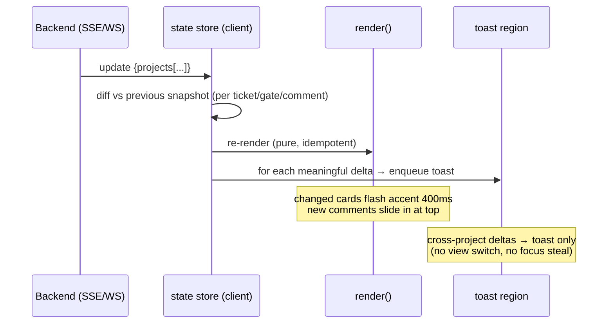

# Aura — UI/UX Design: AI Dev Team Hub (Multi-Project Control Plane)

**Role:** Aura (/ui). **Mode:** design-only (no edits to `hub/`). Single-file, dependency-free vanilla JS on the existing dark theme. Realtime via the backend channel the architect picks (SSE or WS) — the UX below is transport-agnostic.

This design extends Phase 2/3 of `imperative-mapping-prism.md` (multi-ticket state, overlay writes, POST control plane) into a concrete, implementable UI for `hub/public/index.html`.

---

## 1. Design principles (matching the existing aesthetic)

The current hub is GitHub-dark: flat panels (`--panel #161b22`), 1px hairlines (`--line #283040`), violet accent (`--accent #6e56cf`), 12px radius, monospace for IDs/gate-names, uppercase 12px dim column headers, a single pulsing "live" dot. The redesign stays **restrained**: same tokens, same flatness, no shadows-as-decoration, no gradients beyond the existing header. New surfaces (modals, toasts, builder) are darker glass over a scrim, never bright. Color is reserved almost entirely for **status semantics** — chrome stays neutral so the status palette reads loudly.

Hard rules honored: one file, no framework, no build, loopback server. Everything below is inline CSS custom-property additions + vanilla JS render functions driven by one authoritative `state` object pushed over the realtime channel.

---

## 2. Information architecture

```
Hub (single page)
├─ Header (global)
│  ├─ Brand ◆ AI Dev Team · Hub
│  ├─ Project switcher  ← NEW (tabs/pills + "+ tile" toggle)
│  ├─ View toggle: Board ⌷ | Tiles ▦ | Builder ⚙   ← NEW
│  ├─ Preset switch (3-way segmented)              ← NEW (was read-only badge)
│  └─ Global live indicator + notification bell (toast log)  ← NEW
│
├─ Workspace (one of three views)
│  ├─ BOARD view (default, single active project)
│  │   └─ Stage columns from the active track order
│  │        └─ Ticket cards (status color, agent badge, gate strip)  [clickable]
│  ├─ TILES view (multi-project, mirrored)         ← NEW
│  │   └─ N project mini-boards in a responsive grid, each with its own live dot
│  └─ BUILDER view                                 ← NEW
│        ├─ Track editor (drag-reorder stages)
│        ├─ Gate rules (add trigger→gate, owner, refusal)
│        └─ Preset & live preview
│
├─ Overlays (portal layer, focus-trapped)
│  ├─ Ticket detail modal (description, status, active agent, gates, comments timeline)  ← NEW
│  └─ KB markdown viewer modal                     ← NEW
│
├─ Toast region (aria-live, top-right stack)       ← NEW
└─ Footer (project · workflow · last update)       (kept)
```

**State object (extends the Phase-2 multi-ticket shape).** The UI consumes:
```
{
  projects: [                       // NEW: multi-project (server may send one or many)
    { id, name, live, rev, preset, workflow, track,
      tracks: { name: [stage,...] },
      gateDefs: [ {name, owner, refusal, safety, trigger:[...]} ],
      stageOwners: { stage: "/be" },
      tickets: [
        { id, title, description?, track, stage, status,
          assignee,            // active agent command, e.g. "/be" (or null)
          expectedOwner,       // derived owner if unassigned (greyed)
          gates: [ {name, owner, state, refusal, safety, required, by, at, note} ],
          comments: [ {agent, at, body} ],   // PR-thread timeline
          updatedAt }
      ],
      kb: [ {name, file} ]
    }
  ],
  activeProjectId
}
```
Single-project servers send `projects:[one]`. The render layer always iterates `projects`, so one code path serves both Board and Tiles.

---

## 3. Component inventory

**Atoms**
- `StatusPill` — stage/status label, colored by the status system (§6). Pill, 11px, semibold.
- `GateChip` — gate name + state, reuses existing `.chip.state-*`; adds `hard`/`soft`/`safety` modifier and a 2px left state bar.
- `AgentBadge` — monospace `/be`, `/rev` in a rounded token with a per-agent hue dot; greyed + dashed border when it's an `expectedOwner` (not yet assigned).
- `LiveDot` — the existing pulsing dot; reused per project in Tiles + per project tab.
- `Button` (default / primary / ghost / danger) — 28px min height, 24px+ targets.
- `Spinner` (3-dot skeleton shimmer for loading).
- `Scrim` (modal backdrop).

**Molecules**
- `ProjectTab` — name + LiveDot + unread-count dot; active = violet underline.
- `TicketCard` — id, title (truncate), AgentBadge, gate strip, status pill. Hover lift. Click → modal.
- `GateStrip` — horizontal run of GateChips (overflow → "+N").
- `Toast` — icon + project tag + message + relative time; auto-dismiss; click → opens related ticket/KB.
- `CommentRow` — AgentBadge + timestamp + body (markdown-lite).
- `StageRow` (builder) — draggable handle + stage name + linked gate chip + remove.
- `TriggerForm` (builder) — gate select + trigger multiselect + owner + refusal toggle.
- `PresetSegmented` — solo | small-team | regulated.

**Organisms**
- `Header`, `StageColumn`, `BoardView`, `ProjectTile`, `TilesView`, `TicketModal`, `KbModal`, `BuilderPanel`, `ToastRegion`.

---

## 4. Wireframes

### 4.1 Header (global)
```
┌──────────────────────────────────────────────────────────────────────────────────────┐
│ ◆ AI Dev Team · Hub   [ ● ai-dev-team ✕ ][ ● checkout-svc ² ][ ● billing ][ + ]        │
│                                       Board ⌷ │ Tiles ▦ │ Builder ⚙   ( solo · small · reg )  ●live  🔔³ │
└──────────────────────────────────────────────────────────────────────────────────────┘
```
- Project pills: LiveDot (green pulse = receiving updates, amber = stale >10s, grey = disconnected) + name + superscript unread-change count. `+` opens "add project path" (server-side list or manual). Active pill: violet underline + brighter text.
- View toggle = segmented control. Preset = 3-way segmented (writes `/api/preset` in Phase 3; read-only render otherwise).
- 🔔 bell shows unread cross-project change count; opens a dismissible notification log popover.

### 4.2 Board view — stage columns from the active track
```
ACTIVE TRACK: full ──────────────────────────────────────────────────────────────────
┌ vision ──┐ ┌ architecture ┐ ┌ security ─┐ ┌ design ───┐ ┌ approval_gate ┐ ┌ code_review ┐ …
│ ░ empty  │ │ ┌─────────┐  │ │ ┌───────┐ │ │           │ │               │ │ ┌─────────┐ │
│          │ │ │ADT-124  │  │ │ │ADT-130│ │ │           │ │               │ │ │ADT-118  │ │
│          │ │ │New OAuth│  │ │ │Upload │ │ │           │ │               │ │ │Fix CSV  │ │
│          │ │ │ /arch ▣ │  │ │ │/secops│ │ │           │ │               │ │ │ /rev ▣  │ │
│          │ │ │▎ARCH ⠿  │  │ │ │▎SEC ✗ │ │ │           │ │               │ │ │▎REV ⠿   │ │
│          │ │ └─────────┘  │ │ └───────┘ │ │           │ │               │ │ └─────────┘ │
└──────────┘ └──────────────┘ └───────────┘ └───────────┘ └───────────────┘ └─────────────┘
```
- One column per stage of the **active track** (`full` shown; `floor_min` shows 2 columns). Column header = stage token + count, colored by the stage hue (§6) at low opacity.
- Cards sit under their `stage`. Horizontal scroll on overflow; columns are `min-width:200px` and the row is `overflow-x:auto` with snap.
- Empty column = dashed `░ empty` placeholder (dim).

### 4.3 Ticket card (anatomy)
```
┌─────────────────────────────────┐
│ ADT-124            ▎standard ▸   │  ← id (mono, dim) · stage pill (colored, right)
│ New OAuth login screen           │  ← title (truncate 2 lines)
│ ┌──────┐                         │
│ │ /be ●│  working now            │  ← AgentBadge (assignee). greyed+dashed if expectedOwner
│ └──────┘                         │
│ ▎ARCH ✓  ▎SEC ⠿  ▎REV ·  +1      │  ← GateStrip: ✓passed ⠿pending ✗rejected ·n/a
└─────────────────────────────────┘
   hover → 1px lift + accent hairline; whole card is the click target (→ modal)
```
- The "which agent now" indicator: filled AgentBadge with a tiny live dot when `assignee` is set and the ticket is mid-stage; a dashed, dimmed badge showing `expectedOwner` when unassigned ("would be /rev"). This directly answers the user's "which agent is working this now."
- Gate strip uses the same state glyphs everywhere: `✓` passed, `⠿` pending, `✗` rejected, `·` not-applicable. Hard gates get a solid left bar; soft gates a dashed one; safety-override gates a shield `⛉` prefix.

### 4.4 Tiles view — multi-project mirrored, live per project
```
┌── ● ai-dev-team ────────────┐  ┌── ● checkout-svc ───────────┐
│ full · 5 tickets   updated 2s│  │ standard · 3   updated just now│
│ vis│arch│sec│…│review│done   │  │ behav│test│impl│review        │
│  · │ ▣  │ ▣ │ │  ▣   │  ▣    │  │  ·  │ ▣  │ ▣  │  ▣           │
│  · │ADT-124  ADT-118         │  │ CK-9  CK-7                    │
│  · │/arch ⠿  /rev ⠿          │  │ /be ⠿ /rev ✓                 │
└──────────────────────────────┘  └──────────────────────────────┘
┌── ● billing (stale) ─────────┐  ┌── + add project ─────────────┐
│ regulated · 8   updated 14s ⚠ │  │        click to attach        │
│ …                             │  │        a project path         │
└──────────────────────────────┘  └──────────────────────────────┘
```
- Responsive `grid: repeat(auto-fill, minmax(320px, 1fr))`. Each tile is a condensed board: stage micro-columns with a count glyph and the top 1–2 tickets. Click a tile header → switch to full Board for that project; click a ticket → modal.
- Per-tile LiveDot + "updated Ns" freshness. Stale (>10s no event) → amber dot + `⚠` and a subtle desaturation of the tile (mirroring "this project may be out of date").

### 4.5 Ticket detail modal (description · status · active agent · gates · comments timeline)
```
┌─ scrim ───────────────────────────────────────────────────────────────────┐
│   ┌─────────────────────────────────────────────────────────────────────┐  │
│   │ ADT-124  New OAuth login screen                       ▎ architecture │  │ ← title + stage pill
│   │ ai-dev-team · track: full                                       [✕]  │  │
│   │ ───────────────────────────────────────────────────────────────────  │  │
│   │ Active agent:  ┌ /arch ● ┐  since 14:02     [ Assign ▾ ][ Advance → ] │  │ ← controls (Phase 3)
│   │ ─── Description ───────────────────────────────────────────────────   │  │
│   │ Implement OAuth2 login screen with provider buttons and …            │  │
│   │ ─── Gates ─────────────────────────────────────────────────────────   │  │
│   │ ⛉ SECOPS_APPROVED  ▎pending  hard·safety   /secops   [Approve][Reject]│  │ ← per-gate controls
│   │   ARCH_APPROVED     ▎passed   hard         /arch  · 14:20 by /arch    │  │
│   │   CODE_REVIEWED     ▎rejected hard         /rev   · "needs tests"     │  │
│   │ ─── Comments ──────────────────────────────────────────────────────   │  │
│   │ ┌ /rev ┐ 14:31   Rejected: missing unit tests on the token path.     │  │ ← PR-thread timeline
│   │ ┌ /be  ┐ 14:05   Pushed token generation; tests next.                │  │
│   │ ┌ /arch┐ 13:58   Architecture approved — use PKCE.                    │  │
│   │ ─────────────────────────────────────────────────────────────────── │  │
│   │ (read-only feed; comments authored by agents via the ledger)         │  │
│   └─────────────────────────────────────────────────────────────────────┘  │
└────────────────────────────────────────────────────────────────────────────┘
```
- Sections in priority order: header (id/title/stage) → active agent + actions → description → gates → comments.
- Comments timeline = reverse-chronological PR thread; each row AgentBadge + timestamp (relative + absolute on hover) + body. New comments arriving live animate in at the top with a brief accent flash.
- Modal is `max-width:680px`, vertically scrollable body, sticky header/footer.

### 4.6 KB markdown viewer modal
```
┌─ scrim ──────────────────────────────────────────────┐
│  ┌─ docs/architecture/adr-007.md ─────────────  [✕] ┐ │
│  │  # ADR-007 — OAuth provider choice                │ │
│  │  ## Status  Accepted                              │ │
│  │  ## Context                                       │ │
│  │  We needed federated login …                      │ │  ← rendered markdown
│  │  - PKCE required                                  │ │     (lightweight inline renderer)
│  │  ```                                              │ │
│  │  code blocks in mono, violet text                 │ │
│  │  ```                                              │ │
│  │                              [ Open raw ] [ Copy ] │ │
│  └───────────────────────────────────────────────────┘ │
└────────────────────────────────────────────────────────┘
```
- KB list item → fetch raw markdown (`/api/kb?file=...`, path-validated server side) → render with a tiny built-in markdown subset (h1–3, bold/italic, lists, code, links, blockquote). Links to other KB files open in-modal (back arrow appears).

### 4.7 Builder panel
```
┌ BUILDER · ai-dev-team ──────────────────────────  preset: ( solo │ small │ reg ) ┐
│ TRACK: [ full ▾ ]                                                                 │
│ ───────────────────────────────────────────── drag ⠿ to reorder ───────────────  │
│ ⠿ vision         → (no gate)                                              [⌫]     │
│ ⠿ architecture   → ARCH_APPROVED   hard                                   [⌫]     │
│ ⠿ security       → SECOPS_APPROVED hard ⛉safety                           [⌫]     │
│ ⠿ design         → DESIGN_APPROVED soft                                   [⌫]     │
│ ⠿ approval_gate  → APPROVAL_GATE   hard                                   [⌫]     │
│ ⠿ code_review    → CODE_REVIEWED   hard                                   [⌫]     │
│ … [ + add stage ]                                                                 │
│ ─── Add trigger → gate ─────────────────────────────────────────────────────────  │
│ Gate [ SECOPS_APPROVED ▾ ]  Trigger [ +auth +pii +file_upload ]  Refusal (●hard ○soft) │
│ Owner [ /secops ]                                                  [ Add rule ]    │
│ ─── Live preview ──────────────────────────────────────────────────────────────   │
│ standard change → [state_behavior · write_test · implement · self_review · code_review] │
│                                                            [ Discard ] [ Save → overlay ] │
└──────────────────────────────────────────────────────────────────────────────────┘
```
- Drag-reorder via native HTML5 DnD (handle = `⠿`); on drop → optimistic reorder, POST `/api/track/reorder` with `expectedRev`.
- "Add trigger→gate" form posts `/api/gate/trigger`. Preset segmented posts `/api/preset`.
- Save writes the JSON overlay only (never the YAML) — matches the plan's overlay model. Live preview recomputes the track for a sample change-class so the editor sees the effect before saving.

### 4.8 Toast
```
                                            ┌───────────────────────────────────┐
                                            │ ✓  checkout-svc · CK-7             │
                                            │    CODE_REVIEWED passed  (by /rev) │
                                            │                          just now  │
                                            └───────────────────────────────────┘
   stack, top-right, max 4 visible, auto-dismiss 6s, hover pauses, click → opens ticket
```
- Left accent bar carries the event's status color (passed green / rejected red / advanced violet / comment grey). Project tag is bold so cross-project events are scannable. Non-modal, never steals focus.

---

## 5. Realtime / motion flow (Mermaid)



- **Diffing for notifications:** keep the last rendered snapshot keyed by `project:ticket`. On each push, compare `stage`, each gate `state`, `assignee`, and `comments.length`. Each delta → a toast + a per-project unread-count increment on the project pill/bell. The active project's deltas also flash the relevant card; background-project deltas surface only as toast + pill badge (never yank the view).
- **Animate-in:** new/updated cards get a 400ms accent-hairline flash (`@keyframes flash`) then settle. New comment rows use a height+opacity slide. Toasts use `@starting-style`/translateY entrance. All gated behind `@media (prefers-reduced-motion: reduce)` → instant, no transform.

---

## 6. Status / stage color system (the core deliverable)

Built **on the existing tokens** (`--ok/--pend/--rej` and their `*bg`), then extended with one hue per workflow stage so columns and pills are instantly distinguishable on `--bg #0d1117`. Hues chosen for hue-separation around the wheel and verified for contrast on the dark background. Text colors are the lightened "foreground" variant (the pattern the file already uses: `#7ee2a8` on `--okbg`, etc.); the deep `*bg` is the chip fill; the mid hue is the column header / left bar.

### 6.1 Gate-state tokens (reuse + formalize existing)
| State | Token (text) | Hex (text) | Fill token | Fill hex | Contrast on fill | Notes |
|---|---|---|---|---|---|---|
| passed | `--st-pass-fg` | `#7ee2a8` | `--st-pass-bg` `--okbg` | `#12261a` | 8.9:1 | = existing `.chip.state-passed` |
| pending | `--st-pend-fg` | `#e3b341` | `--st-pend-bg` `--pendbg` | `#2a1f06` | 9.1:1 | = existing `.chip.state-pending` |
| rejected | `--st-rej-fg` | `#ff7b72` | `--st-rej-bg` `--rejbg` | `#2a1213` | 7.0:1 | = existing `.chip.state-rejected` |
| n/a (not triggered) | `--st-na-fg` | `#8b949e` | `--st-na-bg` | `#161b22` | 4.6:1 | = existing `--dim`; glyph `·` |

### 6.2 Gate-modifier tokens (refusal / safety)
| Modifier | Token | Hex | Encoding | Notes |
|---|---|---|---|---|
| hard refusal | `--mod-hard` | `#ff7b72` | solid 2px left bar on chip | reuses rejected hue family |
| soft refusal | `--mod-soft` | `#e3b341` | dashed 2px left bar | reuses pending hue family |
| safety-override | `--mod-safety` | `#f78166` | `⛉` shield prefix + amber-red ring | distinct orange-red so it stands apart from plain hard; 5.8:1 on `--bg` |
| required (preset) | `--mod-req` | `#d2a8ff` | `req` chip (existing `.chip.req`) | violet, ties to accent family |

### 6.3 Stage hues (one per `full`-track stage; floor/standard stages reuse the matching hue)
Each stage gets: `fg` (pill/label text, ≥4.5:1 on `--bg`), `bg` (deep chip fill), and an implied mid (column header at ~18% hue). The owner agent is shown via AgentBadge, not color — color encodes the **stage**, badge encodes the **agent**, so they never collide.

| Stage (track token) | Maps to gate | Owner | Token | `fg` hex | `bg` hex | `fg` contrast on `--bg` (#0d1117) |
|---|---|---|---|---|---|---|
| vision | — | /po | `--stg-vision` | `#79c0ff` (sky) | `#0d1f33` | 8.2:1 |
| state_behavior / write_test / tdd | — | /be /fe /qa | `--stg-spec` | `#56d4dd` (cyan) | `#06262a` | 9.6:1 |
| architecture | ARCH_APPROVED | /arch | `--stg-arch` | `#d2a8ff` (violet — accent family) | `#1b1530` | 6.9:1 |
| security | SECOPS_APPROVED | /secops | `--stg-sec` | `#f78166` (orange-red) | `#2a1410` | 5.8:1 |
| design | DESIGN_APPROVED | /ui | `--stg-design` | `#ff9bce` (pink) | `#2e1322` | 6.2:1 |
| approval_gate | APPROVAL_GATE | /verify | `--stg-approve` | `#e3b341` (amber) | `#2a1f06` | 9.1:1 |
| implement | — | /be /fe | `--stg-impl` | `#a5d6ff` (light blue) | `#10243a` | 10.4:1 |
| self_review / code_review | CODE_REVIEWED | /rev | `--stg-review` | `#d2a8ff`→ use `--stg-reviewb` `#c297ff` | `#1b1530` | 6.5:1 |
| design_qa | DESIGN_APPROVED | /ui | `--stg-designqa` | `#ff9bce` (pink, lighter ring) | `#2e1322` | 6.2:1 |
| qa | — | /qa | `--stg-qa` | `#7ee2a8` (green-teal) | `#12261a` | 8.9:1 |
| reliability | RELIABILITY_OK | /sre | `--stg-rel` | `#ffa657` (orange) | `#2a1a08` | 7.6:1 |
| verify | VERIFIED | /verify | `--stg-verify` | `#e3b341` (amber, ring) | `#2a1f06` | 9.1:1 |
| done | — | — | `--stg-done` | `#3fb950` (solid green) | `#0e2716` | 7.1:1 |
| perf (PERF_OK) | PERF_OK | /perf | `--stg-perf` | `#ffd33d` (yellow) | `#2a2406` | 12.4:1 |

Notes:
- All `fg` values meet WCAG AA (≥4.5:1) for normal text against `--bg`; most exceed AAA. The lowest (`--stg-sec` 5.8:1) is still AA.
- **Color is never the only signal:** every state also carries a glyph (`✓ ⠿ ✗ · ⛉`) and a text label, satisfying WCAG 1.4.1 (not by color alone) for color-blind users.
- Stage hues are spread across the wheel (blue→cyan→violet→pink→amber→orange→green) so adjacent board columns are distinguishable even in deuteranopia; the two amber stages (approval_gate, verify) are separated by many columns and disambiguated by label + position.
- `--accent #6e56cf` stays reserved for **selection/primary action** chrome (active tab underline, primary button), not status — so "this is interactive" and "this is a status" never compete.

### 6.4 Agent badge hues (subtle, secondary)
AgentBadges use `--dim` text on `--panel2` by default with a 6px hue dot keyed to the agent's discipline, so a glance reads discipline without shouting: management `--stg-vision`, architecture `--stg-arch`, security `--stg-sec`, design `--stg-design`, dev `--stg-impl`, review `--stg-review`, qa `--stg-qa`, ops `--stg-rel`. Unassigned (`expectedOwner`) badges drop the dot, go dashed-border + `--dim`.

---

## 7. Interaction & state design

| Surface | hover | active/pressed | empty | loading | error | optimistic | conflict |
|---|---|---|---|---|---|---|---|
| Ticket card | 1px lift, accent hairline, cursor pointer | scale .99 | column shows `░ empty` | skeleton shimmer card | card border `--rej`, ⚠ tooltip | new stage/badge applies instantly, faint pulse until confirmed | revert + amber toast "reloaded — changed elsewhere" |
| Gate Approve/Reject | btn bg lighten | depress | — | btn → spinner, disabled | inline red note under gate | chip flips state instantly, dimmed until ack | chip reverts, conflict toast, modal refreshes from server |
| Advance | — | — | disabled if at last stage | spinner on button | toast error | ticket jumps column with slide | 409 → snap back + "stale, retry" |
| Project pill | brighten | — | — | grey dot + skeleton tiles | red dot + "disconnected" | — | — |
| Builder drag | row raises, drop-targets show insertion line | grabbed row dims | "no stages — add one" | — | invalid permutation → row shakes, blocked | reorder applies instantly | overlay rev stale → reload overlay, re-apply diff or discard |
| KB item | underline | — | "No knowledge base (docs/) yet" (kept copy) | modal skeleton lines | "Couldn't load file" + retry | — | — |
| Toast | pause auto-dismiss | — | (none rendered) | — | — | — | — |

**Optimistic + conflict reconcile (Phase 3):** every mutating action sends the last-seen `rev` as `expectedRev`. `200` → server's authoritative `state` (over the realtime channel) replaces the optimistic guess (pure render = no flicker). `409 {conflict, state}` → revert the optimistic change, apply the fresh server state, and surface a non-blocking amber toast ("CK-7 changed elsewhere — reloaded"). Because `render()` is pure and idempotent, the self-triggered re-broadcast after our own write is a visual no-op (no echo suppression needed) — consistent with the plan.

### Accessibility (WCAG 2.2 AA)
- **Modals:** `role="dialog" aria-modal="true"`, labelled by the ticket id/title. Focus moves to the modal on open, **focus trap** (Tab cycles within), **ESC closes**, focus returns to the invoking card. Scrim click closes (with a confirm only if a builder edit is dirty).
- **Keyboard:** cards are `<button>`/`tabindex=0`, Enter/Space open. Board columns are a roving-tabindex list; arrow keys move between cards. Builder rows are keyboard-reorderable (Alt+↑/↓) as a non-drag alternative — satisfies WCAG 2.2 **Dragging Movements (2.5.7)**.
- **Targets:** all interactive controls ≥24px (2.5.8); buttons 28px.
- **Live regions:** toast region `aria-live="polite" aria-atomic="true"`; the global live dot has `aria-label` reflecting connection state. Status changes are announced once (deduped) so screen readers aren't flooded.
- **Focus appearance:** 2px `--accent` outline, ≥3:1 against adjacent (1.4.11 / 2.4.13).
- **Contrast:** every status/stage token verified ≥4.5:1 (§6); UI hairlines/chips ≥3:1.
- **Not by color alone:** glyph + label on every status (1.4.1).
- **Reduced motion:** `prefers-reduced-motion` removes flashes/slides/pulses; toasts still appear, instantly.

### Responsiveness
- **≥1100px:** full board (all stage columns) or 2–3 tiles per row.
- **700–1100px:** board columns horizontally scroll with snap; tiles 1–2 per row; header view-toggle collapses labels to icons.
- **<700px:** single-column stacked view — Board becomes a vertical list grouped by stage (collapsible stage headers); Tiles becomes one tile per row; modals go full-screen sheets; builder rows full-width. Uses container queries where the panel is the query context, media queries for the page shell.

---

## 8. Concrete changes to `hub/public/index.html` (single-file, implementable)

**CSS (`<style>` additions — extend `:root`, do not rewrite):**
1. Add `--st-*`, `--mod-*`, `--stg-*` custom properties from §6 to `:root` (formalizing the existing inline hexes as tokens).
2. New rules: `.tabs/.tab`, `.viewseg/.seg`, `.presetseg`, `.bell`, view containers `.board/.tiles/.builder`, `.stagecol/.stagecol h3` (header tinted via `color-mix(in oklab, var(--stg-x) 18%, var(--panel))`), `.card/.card:hover`, `.agent/.agent.expected/.agent .dot`, `.gatestrip`, `.statuspill` (background `var(--stg-x-bg)`, color `var(--stg-x-fg)`).
3. Overlay layer: `.scrim`, `.modal`, `.modal header/.modal .body`, `.timeline/.comment`, `.kb-md` (markdown element styles reusing `code`/`--accent`).
4. Builder: `.stagerow`, `.handle`, `[draggable] .dragging/.dropline`, `.triggerform`.
5. Toast: `.toasts`, `.toast`, `.toast.pass/.rej/.advance/.comment` left-bar colors, `@keyframes flash/slidein/toastin`, all wrapped with `@media (prefers-reduced-motion: reduce){ * { animation:none!important; transition:none!important } }`.
6. `@media`/`@container` blocks from §7 responsiveness.

**HTML (`<body>` structure):**
- Replace the static `<header>` meta with: brand + `#tabs` + `#viewseg` + `#presetseg` + live dot + `#bell`.
- Replace the fixed 3-column `<main>` with `<main id="view">` that the renderer fills per active view (Board/Tiles/Builder).
- Add portal nodes once: `<div id="scrim"></div><div id="modal" role="dialog" aria-modal="true" hidden></div><div id="toasts" aria-live="polite"></div>`.
- Keep `<footer id="foot">`.

**JS (vanilla, no deps):**
1. Keep `$`, `esc`. Add `relTime()`, tiny `mdToHtml()` (escape-first, then a whitelisted subset).
2. `let prev = null; const unread = {}` — snapshot for diffing + per-project unread counts.
3. Realtime: keep `EventSource('/api/events')` (or swap to `WebSocket` if the architect picks WS — isolate behind a `connect(onUpdate)` function so the transport is one swap). On message → `applyUpdate(state)`.
4. `applyUpdate(state)`: `diff(prev, state)` → enqueue toasts + bump `unread` + flag changed card ids; set `prev`; call `renderHeader/renderView`.
5. `renderView()` switches on the active view: `renderBoard(project)` (group tickets by stage over `project.tracks[project.track]`), `renderTiles(projects)`, `renderBuilder(project)`.
6. `renderCard(t)` → status pill class `stg-<stage>`, AgentBadge (assignee|expectedOwner), gate strip; `data-id`, click → `openTicket(projId,id)`.
7. `openTicket()` → builds modal (description/active-agent/actions/gates/comments), `trapFocus`, ESC handler, returns focus on close.
8. KB click → `openKb(file)` → fetch raw → `mdToHtml` → modal.
9. Mutations (Phase 3): `post(url, body)` adds `expectedRev`; optimistic patch to `prev`+re-render; on `409` revert + toast. Guard the whole control plane behind a `state.writable` flag the server sets (loopback only) so the UI hides write controls when the server is read-only.
10. `toast({kind, project, msg, ticket})` → append to `#toasts`, auto-remove 6s, hover pauses, click routes to ticket/KB.

**Single-file guarantee:** no imports, no fonts beyond system stack, markdown rendered by the inline function, drag via native HTML5 DnD, modals via a hidden portal div + class toggles. Nothing requires a build step or network beyond the hub's own endpoints.

---

## 9. Handoff notes for /fe and /arch

- **/arch (realtime channel):** the UI only needs `connect(onUpdate)` to deliver the full `state` object on every change. SSE (current) is sufficient and simplest; WS only matters if you want client→server over the same socket — but Phase 3 already uses POST for writes, so **SSE + POST is the lower-complexity recommendation** and keeps the zero-dep server. Whichever you pick, keep the payload = the authoritative full `state` (the client render is pure, so full snapshots are cheapest to reason about).
- **/fe:** implement as incremental edits to the one file in the section order above (tokens → header → views → modals → toasts → builder → mutations). Land Board+modal+toasts first (read-only value), then Tiles, then Builder/control-plane (Phase 3).
- **/be (server, Phase 2/3):** UI assumes the multi-ticket state shape (§2) with `comments[]`, `assignee`, `expectedOwner`, per-project `rev`, and `writable`. KB viewer needs a path-validated `GET /api/kb?file=`. These align with `hub/lib/state.js` + `write.js` in the plan.

**Out of scope (design only):** no code written; `hub/` untouched. This doc is the spec for the /fe implementation pass.
