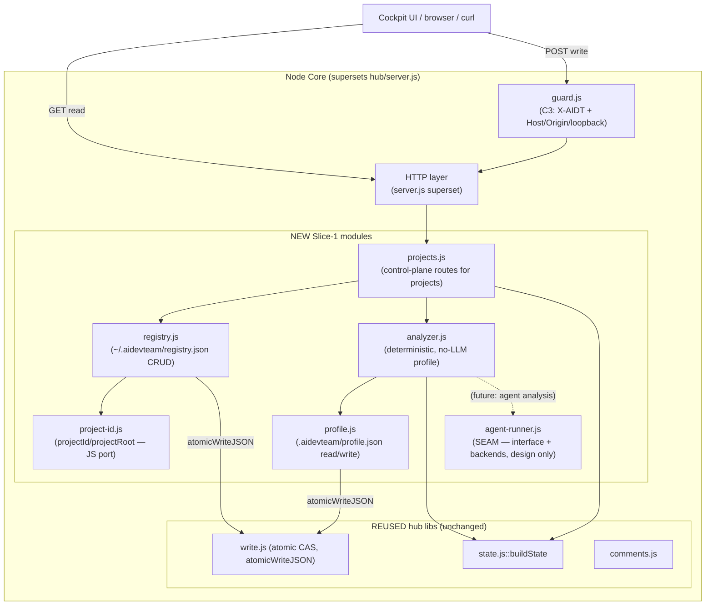

# ARCH — Slice 1 Component Design & Gate Decision

> **/arch (Jorge) — Component design + ARCH gate for Slice 1 (Multi-Project Shell foundation).**
> Scope: the buildable **Node Core foundation** behind ADT-210 (connect & register), ADT-213 (auto-analyze), ADT-216 (loopback guardrails), ADT-217 (cross-platform paths), and the **AgentRunner seam** that ADT-230 implements later. **Design only — no code.** Backend dev builds this under TDD with `node:test`.
> Inputs carried forward: `docs/product-vision/architecture.md` (reconciled architecture, ARCH pending), `README.md` (sprint plan), existing hub libs.

---

## 0. What this slice IS (and is not)

**IS:** the server-side foundation a single backend dev builds first — the **Project Registry**, the **connect + deterministic (no-LLM) analyze flow**, the **HTTP control-plane surface** for the UI, and the **AgentRunner interface** (design, for /secops to threat-model now; implementation in ADT-230/234).

**IS NOT:** the Tauri shell, the Angular Cockpit, Rete.js, the workflow graph runtime, cost metering, or the SSH backend implementation. Those are later slices/tickets. This document keeps everything in the **existing zero-dependency Node hub style** (CommonJS, no build step, no runtime deps, testable with `node:test`).

**Guiding constraint (from L5 / architecture.md §8):** Core is a **superset of `hub/server.js`**, never a rewrite. New capability is **additive**; the proven core (`write.js`, `guard.js`, `state.js`) is **unchanged** and never bypassed. Strangler-Fig seam.

---

## 1. Component view (C3 of the Slice-1 Core foundation)



| Component | Responsibility | Build verdict |
|---|---|---|
| `registry.js` | User-global registry CRUD (register/list/get/remove/touch) at `~/.aidevteam/registry.json`; atomic writes; isolation by `projectId` | **NEW** |
| `project-id.js` | JS port of `claude/memory`'s `projectId`/`projectRoot` so the hub and memory agree on the key | **NEW** (algorithm reused verbatim) |
| `analyzer.js` | Deterministic, no-LLM "init analysis": detect ADT artefacts (fast path) else derive title/description/stack/key-files | **NEW** |
| `profile.js` | Read/write the per-project profile at `<root>/.aidevteam/profile.json` | **NEW** |
| `projects.js` | Control-plane route handlers for `projects/*` (mirrors `api.js` shape) | **NEW** |
| `agent-runner.js` | The execution **seam** — interface + local-CLI + remote-SSH backend contracts (design now; impl in ADT-230/234) | **NEW (interface only this slice)** |
| `state.js::buildState` | Per-project projection (title/desc/tickets/kb) — the existing-files **fast path** | **REUSE as-is** |
| `write.js` | Atomic CAS ledger writes + `atomicWriteJSON` for registry/profile | **REUSE as-is** |
| `guard.js` | C3 anti-CSRF/DNS-rebinding gate on every `projects/*` write | **REUSE as-is** |

---

## 2. Project identity — the load-bearing key

`projectId` is the partition key for **everything** (registry, ledger reads, comments, memory vector rows). It MUST match `claude/memory`'s `src/lib/project-id.ts` exactly or a project's board and its BASE recall diverge.

**`project-id.js` (NEW, JS port — algorithm specified precisely so it matches the TS):**

- `projectRoot(dir)`:
  1. Run `git rev-parse --show-toplevel` with `cwd = dir`, **`execFileSync('git', [...])`** (never `exec`/shell — argv form, no shell interpolation), `stdio: ['ignore','pipe','ignore']`, `encoding: 'utf8'`; `.trim()` the result. If non-empty, return it.
  2. Else `fs.realpathSync(dir)`.
  3. Else (realpath throws) return `dir`.
- `projectId(dir)`: `crypto.createHash('sha1').update(projectRoot(dir)).digest('hex').slice(0, 12)`.

**Match invariants the unit tests must pin (vs the TS):**
- Same hash (`sha1`), same encoding (raw UTF-8 bytes of the root string — no normalization, no trailing slash, no lowercasing), same truncation (`slice(0,12)` → 12 hex chars).
- `git` argv and `cwd` identical; same fall-through order (git → realpath → raw).
- A path **inside** a repo and the repo toplevel itself yield the **same** id (both resolve to toplevel). A non-git dir uses its realpath (symlinks resolved).

**Known limitation (carried from `project-id.ts`):** path-based → move/rename orphans history. **Out of scope for Slice 1**; re-link is ADT-237. Document it in the registry record (we keep `path` so a future re-link can recompute the id).

---

## 3. Registry — schema & operations

**Location:** `~/.aidevteam/registry.json` (user-global; resolve `os.homedir()`). Never written into any product repo. It is **just an index**; the source of truth stays inside each project repo (`.workflow-state.json`, `.aidevteam/`, `workflow.yaml`, memory db) so a project remains fully usable from the bare hub/CLI without the Studio.

### 3.1 Schema (`registry.json`)

```jsonc
{
  "version": 1,
  "projects": [
    {
      "id": "a1b2c3d4e5f6",      // projectId(path) — the 12-hex partition key
      "path": "/abs/canonical/root",  // projectRoot(selectedFolder) — canonical, not the raw pick
      "label": "my-service",     // display name; defaults to basename(path), user-editable
      "color": "#5B8DEF",        // optional UI accent; absent ⇒ UI assigns
      "addedAt": "2026-06-07T10:00:00.000Z",
      "lastSeen": "2026-06-07T10:05:00.000Z",
      "status": "connected"      // connected | analyzing | needs-auth | offline | error
    }
  ]
}
```

- `transport`/`agentBackend` from architecture.md §5 are **deferred to Slice 5** (remote/SSH). Slice 1 is **local only**; omit those fields now (additive later — `version` bump or tolerant read).
- **`path` stores the canonical root** (`projectRoot(folder)`), not the user's raw pick, so dedup by id is exact and a sub-folder pick maps to the repo root.

### 3.2 Operations (`registry.js` API — all sync file ops, async-wrapped where they call write.js)

| Op | Signature (shape) | Behavior |
|---|---|---|
| `load()` | `() → {version, projects[]}` | Read+parse; **never throws** — missing/malformed ⇒ `{version:1, projects:[]}` (hub's read-tolerance contract). On `version` newer than known ⇒ read tolerantly (ignore unknown fields), do not crash. |
| `register(folder)` | `(folder) → {created\|existing, record}` | Validate dir (see §4); `root=projectRoot(folder)`, `id=projectId(folder)`; if `id` already present ⇒ return `{existing, record}` (ADT-210: "detected and offered to open instead of duplicated"); else append `{id,path:root,label:basename(root),addedAt,lastSeen,status:'connected'}` and persist. |
| `list()` | `() → projects[]` | From `load()`. |
| `get(id)` | `(id) → record \| null` | Lookup by id. |
| `remove(id)` | `(id) → {removed:boolean}` | Drop the record and persist. **On-disk project files are untouched** (ADT-210 AC). |
| `touch(id)` | `(id) → record` | Update `lastSeen` (and optionally `status`); persist. |
| `update(id, patch)` | `(id, {label?,color?,status?}) → record` | Whitelisted-field patch (no `id`/`path` mutation here — re-link is ADT-237); persist. |

**Atomic writes (reuse the hub's approach):** every persist goes through **`write.js::atomicWriteJSON`** (tmp + `fsync` + `rename`). The registry is a **single user-global file**, so concurrent writers (two Core instances) are possible → wrap persists in an in-process serialization equivalent to `write.js::withLock`. **Recommendation:** export a small `withRegistryLock`/reuse `withLock` semantics rather than re-implementing — keep one mutex pattern in the codebase. Cross-process safety (two OS processes) is **not** in Slice 1 scope (single-developer model, matching the comment-append note in `write.js`); document it as a known limitation and revisit with an advisory lock if multi-Core contention becomes real (ties to architecture.md R9 single-instance lock).

---

## 4. Connect + analyze flow (deterministic, no-LLM MVP)

```mermaid
flowchart TB
  pick["POST /api/projects/connect {path}"] --> val{Valid dir?<br/>(§4.1)}
  val -->|no| refuse["400/422 — clear reason, NO partial project"]
  val -->|yes| canon["root = projectRoot(path); id = projectId(path)"]
  canon --> dup{id already registered?}
  dup -->|yes| existing["return existing record (open, not duplicate)"]
  dup -->|no| reg["registry.register → status: analyzing"]
  reg --> detect{ADT artefacts present?}
  detect -->|yes| fast["FAST PATH: buildState(root)<br/>title+desc+tickets"]
  detect -->|no| derive["INIT ANALYSIS (no LLM)<br/>title+desc+stack+keyFiles"]
  fast --> prof["profile.js: write .aidevteam/profile.json (analysis only)"]
  derive --> prof
  prof --> done["status: connected; return {record, profile, state}"]
```

### 4.1 Validation (refuse cleanly, no partial project) — ADT-210 + ADT-217

In order, each failure → a clear machine-readable reason, **nothing persisted**:
1. `path` present, a string, **absolute** (reject relative — caller resolves; avoids cwd ambiguity).
2. `fs.statSync(path).isDirectory()` true (mirrors `server.js` startup check). Not-exist / not-a-dir / `EACCES` ⇒ refuse with the specific reason.
3. **Path-traversal / containment:** `projectRoot(path)` is canonicalized via git-toplevel or `realpathSync` (symlinks resolved), so the stored `path` is always canonical. Reject a `path` that, after `path.resolve`, contains a NUL byte or is empty. (We do **not** restrict to an allowlist root in Slice 1 — local connect is user-driven folder selection — but every stored path is canonical, and the analyzer's reads are confined to that root: see §4.4.)
4. **Cross-platform (ADT-217):** use `path.resolve`/`path.sep` throughout; compare ids on the canonical root. On case-insensitive filesystems, two picks differing only in case resolve (via `realpathSync`) to one canonical root ⇒ one id. Do not lowercase paths ourselves (preserves the TS-match invariant) — rely on `realpathSync`.

### 4.2 Fast path — existing ADT artefacts

**Detection:** the project "already has ADT artefacts" if ANY of these exist under `root`:
`.workflow-state.json`, `.aidevteam/` (dir), `claude/` (dir), `CLAUDE.md`, or a resolvable `workflow.yaml` (`state.js::findWorkflow(root)` non-null).

**Derivation:** call **`state.js::buildState(root)`** (REUSE verbatim). It already returns `project` (basename), `tickets[]` (with titles/descriptions), `kb[]`, gates, etc.
- **title** ← see §4.5 (buildState's `project` basename is the baseline, refined by §4.5 sources).
- **description** ← §4.5.
- We do **not** mutate the repo on the fast path (ingest/merge is ADT-214, later). We only **read** to populate the profile + return state.

### 4.3 Init-analysis path — no LLM (deterministic MVP)

When no artefacts exist, derive a profile by **reading a bounded set of files** — purely deterministic, no agent, no network. This satisfies ADT-213's "auto-derive a title + description" for the MVP; an *agent-driven* richer analysis is a later enhancement that plugs into the same `agent-runner.js` seam (§6) without changing this contract.

**title** (first non-empty wins):
1. `package.json` `name` (if present & parseable).
2. Git remote repo name — `git -C root config --get remote.origin.url` → basename without `.git` (argv form, no shell).
3. `basename(root)`.

**description** (first non-empty wins):
1. `README.md` (or `README`/`readme.md`, case-insensitive) **first paragraph** — reuse `state.js::markdownBody`-style stripping (front-matter + leading H1 removed), take the first blank-line-delimited paragraph, cap at N chars (e.g. 500).
2. `package.json` `description`.
3. `pyproject.toml` / `Cargo.toml` `description` (simple line-regex, no full TOML parser — keep zero-dep).
4. A generated **file-type summary** sentence, e.g. *"A TypeScript project with 142 source files."* derived from the stack scan below.

**detected stack** (`stack[]`): a deterministic scan of marker files at the root (and one level into obvious dirs), e.g.:
`package.json`→node; `tsconfig.json`→typescript; `pyproject.toml`/`requirements.txt`→python; `Cargo.toml`→rust; `go.mod`→go; `pom.xml`/`build.gradle`→java/kotlin; `Gemfile`→ruby; `composer.json`→php; `Dockerfile`→docker; `.github/workflows`→ci. Order-stable, de-duplicated.

**key files** (`keyFiles[]`): a small fixed-priority list of present files (`README*`, `package.json`, `CLAUDE.md`, `workflow.yaml`, primary manifest) — for the UI to surface. Bounded (≤ ~10).

**Determinism contract (for TDD):** same directory ⇒ byte-identical profile (sort all scans; no timestamps inside the derived fields except `analyzedAt`). This makes `node:test` golden-fixture tests trivial.

### 4.4 Read-confinement (security floor for the analyzer)

The analyzer reads **only within `root`**: every file it touches is `path.join(root, rel)` where `rel` is from its **fixed allowlist** of marker/doc files (§4.3) — it never follows a path from file *contents*, never globs unbounded, never reads outside `root`. Symlinks inside `root` that point outside are resolved by `realpathSync` and, if the resolved target escapes `root`, **skipped** (don't read it). Bound total bytes read per file (e.g. README capped) and total files scanned. This is the containment surface /secops reviews (§7).

### 4.5 What "title" and "description" are, and where the profile lives — definitive

- **title** = fast path: refined from `buildState`/§4.5 sources; init path: §4.3 title ladder. The Operator can **edit** title/description (ADT-213 AC) — edits are stored in the profile (`titleOverride`/`descriptionOverride`) and **win** over re-analysis (re-analysis fills only non-overridden fields).
- **description** = the ladders above.
- **Profile storage:** `<root>/.aidevteam/profile.json` (per-project, inside the repo's `.aidevteam/` — same home the hub already uses for `comments/`, `workflow.overrides.json`). Written via `write.js::atomicWriteJSON`. Rationale: keeps the Studio's derived metadata **with the project** (portable, isolated by construction), not smeared into the user-global registry. The registry holds only the **index fields** (§3.1: id/path/label/color/status/timestamps); the **profile** holds the analysis output:

```jsonc
// <root>/.aidevteam/profile.json
{
  "version": 1,
  "id": "a1b2c3d4e5f6",
  "title": "my-service",
  "description": "A Spring Boot service for …",
  "titleOverride": null,        // set when the Operator edits; wins over re-analysis
  "descriptionOverride": null,
  "stack": ["node", "typescript", "docker"],
  "keyFiles": ["README.md", "package.json", "CLAUDE.md"],
  "source": "artefacts | analysis",   // which path produced it
  "analyzedAt": "2026-06-07T10:05:00.000Z"
}
```

**On analysis failure** (ADT-213 AC): connect **anyway** with `status:'connected'`, a placeholder profile (`title=basename(root)`, `description=null`, `source:'analysis'`, plus an `error` field), so the project is usable and the UI offers "re-run analysis". Never leave the project in a half-registered state.

---

## 5. HTTP surface (control-plane)

All of these extend the existing `server.js` HTTP layer. **Reads** (`GET`) are open like `/api/state`/`/api/events` today. **Writes** (`POST`, `DELETE`) are mutations → they go **behind `guard.js::writeAllowed`** exactly as `/api/<route>` POSTs do now (X-AIDT header + Host/Origin loopback + loopback socket unless `--allow-remote-writes`). The body is capped at `MAX_BODY` (64 KB) and parsed by the existing `readJsonBody`.

**Routing:** add a `projects.js` handler mirroring `api.js::handle(route, data, …)` and wire it in `server.js` ahead of the generic `/api/<route>` dispatch (or extend the dispatch to recognize the `projects/*` namespace). Keep the `{ code, payload }` return contract.

| Method + path | Guard | Request | Response (200) | Errors |
|---|---|---|---|---|
| `GET /api/projects` | read (none) | — | `{ ok:true, projects:[{id,path,label,color?,status,lastSeen,addedAt}] }` | — |
| `POST /api/projects/connect` | **write (guard)** | `{ path:"/abs/dir" }` | `{ ok:true, created:bool, project:{…record}, profile:{…}, state:{…buildState} }` | 400 (missing/relative/invalid path, NUL), 422 (not a dir / EACCES) — clear `error`; **nothing persisted** |
| `GET /api/projects/:id` | read (none) | — | `{ ok:true, project:{…record}, profile:{…}, state:{…buildState} }` | 404 unknown id |
| `DELETE /api/projects/:id` | **write (guard)** | — | `{ ok:true, removed:true }` (files untouched) | 404 unknown id |
| `POST /api/projects/:id` *(optional this slice)* | **write (guard)** | `{ label?, color?, title?, description? }` | `{ ok:true, project, profile }` | 400 bad field, 404 unknown id |

**Path-param parsing:** `:id` comes from the URL path; validate it against the registry (must be an existing 12-hex id) before any work — never use it to build a filesystem path directly (defense in depth; the registry already maps id→canonical path).

**Notes**
- `connect` is **idempotent on id**: connecting an already-registered folder returns `created:false` + the existing record (ADT-210 "offered to open instead of duplicated").
- `DELETE` removes the **index entry only**. The `.aidevteam/profile.json` and all project files remain on disk (re-connect restores them — ADT-214's restore behavior).
- The existing per-project SSE (`/api/events`) is unchanged for Slice 1; **multi-project SSE multiplexing is ADT-211**, out of this foundation's scope. (Design note for ADT-211: namespace events by `projectId`; do not break the existing single-project stream.)

---

## 6. AgentRunner seam (design only — for /secops now, impl in ADT-230/234)

One seam, swappable backends. **This slice ships the interface contract only**; ADT-230 implements `local-cli`, ADT-234 implements `remote-ssh`. The analyzer's *future* agent-driven path and every workflow agent step go through this one seam — no special-case execution code path anywhere.

### 6.1 Interface

```jsonc
// agent-runner.js — interface (design)
//
// run(agent, prompt, projectPath, opts) → AsyncIterable<RunEvent> | Promise<RunResult>
//   agent       "/be" | "/arch" | … (role command; maps to the host tool's agent)
//   prompt      string (the task/instruction)
//   projectPath canonical project root (cwd for the agent; the isolation boundary)
//   opts        { backend?: 'local-cli'|'remote-ssh', timeoutMs?, signal?: AbortSignal,
//                 env?: {}, mode?: 'foreground'|'background' }
//
// Streams typed events so the UI/orchestrator can show "which agent is active"
// and so EVERY step is recordable as a typed ledger comment (reuse write.js::appendComment):
//   { type:'start',  agent, at }
//   { type:'stdout', chunk }            // result text, tool calls — NEVER secrets
//   { type:'stderr', chunk }
//   { type:'exit',   code, at }
//   { type:'error',  reason }
//
// Backends register under a single factory: createRunner(backend, config) → { run, healthCheck }
```

**Cross-cutting (per skill guidance):** wrap every `run()` in a metering/audit decorator (cost + typed-comment emission) — **one** path, not hand-woven per call. Cost metering is ADT-235; the seam must expose token/cost on the `exit` event for that decorator to consume. Do **not** bury orchestration *decisions* (which agent/branch) inside the decorator — that is domain logic and stays visible in the caller/graph.

### 6.2 `local-cli` backend (default — reuses host login, **no new key**)

- Spawns the host tool's own headless CLI (e.g. `claude -p <prompt>`) as a **child process** with `cwd = projectPath`, via **`child_process.spawn` in argv form (never a shell string)** — no `shell:true`, no string interpolation of the prompt into a command line.
- **Credential model:** Core **never reads the host's token**. The host binary authenticates itself from its own login; Core only sees `stdout`/`stdin`. This is the compliant + privacy-correct path (architecture.md §4): the SDK can't reuse subscription OAuth per 2026 terms, so host-CLI is the *only* "no new key" path.
- **No secrets cross the seam:** prompt/result stream through; secrets never appear in events, profile, registry, ledger, comments, UI, or logs (ADT-230 AC). Redact a small denylist of env/token patterns from `stderr` before emitting if the host CLI ever echoes them.
- Bound: `timeoutMs` + `AbortSignal` kill the child; concurrency cap (process-per-step is heavy).

### 6.3 `remote-ssh` backend (v1 per PD-3 — design now, impl ADT-234)

- "Remote" = **run the `local-cli` runner on the remote host over SSH**; stream results back. The Cockpit can't tell local from remote apart from a badge.
- **Trust/exec surface (the highest-risk item — enumerated for /secops in §7):**
  - **Opt-in only**, per project; off by default; behind the same `--allow-remote-writes` / remote-enable policy as guard.js.
  - **Host allowlist** + **known-hosts pinning** (`StrictHostKeyChecking`, pinned host key) — no TOFU-accept of unknown hosts.
  - **No arbitrary shell:** SSH executes **only** the fixed agent command (argv form), never a user-supplied shell string. Remote `cwd` is the remote project root.
  - Auth via the user's existing SSH key/agent; Core does not store SSH secrets (keychain/agent only).
  - Remote = **remote code execution** → its own dedicated `SECOPS_APPROVED` (hard, safety-override) pass per architecture.md §10. **Not enabled in Slice 1.**

---

## 7. Security surfaces to hand to /secops (Slice 1)

This foundation touches **file access, external input, network bind, and (designed) process/remote exec** — four gate triggers. /secops owns `SECOPS_APPROVED` (hard, safety-override). Enumerated surfaces:

| # | Surface | Concern | Mitigation built into this design |
|---|---|---|---|
| S1 | **`connect` path input** | Path traversal / NUL / non-dir / symlink escape; reading outside the chosen folder | Absolute-path require; `statSync.isDirectory`; canonicalize via `projectRoot`/`realpathSync`; analyzer reads a **fixed allowlist** within `root` only, skips symlinks escaping `root` (§4.1, §4.4) |
| S2 | **Registry write** (`~/.aidevteam/registry.json`) | Corruption, concurrent clobber, malformed-input persistence | `write.js::atomicWriteJSON` (tmp+fsync+rename) + in-process lock; tolerant read (never throws); whitelisted patch fields; **nothing persisted on validation failure** |
| S3 | **Profile write** (`<root>/.aidevteam/profile.json`) | Writing into a user repo; injection via README content into stored fields | Single fixed file under `.aidevteam/`; values are plain strings, length-capped; no execution of file contents; atomic write |
| S4 | **Control-plane writes** (`connect`, `DELETE`, patch) | CSRF / DNS-rebinding / cross-site fetch driving registry mutation | **Reuse `guard.js::writeAllowed`** unchanged (X-AIDT + Host/Origin loopback + loopback socket); body cap 64 KB; `:id` validated against registry, never used as a raw FS path |
| S5 | **`git` invocation** in `project-id.js` / analyzer | Command injection, hostile repo config, hang | `execFileSync`/`spawn` **argv form only** (no shell); fixed args; `stdio` ignores stderr; bounded (git already fast); failure falls through to realpath |
| S6 | **AgentRunner `local-cli` exec** (design) | Spawning a host binary; prompt injection into a command line; secret leakage | `spawn` argv form, no `shell:true`; prompt via stdin/arg not interpolated into a shell; Core never reads the host token; secret redaction on streams (§6.2) — **review the contract now; impl gated in ADT-230** |
| S7 | **AgentRunner `remote-ssh`** (design, v1) | **Remote code execution** | Opt-in, host allowlist, known-hosts pinning, no arbitrary shell, fixed agent command only — **dedicated hard SECOPS pass before enable**; not in Slice 1 (§6.3) |
| S8 | **Bind policy** (ADT-216) | Off-loopback exposure | Loopback by default (`127.0.0.1`), inherited from `server.js`; remote bind only via explicit `--allow-remote-writes` + guard; remote connection refused when not enabled |

**Recommendation to /secops:** Slice-1 *implementation* tickets (ADT-210/213/216/217) can proceed on the **local, no-exec** surfaces (S1–S5, S8) under a standard SECOPS pass. **S6 (host-CLI exec)** and **S7 (SSH)** are the AgentRunner tickets (ADT-230/234) and each must carry their **own mandatory hard** SECOPS gate — review the *contract* here now so the seam is shaped safely, but enabling exec is a separate gated step.

---

## 8. Reuse vs Add — explicit ledger

**REUSE as-is (cite):**
- `hub/lib/state.js::buildState` — existing-files fast path (title/desc/tickets/kb).
- `hub/lib/write.js::atomicWriteJSON` — atomic writes for registry + profile; `withLock` pattern for serialization; `appendComment` (later, for AgentRunner audit).
- `hub/lib/guard.js::writeAllowed` — C3 gate on every `projects/*` write. **Never weakened.**
- `hub/lib/comments.js` — comment read/`safeId` (later slices).
- `hub/lib/stage-map.js` / `digest.js` — unchanged; consumed via `buildState`.
- `hub/server.js` `readJsonBody`/`sendJson`/`MAX_BODY`/SSE — the HTTP plumbing the new routes extend.
- **`claude/memory/src/lib/project-id.ts` algorithm** — reimplemented in JS (§2) to keep the partition key identical.

**Boundary rule (architecture.md §8):** Core **never bypasses `write.js`** for file mutations and **never weakens `guard.js`** for writes. New capability is additive only.

### 8.1 NEW files/modules (paths + one-line role — all CommonJS, zero-dep, `node:test`-able)

| Path | Role |
|---|---|
| `hub/lib/project-id.js` | JS port of `projectId`/`projectRoot` (sha1-of-canonical-root), matching the TS exactly. |
| `hub/lib/registry.js` | User-global `~/.aidevteam/registry.json` CRUD (load/register/list/get/remove/touch/update), atomic + locked. |
| `hub/lib/profile.js` | Read/write `<root>/.aidevteam/profile.json` (the analysis output), atomic. |
| `hub/lib/analyzer.js` | Deterministic no-LLM connect analysis: artefact detection (fast path) + title/desc/stack/keyFiles derivation (init path), read-confined to `root`. |
| `hub/lib/projects.js` | Control-plane route handlers for `projects/*` (`{code,payload}`), mirroring `api.js`. |
| `hub/lib/agent-runner.js` | The execution **seam**: interface + `local-cli`/`remote-ssh` backend contracts (interface this slice; impl ADT-230/234). |
| `hub/test/project-id.test.js` | `node:test` — TS-match invariants (git toplevel vs realpath vs raw; sub-dir == root id). |
| `hub/test/registry.test.js` | `node:test` — CRUD, dedup-by-id, tolerant read, atomic-write, untouched-files-on-remove. |
| `hub/test/analyzer.test.js` | `node:test` — golden-fixture profiles (fast path + init path), determinism, read-confinement, failure-placeholder. |
| `hub/test/projects.test.js` | `node:test` — route shapes, guard required on writes, error codes, idempotent connect. |

`server.js` gets a **small additive edit** (wire the `projects/*` routes through `guard.js`) — not a rewrite; the existing single-project routes are untouched.

---

## 9. ATAM-lite — trade-offs & risks for this slice

| Decision | Sensitivity / trade-off | Verdict |
|---|---|---|
| JS port of `projectId` (vs importing the TS) | Two implementations of one algorithm — drift risk | **Accept**, pinned by cross-impl unit tests (§2); hub stays build-step-free/zero-dep (importing TS would pull a toolchain) |
| Profile in `<root>/.aidevteam/` (vs in the registry) | Writes into the user repo | **Accept** — isolation-by-construction + portability outweigh; single fixed file, atomic, in the dir the hub already owns |
| No-LLM deterministic analysis for MVP | Lower-quality title/desc than an agent | **Accept** — deterministic, testable, zero-cost, no auth needed; agent enrichment plugs into the same seam later |
| Single-file user-global registry | Cross-process write contention (two Cores) | **Accept for Slice 1** (single-dev model); document; single-instance lock is ADT-211/R9 follow-up |
| AgentRunner interface only (no impl) | Seam could be wrong | **Low risk** — interface is small and mirrors `workflow/adapters`; /secops reviews the contract now |

**Open/unresolved (do not block Slice-1 ARCH):**
- Multi-project SSE multiplexing → **ADT-211** (design-noted: namespace by `projectId`).
- Registry cross-process locking → follow-up (single-instance discovery file, architecture.md R9).
- Agent-driven richer analysis → later enhancement on the §6 seam.
- `transport`/`agentBackend` registry fields → added in Slice 5 (tolerant-read forward-compat now).

---

## 10. Gate decision

**`ARCH_APPROVED` — APPROVED for Slice 1**, scoped to the **local, no-exec foundation**: `project-id.js`, `registry.js`, `profile.js`, `analyzer.js`, `projects.js` HTTP routes, and the **AgentRunner interface contract** (design). This covers **ADT-210, ADT-213, ADT-216, ADT-217** and the *seam* for **ADT-230**.

**Conditions (binding on implementation):**
1. **`projectId` parity** — `hub/lib/project-id.js` must reproduce `claude/memory`'s algorithm byte-for-byte (sha1 of canonical root, 12-hex slice); enforced by `hub/test/project-id.test.js`. (§2)
2. **No bypass / no weakening** — all file writes go through `write.js::atomicWriteJSON`; all `projects/*` **writes** go through `guard.js::writeAllowed` unchanged. (§5, §8)
3. **Read-confinement** — the analyzer reads only the fixed allowlist within the canonical `root`; symlinks escaping `root` are skipped. (§4.4)
4. **No partial state** — `connect` validation failures persist nothing; analysis failure still yields a usable placeholder profile, never a half-registered project. (§4.1, §4.5)
5. **No secrets across the seam** — the AgentRunner contract carries no credential; Core never reads the host token; secret redaction on streams. (§6)
6. **Determinism** — analyzer output is byte-stable per directory (golden-fixture tests). (§4.3)

**Gate dependency — MANDATORY next:** **`SECOPS_APPROVED` (/secops, hard, safety-override)** before implementation, per the sprint plan and architecture.md §10. /secops reviews surfaces **S1–S8** (§7). The local foundation (S1–S5, S8) is reviewable as one pass; **S6 (host-CLI exec, ADT-230)** and **S7 (SSH, ADT-234)** each require their **own dedicated hard** SECOPS pass before that exec path is enabled — they are **not** unblocked by this ARCH approval.

**Not approved here / out of scope:** multi-project SSE (ADT-211), AgentRunner *implementation* (ADT-230/234 — separate ARCH boundary notes + SECOPS), workflow graph runtime (Slice 4), cost metering (ADT-235), Tauri/Angular/Rete.js layers.

**Verdict:** `ARCH_APPROVED` (conditional, as above) for the Slice-1 Node Core foundation. Buildable by one backend dev under TDD. → **/secops next.**
